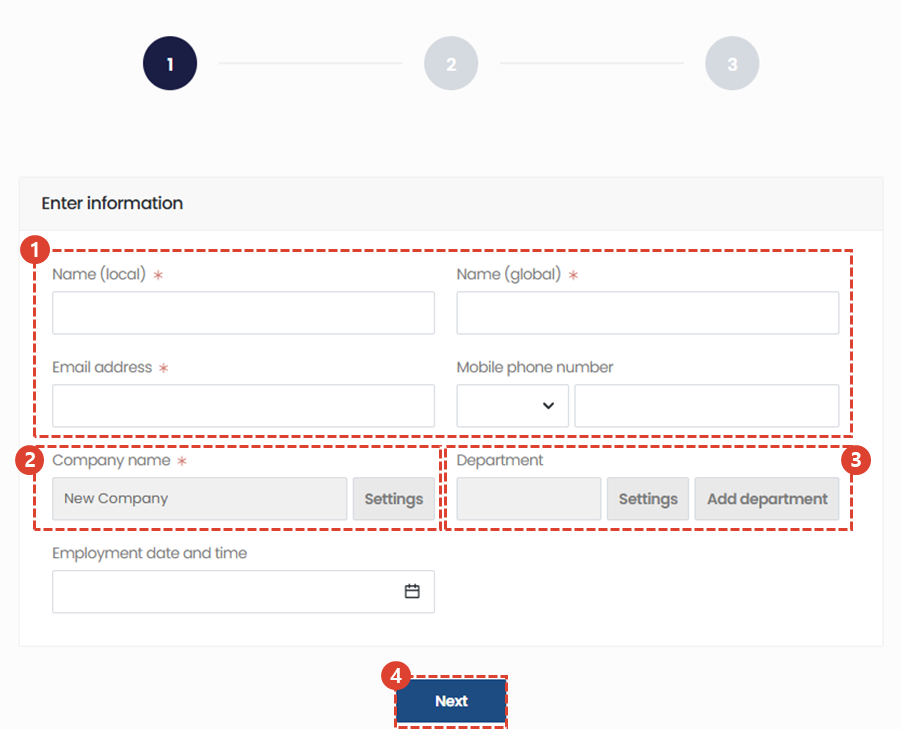
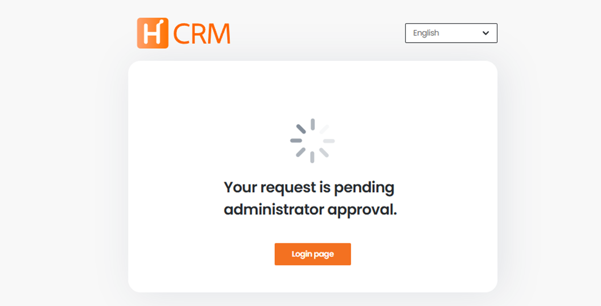

import ValidateTextByToken from "/src/utils/getQueryString.js";
import StrongTextParser from "/src/utils/textParser.js";
import text from "/src/locale/ko/SMT/tutorial-01-auth/create-a-acount-non-circle-user.json";

# Create a CRM account (retail)

<!-- 메뉴단에서 번역이 안되므로 여기 하드코딩해야 함 #가 달린 헤더와 함께 -->
We'll walk you through the steps to create a CRM user account on your **external network**.

:::danger
Circle users are requested to follow the account creation procedures for employees.
:::

<ValidateTextByToken dispTargetViewer={true} dispCaution={false} validTokenList={['head', 'branch', 'agent']}>

## Outline

The creation scenario for a CRM account for a reseller user is as follows:
:::warning 
   - **Service Agent User**: This structure allows the administrator to create an account on behalf of the user.
   - **Regular customer users**: You can create an account directly in your CRM system.
:::

</ValidateTextByToken>

## Create a Service Agent User Account

<ValidateTextByToken dispTargetViewer={false} validTokenList={['head', 'branch', 'agent']}>

:::info
We will grant separate account creation authority, and only users with authority will be able to perform account creation tasks.
:::

### Move Page

1. Select [Standard Information] - [Customer] or [Center] menu in the sidebar.
2. Select the company code of the company (client or center) you wish to add an account to and go to the details page.

1. Select the [Users] tab from the tabs at the bottom.
2. A list of user accounts belonging to the selected company (client or center) is displayed.
3. Click the [+] button to enter the Add User screen.

### Add User (1/3)

1. Enter your user information.
   - Name (Local): Enter the name in your local language.
   - Name (Global): Enter the name that will be displayed in English.
   - Email Address: Enter the email address of the user who will use the account.
   - Mobile Number: Enter the mobile number of the user who will use the account. (**Optional**)
2. Verify the company name. The affiliation information of the user registering the account on behalf of the user is set as default.
   :::note
   Administrators with account management authority can change their company affiliation.
   :::
3. Add your own department or select from a list of saved departments. See the department setup procedure.
   :::tip
   There are many cases where you utilize departments within your CRM system. Setting up departments makes future tasks easier.
   :::

#### Register Department

1. Click the [Settings] button to load the list of saved departments. If there are many registered departments, you can use the search function. Click the department name you want to use in the list of saved departments. Click the [Save] button to set the department.
1. Click the [Add Department] button to add a department. Enter the **department name** and enter a **description of the department** in the Department Description field. Click the [Save] button to save the department information.

### Add User (2/3)

1. Select a business unit.
1. If there are many permissions in the permission list, you can search for only the necessary permissions.
1. You can reset the search results.
1. You can view it in full screen.
1. If you have a lot of permissions to apply for, you can copy permissions from other people.
1. Resets selected permissions.
1. A description of the selected permission is displayed.
1. Select the permissions you want to assign.
   :::warning
      - Please be careful to assign only the permissions that are absolutely necessary.
      - Approval may be denied at the final approval stage of your account based on review by a security administrator.
   :::
1. Proceed to the next step.

### Add User (3/3)

1. A list of application permissions is displayed by business unit.
1. The user of the account is an employee of **Hanwha Semitech**, and confirms that there is no problem with the information entered.
   :::danger
   Please be careful not to have your account issued improperly.
   :::
1. Click the [Confirm] button.
   - A final approval request notification will be sent to the administrator to enable use of the account you created.
   - An additional authentication email will be sent to the account user. Please refer to Additional Authentication.

### Add User Authentication (1/2)

1. Account users should check their mailbox and click on the account registration instructions email received.
   :::tip
   If you do not receive the email, please contact the person who created the account on your behalf.
   :::
1. Click the authentication link.

### Additional User Authentication (2/2)

1. Check the name information you entered. You can edit it if necessary.
1. Verify your mobile phone number. Click the [Verify] button.
1. Enter your mobile phone number.
1. Click the [Send] button to receive the authentication number.
1. Enter the authentication number received on your mobile phone.

1. Click the [Confirm] button.
1. Enter the password you want to use.
   :::note
   - Please enter 8 to 20 characters when combining three of the following: uppercase letters, lowercase letters, special characters, and numbers. Please enter 10 to 20 characters when combining two of them.
   - Please refrain from using passwords that are easy to guess, such as numbers related to personal information such as date of birth, phone number, or consecutive numbers, as they can be easily figured out by others.
   - Please use a password that is different from the password you have used before or the password you use on other sites.
   :::
1. Click the [Next] button to complete the authentication process.

- Awaiting final approval from the administrator.
   :::tip
   Approval usually takes place within 1 day. If you need expedited approval, please contact smtcs@hanwha.com.
   :::

</ValidateTextByToken>
