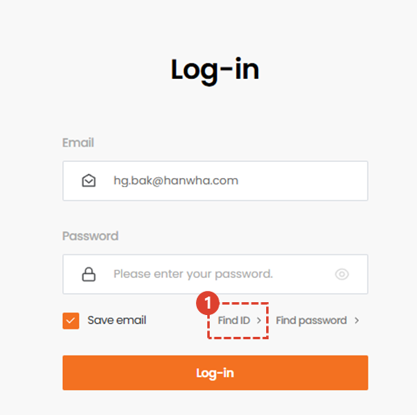
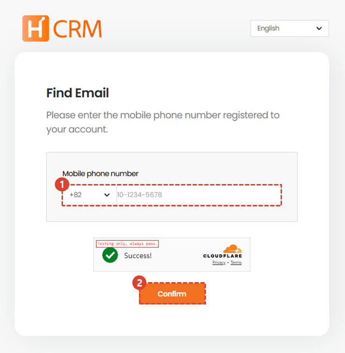
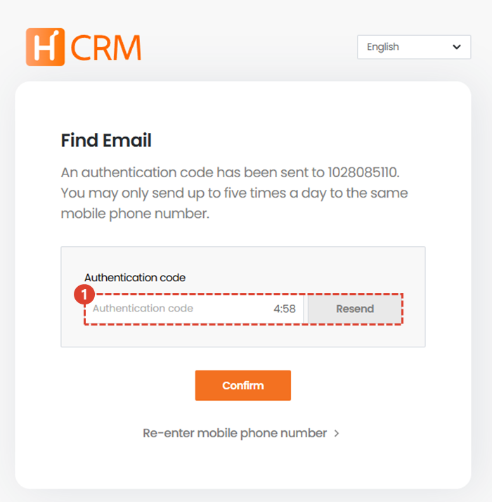
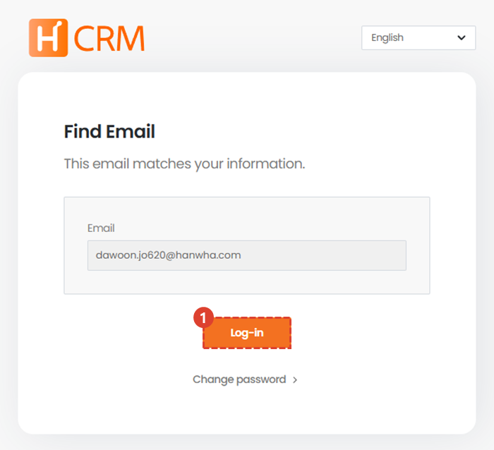

import ValidateTextByToken from "/src/utils/getQueryString.js";

# Find Email

This is a guide to the menu to use if you have lost your account email.

<ValidateTextByToken dispTargetViewer={true} validTokenList={['head', 'branch', 'agent', 'customer']}>

## Move Page

1. On the login screen, click the [Find ID] button.

## Find your ID (email) by phone number

1. Enter the mobile phone number registered to your account.
1. Enter the number and press the [Confirm] button.

1. Enter the authentication number received on your mobile phone and press the [Confirm] button.

## Verify ID (email)

1. Check your email.
1. Perform a login or password reset operation.

</ValidateTextByToken>