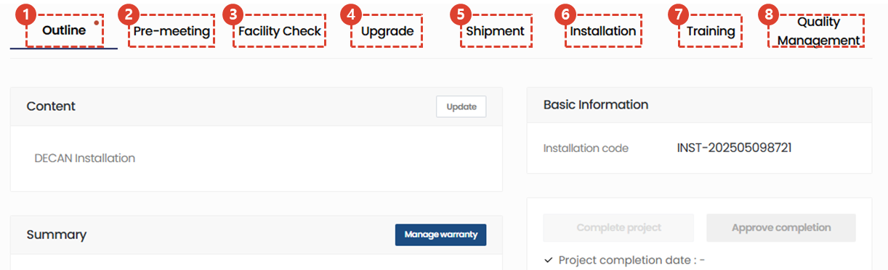
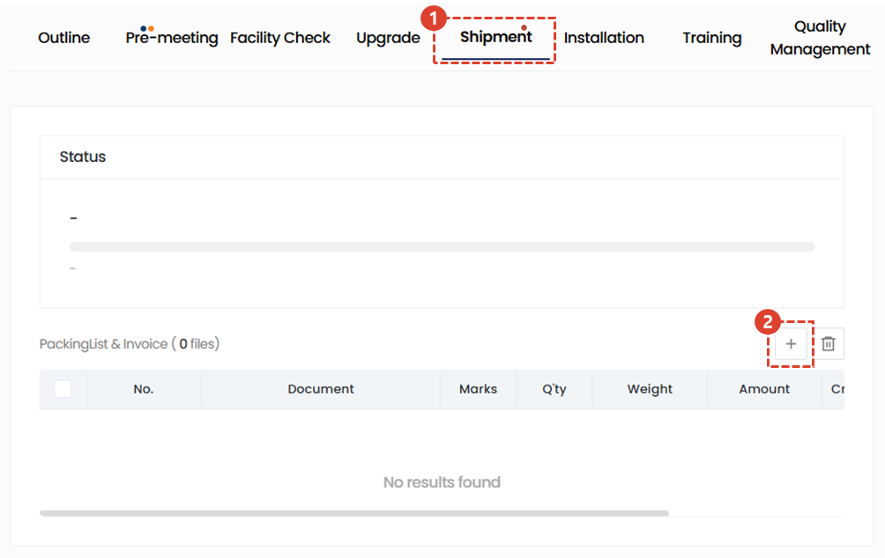
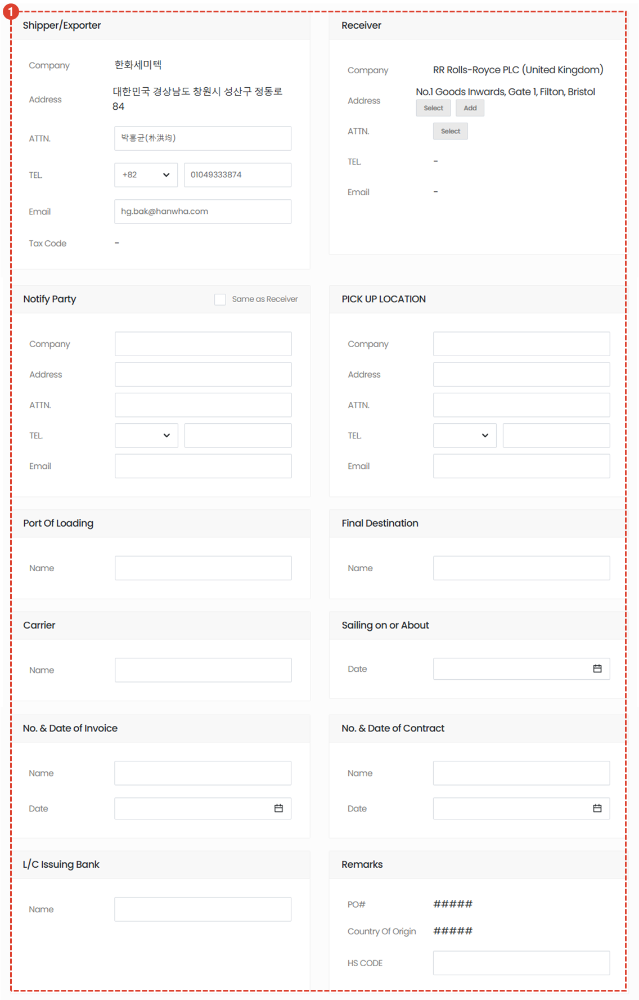
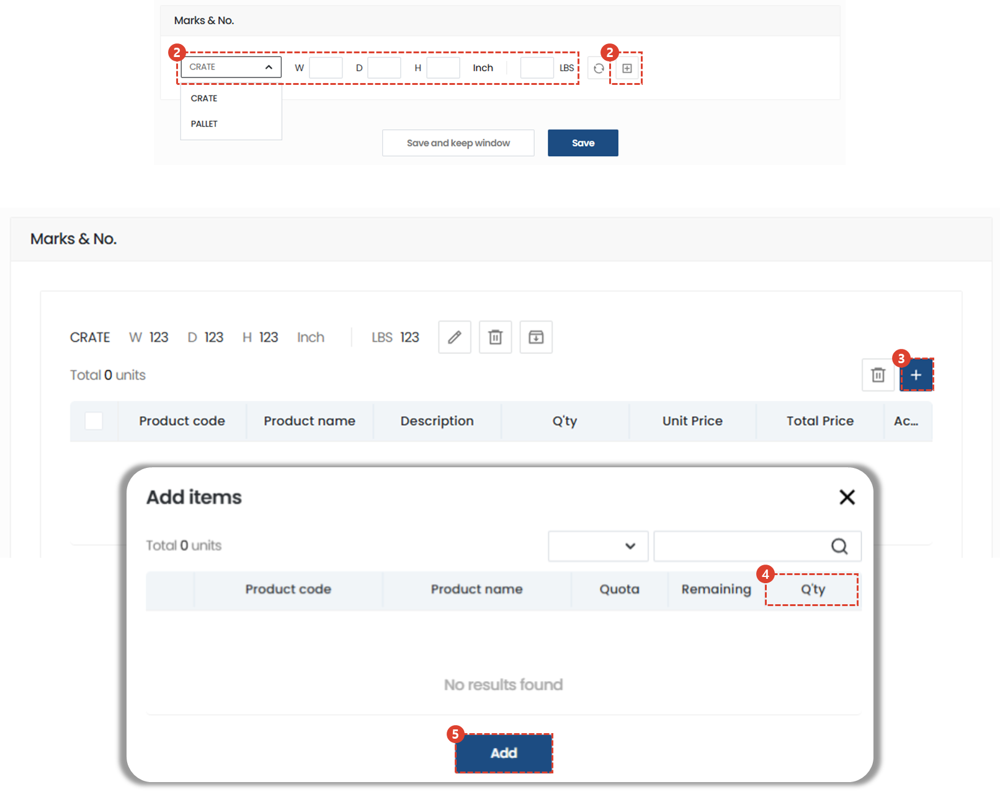
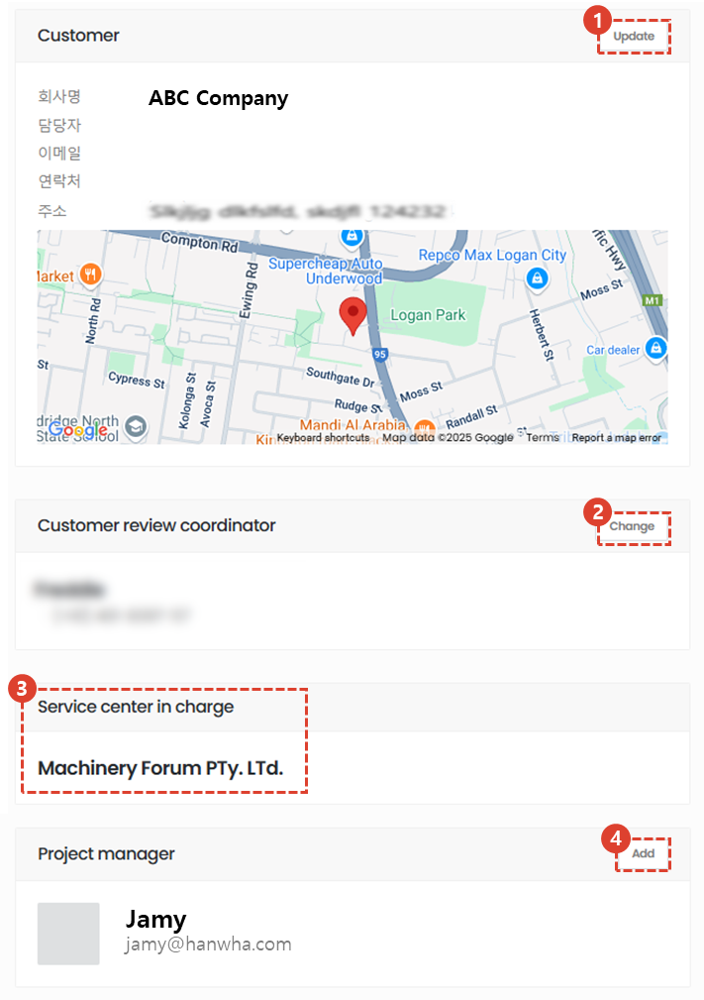
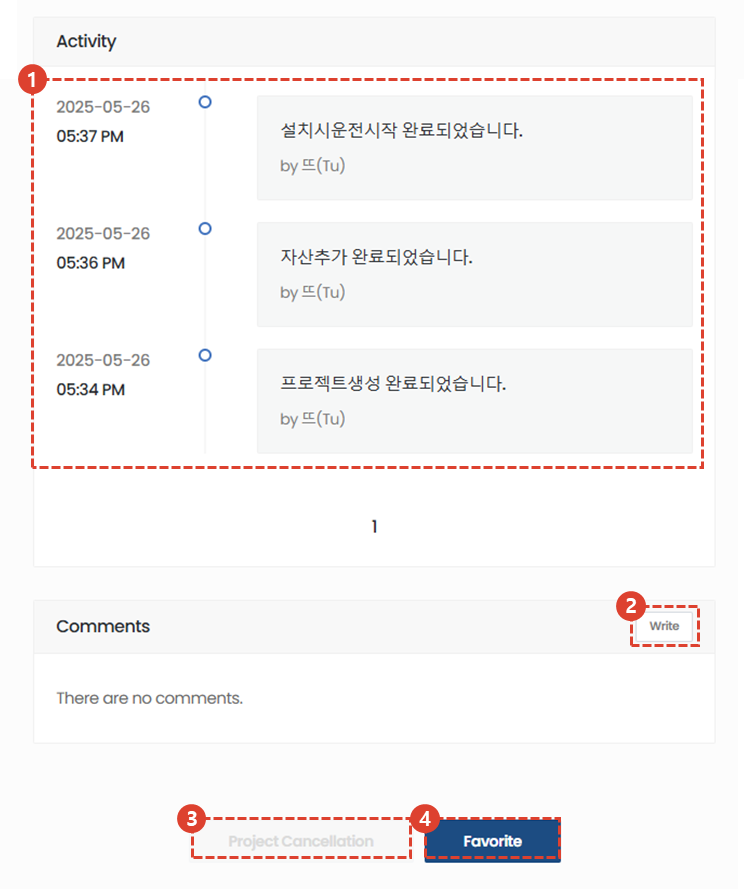

import ValidateTextByToken from "/src/utils/getQueryString.js";
import StrongTextParser from "/src/utils/textParser.js";
import text from "/src/locale/ko/SMT/tutorial-02-installation/02-details-project.json";
import DataAdd from "./img/012_2.png";
import Signature from "./img/039.png";

# Project Details - Shipping(HSA)

This guides you through the Shipment tab on the Project Details screen. This is a tab exclusive to HSA.

## Detail tap

<ValidateTextByToken dispTargetViewer={false} dispCaution={true} validTokenList={['head', 'branch', 'agent']}>

1. **Overview** : Enter basic information and summary of the installation and commissioning, as well as the delivery list.
1. **Pre-meeting** : You can enter the details of the pre-meeting with the customer for installation and commissioning. You can manage the details and time required for the pre-meeting.
1. **Check the installation environment** : (For HSA only) If a pre-meeting is difficult, you can save the installation environment information received from the customer via wire.
1. **Upgrade** : (For HSA only) You can enter the location where the optional installation will be performed according to the customer's order.
1. **Shipment** : (For HSA only) You can enter shipping information.
1. **Installation** : You can enter detailed information about the installation test drive and choose whether to perform a final confirmation of the installation test drive.
1. **Traning** : You can enter details of test drives and training conducted before and after installation.
1. **Quality Management** : You can enter work history for quality stabilization after installation and commissioning.

</ValidateTextByToken>
 
 

## Shipping (for HSA)

<ValidateTextByToken dispTargetViewer={false} dispCaution={true} validTokenList={['branch']}>

1. Used when shipment management is required.
1. Click the + button to issue a packing list/invoice.

### Generate packing list & invoice (1/3) (for HSA)

1. Enter your shipping information.

### Generate packing list & invoice (2/3) (for HSA)

1. Enter the packing specification information.
1. Click the + button.
1. Tap to add a packing item.
1. Edit the quantity.
1. Click the Add button.

### Generate packing list & invoice (3/3) (for HSA)

1. <StrongTextParser text={text.step3Packing01} />
1. <StrongTextParser text={text.step3Packing02} />

</ValidateTextByToken>
 
 

## Common content
<ValidateTextByToken dispTargetViewer={false} dispCaution={true} validTokenList={['head', 'branch', 'agent']}>

:::info
    This is the common content for each tab in the project details screen. Please refer to the contents below for each item in the common content.
:::
 
 

### Common content - 1/3

1. You can check the code of the installation and commissioning project.
1. After completing the installation and commissioning, the operator must click the Project Complete button. When the button is clicked, the tasks in all tabs will be processed as completed.
    :::warning
     You can change the warranty period start date in the pop-up window that appears when you click the Complete button.
     You must check again to see if the warranty period start date is correct before proceeding with the completion process.
    :::
1. When Project Completion is selected, the button becomes active. The administrator clicks the Approve Project button after checking the project results.
    :::warning
     You can change the warranty period start date in the pop-up window that appears when you click the Complete button.
     You must check again to see if the warranty period start date is correct before proceeding with the completion process.
    :::
1. You can check the installation test drive report by clicking. The report is automatically generated when you complete all the checklists in the Installation tab.
1. You can add attachments for reference to your project.
 
 

### Common content - 2/3

1. Check the customer information and click the Edit button if any changes are needed.
1. If you need to change the customer reviewer, click the Change button.
1. For the responsible center, changes cannot be made after the project is created.
1. You can add project managers by clicking the Add button.
 
 

### Common content - 3/3

1. You can check the project's activity history in a timeline.
1. Comments allow engineers and managers to communicate with each other.
    :::tip
    - [Important] If you check the box and write a comment, an email will be sent to the people registered in the project.
    :::
1. Use this if you need to cancel a project. The button will be disabled once the installation and commissioning tasks are complete.
1. You can select your favorites.
</ValidateTextByToken>

