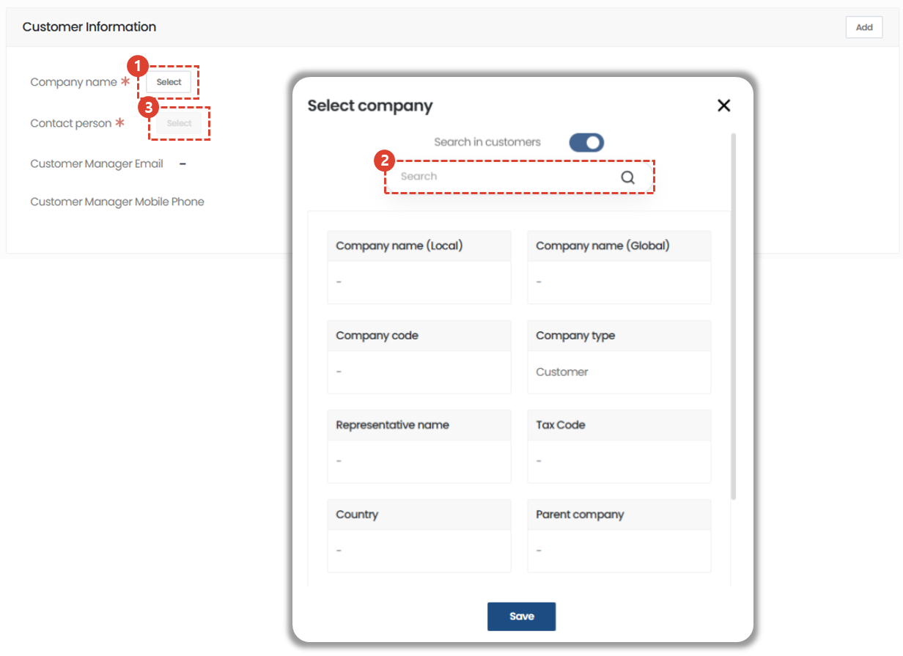
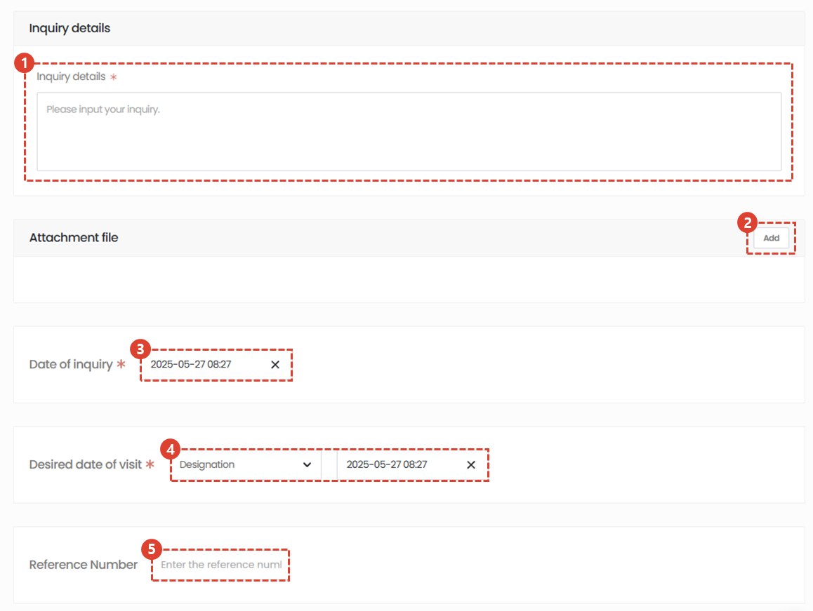
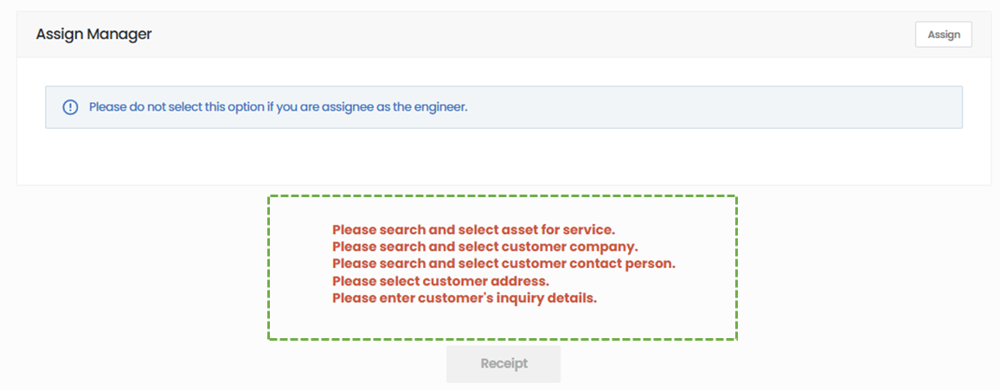

import ValidateTextByToken from "/src/utils/getQueryString.js";
import StrongTextParser from "/src/utils/textParser.js";
import text from "/src/locale/ko/SMT/tutorial-01-auth/create-a-acount-circle-user.json";

# Service reception

We guide you through the process of receiving and processing services according to your request.
<ValidateTextByToken dispTargetViewer={true} dispCaution={false} validTokenList={['head', 'branch', 'agent']}>

## List of services

1. Select Service Order.
1. A list of all services is displayed.
      - Processing : Indicates the number of services being processed. When clicked, only the list being processed is displayed. 
      - complete : Indicates the number of services that have been completed. When clicked, only completed services are displayed in the list.
      - cancellation : Indicates the number of cancelled services. When clicked, only the cancelled services are displayed in the list.
      - closing : This shows the number of services that were terminated without being processed through the normal process after receiving the service. When clicked, only the terminated list is displayed in the list.
1. receipt : You can register for general service reception.
      - This is suitable for use when you only register applications first or when there is a separate administrator who receives and registers applications.
1. Performance registration : You can input everything from service reception to processing details at once.  
      - It is suitable for use when you need to enter the reception and work details at once after the service work is completed.
1. [Feeder repair](./create-a-service-order_feeder.md) : Proceed when you need to enter service history for multiple assets, such as feeders. Unlike reception and performance registration, you register the service by entering only the reception date and action date without adding the time required for movement/work/meals.

## Service reception - 1/4

1. Select reception.
1. Search for and register the equipment for which you wish to receive service.
1. If the target facility information is not found, click the button to find and add the corresponding asset.
    :::warning
       When adding assets, please use it only when asset search is unavoidable.
    :::
1. Click Save to reflect the asset.

## Service reception - 2/4

:::info
When an asset is selected in the above step, the information of the customer holding the asset is automatically entered. Registration of the customer is only performed when the information of the customer linked to the asset has changed.
:::

1. Click Select to register your customer information.
    :::note
    If you do not first search for the target facility or asset, you cannot register as a customer.
    :::
1. Search and save the client name.
1. Click Select to set the contact person for your company.

## Service reception - 3/4

1. Enter your inquiry details.
1. You can add attachments by clicking Add.
1. The date of receipt is automatically entered as the date of receipt. If changes are needed, you can click to change them.
1. Select your desired date of visit.
1. You can enter the service number associated with that service.
    :::note
    Reference Number is a tab where you enter the number managed by the agency.
    :::

## Service reception - 4/4

1. Select Assign to assign a responsible engineer.
    :::note
    The default for the responsible engineer is the recipient. If the recipient himself is assigned as an engineer, no separate selection is required.
    :::
1. Click Save to assign engineers.
1. Click Apply to complete the service application.
    :::note
    
    Required values ​​for service registration are displayed at the bottom of the registration screen, and if the required values ​​are not entered, the registration button is disabled.
    :::
</ValidateTextByToken>