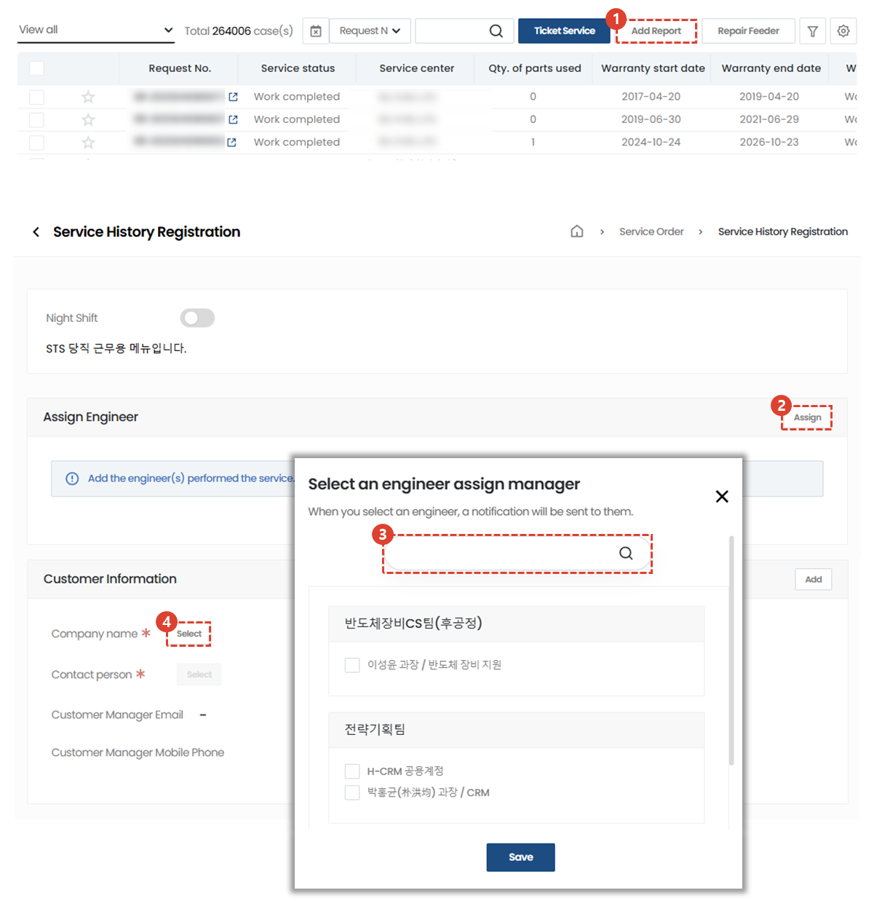
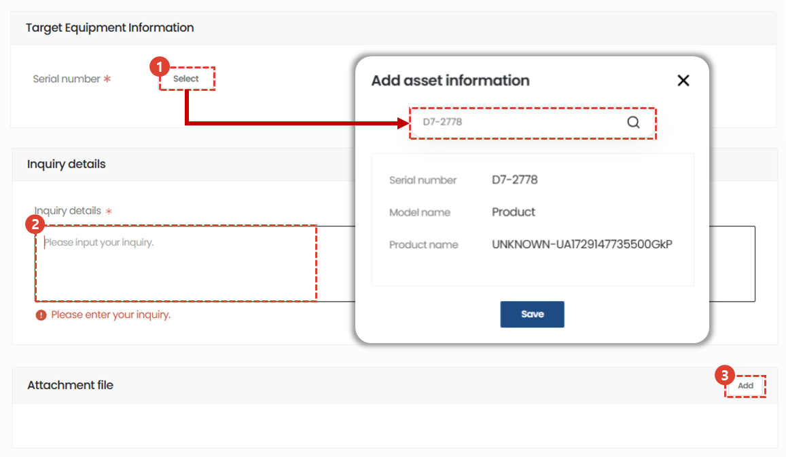
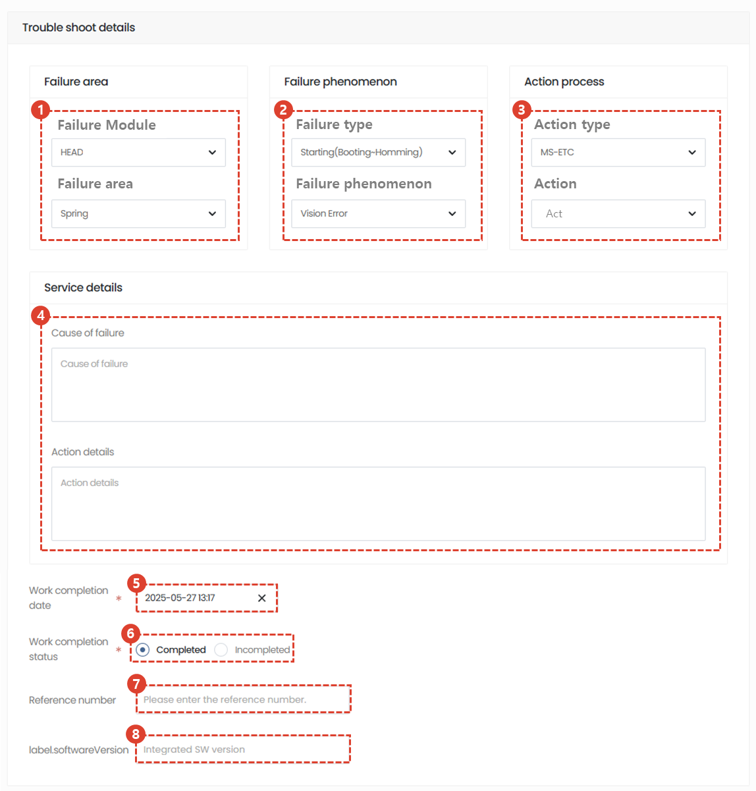
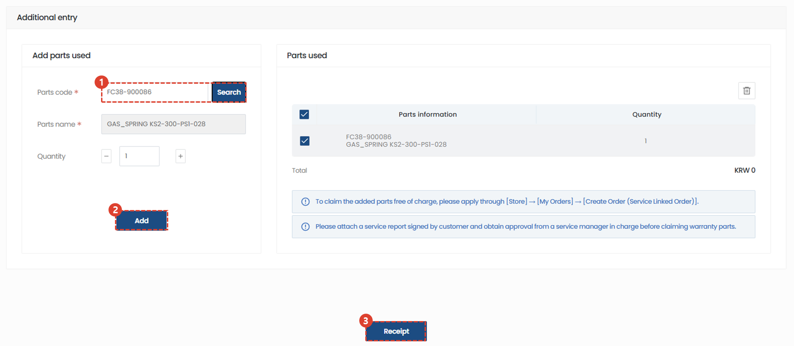

import ValidateTextByToken from "/src/utils/getQueryString.js";
import StrongTextParser from "/src/utils/textParser.js";
import text from "/src/locale/ko/SMT/tutorial-01-auth/create-a-acount-circle-user.json";

# Performance registration
Unlike the basic procedure where you can enter processing details later after registering a service, we will guide you through the performance registration tab where you can enter service reception/registration/processing details all at once.
<ValidateTextByToken dispTargetViewer={true} dispCaution={false} validTokenList={['head', 'branch', 'agent']}>

## List of services

1. Select Service Order.
1. A list of all services is displayed.
      - Processing : Indicates the number of services being processed. When clicked, only the list being processed is displayed. 
      - complete : Indicates the number of services that have been completed. When clicked, only completed services are displayed in the list.
      - cancellation : Indicates the number of cancelled services. When clicked, only the cancelled services are displayed in the list.
      - closing : This shows the number of services that were terminated without being processed through the normal process after receiving the service. When clicked, only the terminated list is displayed in the list.
1. receipt : You can register for general service reception.
      - This is suitable for use when you only register applications first or when there is a separate administrator who receives and registers applications.
1. Performance registration : You can input everything from service reception to processing details at once.  
      - It is suitable for use when you need to enter the reception and work details at once after the service work is completed.
1. [Feeder repair](./create-a-service-order_feeder.md) : Proceed when you need to enter service history for multiple assets, such as feeders. Unlike reception and performance registration, you register the service by entering only the reception date and action date without adding the time required for movement/work/meals.

## Performance registration - 1/2

1. Select Performance Registration.
1. Assign engineers by selecting Assignments.
1. Click Select to register your customer information.
    :::note
    If you do not first search for the target facility or asset, you cannot register as a customer.
    :::
1. Click Select to set the contact person for your company. 

## Performance registration - 2/2

1. Click Select to enter the target facility information.
1. Enter your inquiry details.
1. Click Add to enter relevant attachments.

### Service processing - 1/2

1. Select the faulty module and detailed fault location.
1. Select the failure type and phenomenon.
1. Select the action type and task content.
1. Please write the service details in detail.
1. Select an action date.
1. Select the service action completion category. If the service action is completed, select Complete.
1. Enter the relevant reference number.
1. Enter the integrated SW version.

### Service processing -2/2

1. Enter the part code you used and click the Search button. 
    :::note
    If the part code is registered in the system, the part name and unit price are automatically entered. If not, the cause is displayed in the classification tab, and you can enter the data directly if necessary.
    :::
1. Click Add to register the part.
1. Check the registered parts.
1. Click the Save button to save your actions.

</ValidateTextByToken>

