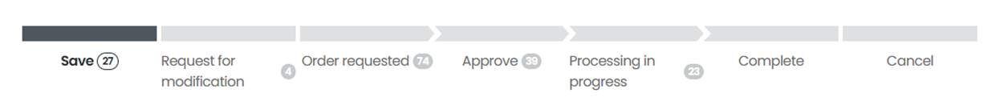

import ValidateTextByToken from "/src/utils/getQueryString.js";

# Oder modify

<ValidateTextByToken dispTargetViewer={true} dispCaution={false} validTokenList={['head', 'branch', 'agent']}>

We will guide you through the process of modifying the order form for the service parts you wish to purchase.

</ValidateTextByToken>

## Order List

<ValidateTextByToken dispTargetViewer={false} dispCaution={true} validTokenList={['head', 'branch', 'agent']}>

1. Store - Select the My Orders menu.
1. View the order list.

</ValidateTextByToken>

## Order Status

<ValidateTextByToken dispTargetViewer={false} dispCaution={true} validTokenList={['head', 'branch', 'agent']}>

- Save: The order form is currently being saved temporarily.
- Request for modification: This is an order that the seller has requested the buyer to make modifications to.
- Order requested: This is an order form that has been created by the customer and received by the seller.
- Approve: This is an order that has been approved by the seller.
- Processing in progress: An order is an order that has been approved and is in the process of being delivered to the purchaser.
- Complete: This is an order form that has been delivered to the customer.
- Cancle: 

</ValidateTextByToken>

## Modify

<ValidateTextByToken dispTargetViewer={false} dispCaution={true} validTokenList={['head', 'branch', 'agent']}>

1. Select the order number that needs to be modified. Modification of the order is only possible when the order is saved and in the order reception status.

1. You can edit and save your order by selecting the Edit button at the bottom of the details page to edit your order.
    :::warning
        The modified order form will only be processed if the "Order" button is clicked.
    ::: 

</ValidateTextByToken>

