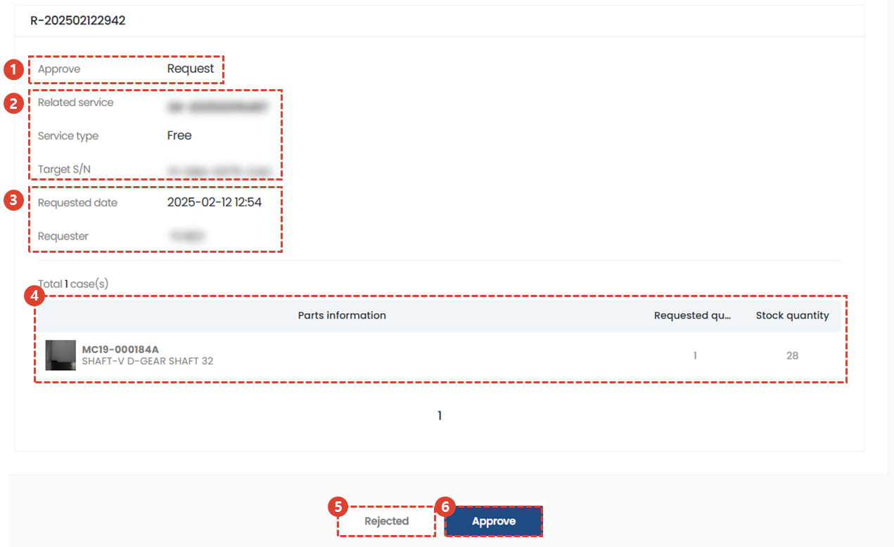

import img043 from "./img/043.png";
import img046 from "./img/046.png";
import ValidateTextByToken from "/src/utils/getQueryString.js";

# Service Parts Release Approval and Management

<ValidateTextByToken dispTargetViewer={true} dispCaution={false} validTokenList={['head', 'branch']}>

We will guide you through the usage procedure when a service parts receipt/release request and approval process is required.

</ValidateTextByToken>

## Check the shipping request details

<ValidateTextByToken dispTargetViewer={false} dispCaution={true} validTokenList={['head', 'branch']}>

1. Click [Store] → [Shipping & Inventory] menu.
1. Click [Request] bar in [Shipping] tab to filter to view only requested items.
1. Click **Request Number**

1. Check the shipment status. Confirm that it is in the **Request** stage.
1. If there is a related service order, the service order number, service type, and serial number of the service target asset are displayed.
1. Check the request date and requester information.
1. Check the list of requested parts.
1. If there is a reason for rejection, click on it. Move to [Rejection stage](#Shipping-Request-Rejection).
1. Click the [Approve] button to process the shipment approval. Move to [Approval stage](#Shipping-Request-Approval).

## Rejected shipment request

1. Enter the reason for rejection.
1. Click the [Confirm] button.

## Approval of shipment request

When you click the [Approve] button in the [Approve Shipment Request](#Shipping-Request-Content-Confirmation) step, click the [Confirm] button once more in the modal screen that appears.

## Shipping in progress

1. Click the [Pending Shipment] bar in the [Shipping] tab. 
1. Click the request details.

1. Check that the status value is **Waiting for shipment**.
1. You can check the closed history.
1. You can check the shipped history.
1. You can check the stock quantity.
:::info Stock quantity location
[Standard information] → [Center] → [Basic information] → [Storage location] Displays the available stock quantity of the Storage Location corresponding to the value.
:::
1. Perform the closing process.
1. Proceed with the shipment process.

## Shipment

1. Double-click the shipping quantity to edit it.
1. Enter comments related to shipping.
1. Click the [Save] button.
:::warning
Since the work here only deals with system processing, you must actually proceed with the shipping of the actual parts according to the contents described.
:::
 
### Shipment history

1. When a shipment history occurs, the status changes to **Shipping**.
2. You can check the shipment history by clicking the [Shipping History] button.

- Check the shipping history.
1. If it is not an actual shipped item, you can delete the shipping history by clicking the [Delete] button.

## Closing

### Closed - Sale

1. You can modify the quantity to be closed.
1. Select **Sales** for the **Processing Type** item.
1. Enter the **Customer PO** number.
:::tip
Since the purpose of management is large, enter the correct data.
:::
1. Search for users so that you can share the closed processing details.
:::info
You can only search among users belonging to my center.
:::
1. Enter additional information required for management.
1. Click the [Save] button.

### Closed - Free

1. You can modify the quantity to be closed.
1. Select **Free** for the **Processing Type** item.
1. Search for users to share the closed processing content.
:::info
You can only search among users belonging to my center.
:::
1. Enter additional information required for management.
1. Click the [Save] button.

### Closed - Return

1. You can modify the quantity to be closed.
1. Select **Return** for the **Processing Type** item.
1. Search for a user to share the closed processing details.
:::info
You can only search among users belonging to my center.
:::
1. Enter additional information required for management.
1. Click the [Save] button.

</ValidateTextByToken>