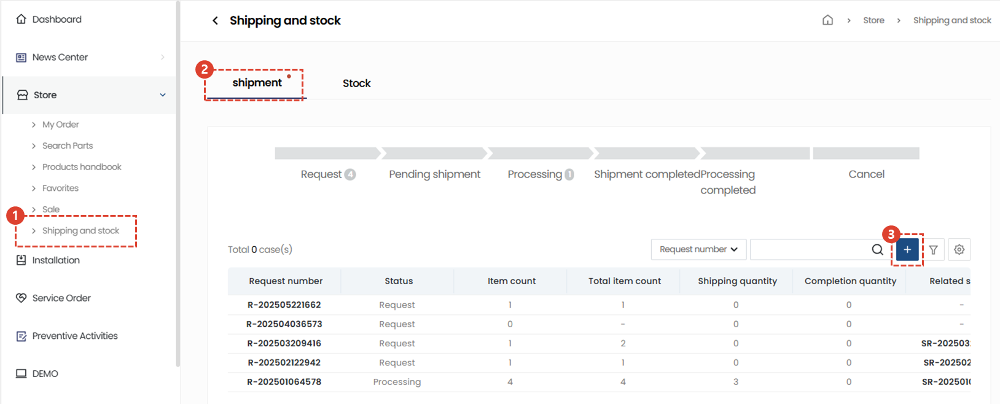
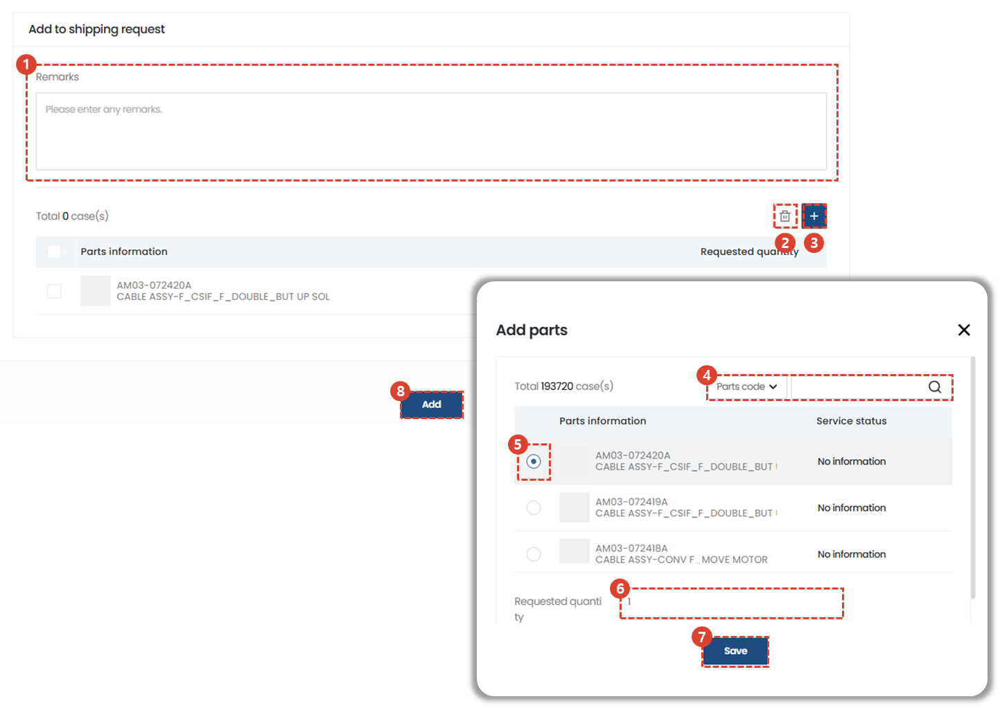

import ValidateTextByToken from "/src/utils/getQueryString.js";

# Request for service parts shipment

<ValidateTextByToken dispTargetViewer={true} dispCaution={false} validTokenList={['head', 'branch']}>

We will guide you through the usage procedure when a service parts receipt/release request and approval process is required.

</ValidateTextByToken>

## Request for parts shipment

<ValidateTextByToken dispTargetViewer={false} dispCaution={true} validTokenList={['head', 'branch']}>

We will guide you through the parts shipment request process.

## Request delivery from another menu

- You can request the shipment of parts required for service from another menu related to the parts shipment service.
    :::info
    ※ Related Service Menu
    - Service Order
    - Intstallation
    :::

## Request delivery

### Register your request

1. Click [Store] → [Shipping & Inventory] menu.
1. Click [Shipping] tab.
1. Click [+] button.
:::info Progress Bar Status
- **Request**: This is the status immediately after the shipment request form is created.
- **Waiting for shipment**: This is the status after the shipment request has been approved by the shipment manager/manager.
- **Shipping**: Some of the parts requested by the shipment manager/manager have been shipped.
- **Shipping Complete**: All of the parts requested by the shipment manager/manager have been shipped.
- **Processing Complete**: The status of all shipped parts has been processed as follows.
- **Customer Sales**: This means that the shipped parts have been sold.
- **Free Supply**: This means that the shipped parts have been supplied free of charge.
- **Return**: This means that the parts have been returned to the warehouse.
:::

### Write your request

1. Enter the details related to the request in the remarks column.
1. Click the [+] button to open the parts search window.
1. Search for parts.
1. Select the parts to add.
1. Enter the quantity.
1. Click the [Save] button.
1. Use to delete added parts.
1. Click the [Add] button to create a shipping request.
- A notification email will be sent to the **shipping approval manager** at the same time as the request is created.

</ValidateTextByToken>