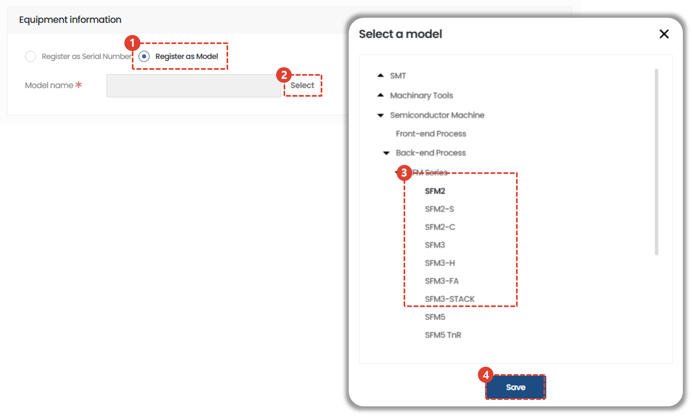

import ValidateTextByToken from "/src/utils/getQueryString.js";

# VOC registration

<ValidateTextByToken dispTargetViewer={true} dispCaution={false} validTokenList={['head', 'branch', 'seller', 'agent']}>

We will guide you through the process of registering an issue you wish to register as a VOC in the VOC menu.

</ValidateTextByToken>

## VOC List

<ValidateTextByToken dispTargetViewer={false} dispCaution={true} validTokenList={['head', 'branch', 'seller', 'agent']}>

1. Click [VOC] on the sidebar. 
1. Click the [+] button in the VOC list at the bottom.

</ValidateTextByToken>

## VOC Details

<ValidateTextByToken dispTargetViewer={false} dispCaution={true} validTokenList={['head', 'branch', 'seller', 'agent']}>

### Enter equipment information
There are two ways to enter equipment information.
You can register by serial number or by model.

1. Click Register with Serial Number.
1. Click the Select button to open the Serial Number input window.
1. Enter the Serial Number.
1. Click the Save button. 

1. Click Register as Model.
1. Click the Select button to open the Model Selection modal.
1. Only **leaf models** at the very end of the model tree can be selected.
    :::warning
      
    Clicking on a model name that has sub-models will result in an error.
    :::
1. Click the [Save] button.

### Enter registrant and client information

 

1. Click the [Select] button to register a customer company.
1. Select the [Country] of the VOC registered customer company.
1. Select [Region]. **For indicator management**

### Enter VOC information

 

1. Select a type. There are three types as follows:
    - Defects
        - Faultiness (H/W)
        - Faultiness (S/W)
        - Manufacturing defects
        - Printing/notation defects
        - ISV defects
        - Operation S/W defects
        - Control S/W defects
        - T/P defects
        - Mechanical defects
        - Controller defects
    - Improvements
        - ISV improvements
        - Other improvements
        - Ensuring serviceability
        - SW improvements
        - Mechanical improvements
    - Others
        - Others
        - Sales VOC
        - Quality VOC
        - Development VOC
        - Service VOC
1. Select a detailed type item based on the selected type.

### Enter and submit VOC details

 

1. Enter the content required for review.
- Enter the title and specific VOC-related content.
- Enter the desired completion date for the requested VOC suggestion.
- Add attachments if necessary.
1. Click the [Submit] button.

### Automatic email delivery for VOC submissions

 

- As soon as the VOC is received, an email notification as shown in the image will be sent to the administrator.

</ValidateTextByToken>