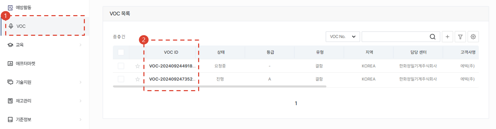
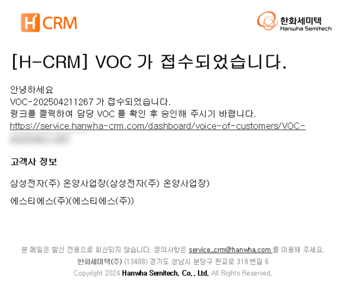
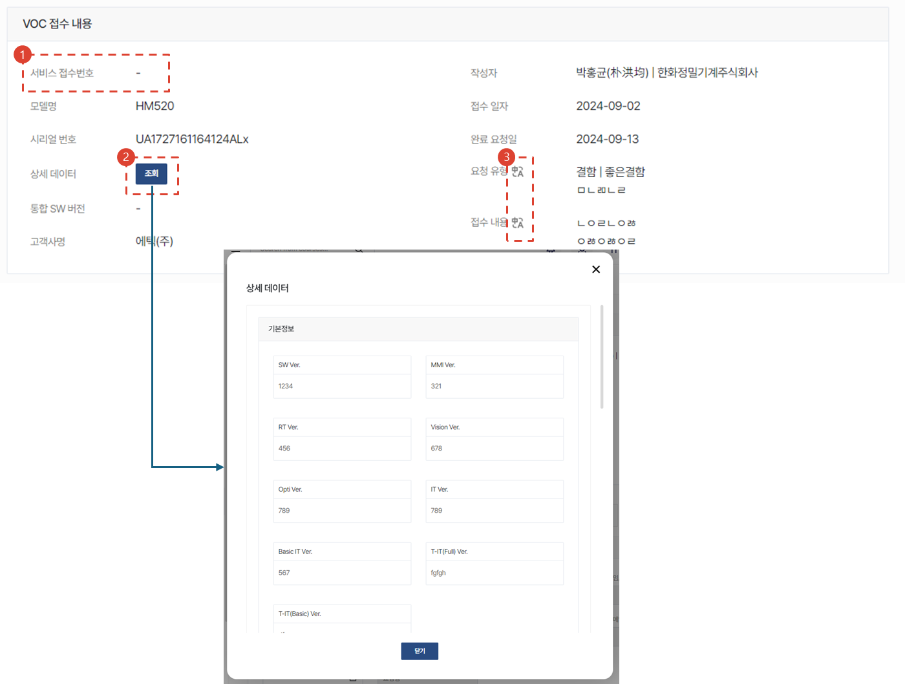
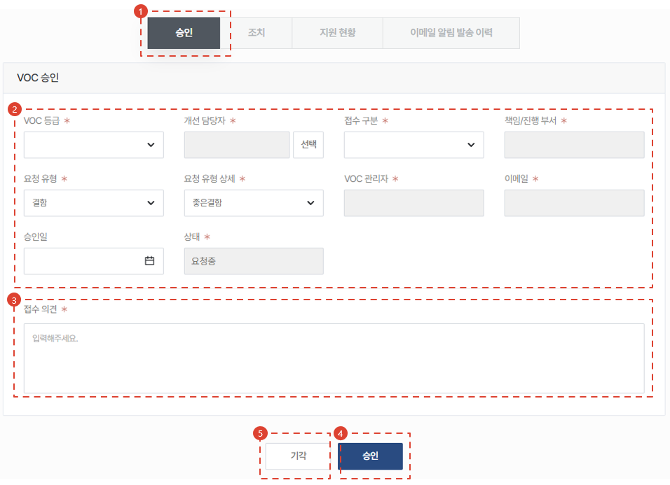
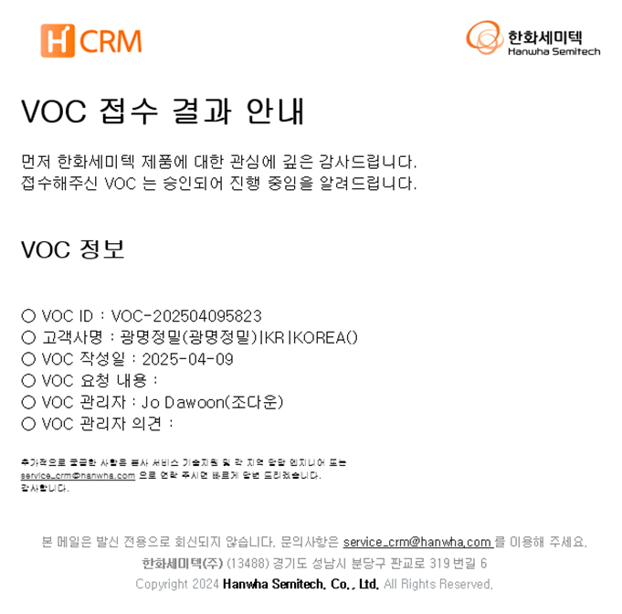
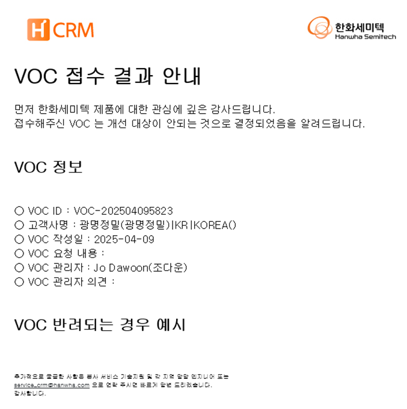
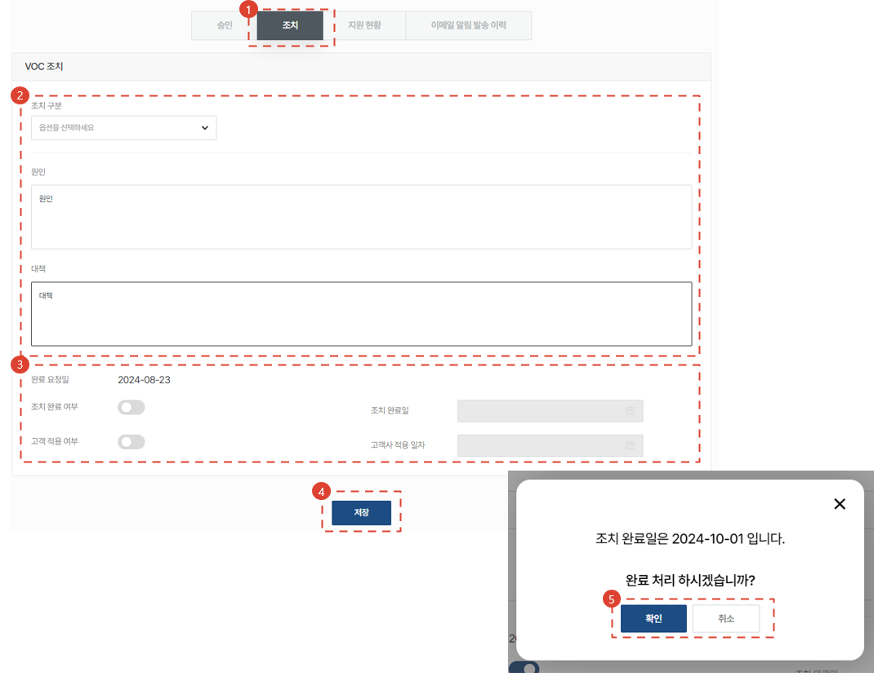
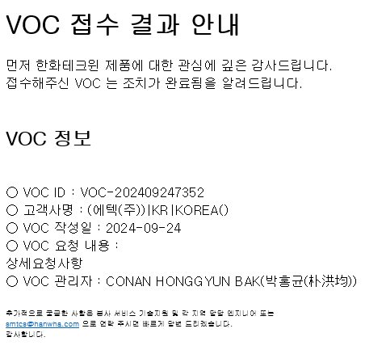
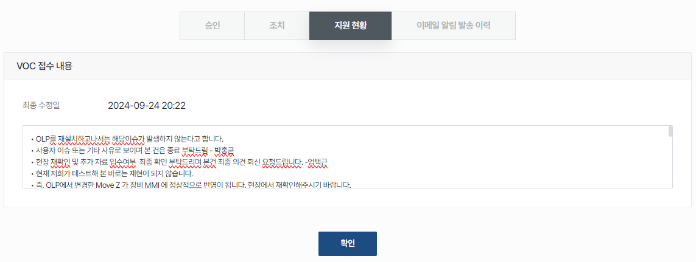
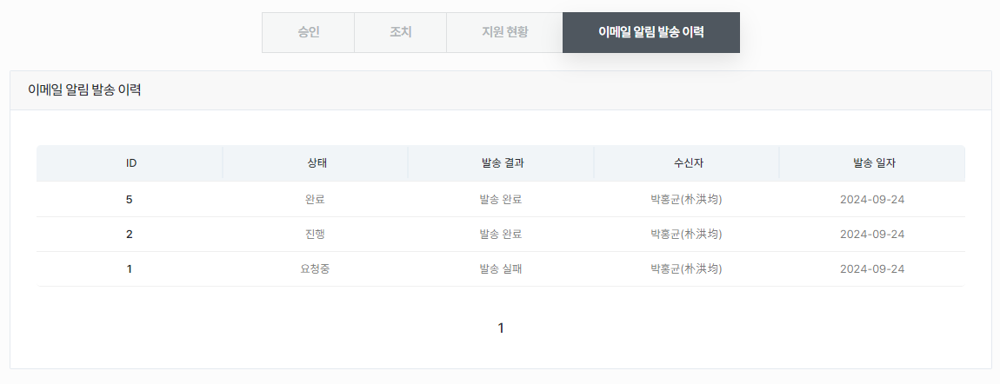

import mmiQrImg from "./img/011.png";
import ValidateTextByToken from "/src/utils/getQueryString.js";

# VOC process

<ValidateTextByToken dispTargetViewer={true} dispCaution={false} validTokenList={['head']}>

This is a head office only feature.

</ValidateTextByToken>

## VOC 접수 조회

<ValidateTextByToken dispTargetViewer={false} dispCaution={true} validTokenList={['head']}>

### 시스템에서 조회

1. 사이드바의 [VOC]를 클릭합니다.
2. 하단의 VOC 목록에서 [VOC ID] 컬럼에서 ID 값을 클릭합니다.

### 알림 이메일을 통한 조회

1. 수신된 이메일의 링크를 클릭합니다.

</ValidateTextByToken>

## VOC 상세

<ValidateTextByToken dispTargetViewer={false} dispCaution={true} validTokenList={['head']}>

### VOC 접수 내용

1. 서비스접수 건으로부터 VOC로 등록된 경우, 서비스 접수번호가 표시됩니다.
1. 최근의 **설비 MMI화면의 QR코드** 스캔 이력 정보를 표시합니다. 
    :::tip
        

        설비 MMI 화면의 QR 코드를 스캔하게 되면 VOC 원인 분석을 위한 설비의 기본정보들을 간편하게 등록할 수 있습니다.
    :::
1. 버튼을 클릭시 CRM 시스템의 언어에 맞게 번역된 결과를 표시합니다.

</ValidateTextByToken>

## VOC 처리

<ValidateTextByToken dispTargetViewer={false} dispCaution={true} validTokenList={['head']}>

### 승인 / 기각

 

1. 필수 필드를 입력합니다.
    - VOC 등급: A, B, C, D 중 1개를 선택합니다.
    - 개선담당자: [선택] 버튼을 눌러 담당자를 검색하여 등록합니다. CRM 사용자가 아닌 임직원(서클 사용자) 중에서 검색이 됩니다.
    - 접수구분: 개선대상 여부에 따라 구분자를 선택합니다.
    - 책임/진행부서: 개선담당자에 따라 자동으로 입력됩니다.
    - 요청유형: VOC 성격에 맞게 유형 1개를 선택합니다.
    - 요청 유형 상세: 요청 유형에 따른 상세 유형을 선택합니다.
    - VOC 관리자 / 이메일: CRM 접속 사용자가 **VOC 관리자인 경우** 자동 입력됩니다.
    - 승인일: 승인하고자 하는 날짜를 입력합니다.
1. 접수 및 기각 의견을 입력합니다.
1. [승인] 버튼을 눌러 승인합니다.
    - 승인시, 접수자에게 아래와 같은 이메일이 발송됩니다.
        

1. [기각] 버튼을 눌러 기각합니다.
    - 기각시, 접수자에게 아래와 같은 이메일이 발송됩니다.
        

### 조치

 

1. 조치 결과를 입력하기 위해 [조치] 버튼을 누릅니다.
1. 조치 구분자와, 원인/대책 내용을 입력합니다.
1. 조치완료일과 실제 고객사 적용일이 다른 경우, 따로 입력합니다. VOC 처리 LT 지표에는 **조치완료 일자**를 종결일자로 적용합니다.
1. [저장] 버튼을 누릅니다.
1. 최종 확인 작업을 수행합니다.
    - 아래와 같이 이메일이 접수자에게 발송됩니다.
        
 

### 지원현황

 

- VOC 조치작업 중에 담당자 간 지원이력을 기록합니다.

### 이메일 알림 발송 이력

 

- VOC 건과 관련하여 발송된 이메일 이력을 표시합니다.

</ValidateTextByToken>