import ValidateTextByToken from "/src/utils/getQueryString.js";
import all_proceeding from "./img/027.png";
import proceeding from "./img/028.png";
import rejection from "./img/029.png";
import Approval from "./img/018.png";

# Retrofit

<ValidateTextByToken dispTargetViewer={true} dispCaution={false} validTokenList={['head', 'branch', 'seller', 'agent']}>

Registers assets to be retrofitted and manages whether operations are performed on registered assets.

</ValidateTextByToken>

## Project List

<ValidateTextByToken dispTargetViewer={false} dispCaution={true} validTokenList={['head', 'branch', 'seller', 'agent']}>

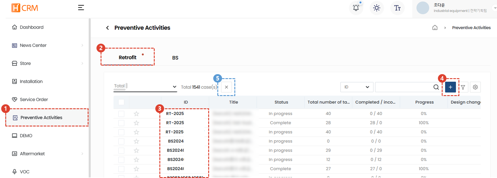
1. Select the Prevention Activities tab.
1. The Retrofit menu is the default. You can check the list of currently registered Retrofits.
1. You can click on the Retrofit ID to go to the details page.
1. Click the + button to register a new Retrofit task.
1. You can cancel a project by selecting it and clicking the X button. Projects cannot be canceled after final confirmation. When canceling a project, you must enter a reason for canceling the project.

</ValidateTextByToken>

## Create a project 

### Register basic information

<ValidateTextByToken dispTargetViewer={false} dispCaution={true} validTokenList={['head']}>
    :::info
        Before creating a project, a Retrofit proposal must be prepared.
    :::
 
 

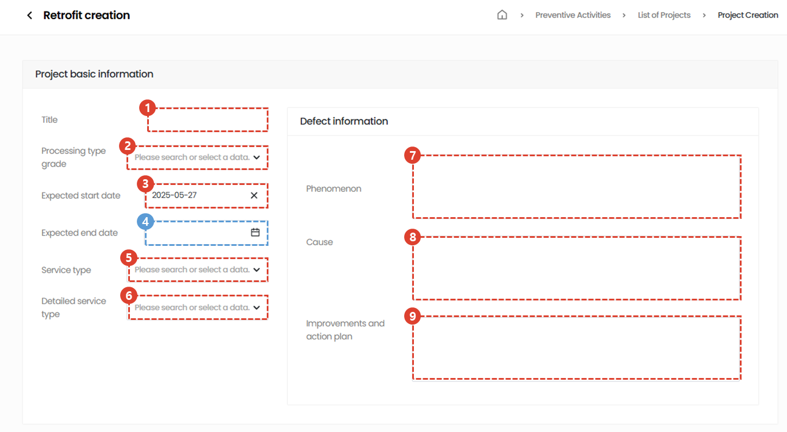

Basic information is written based on the relevant consultation.
1. Enter the project title.
1. Select the processing type grade.
1. Select the start date.
1. Select the completion date. The completion date is optional and can be entered if necessary.
1. Select the service category.
1. Select a detailed category for the service category.
1. Enter the defect phenomenon.
1. Enter the cause of the defect.
1. Enter the improvement measures and response plans for the defect.
 
 

### Register used parts

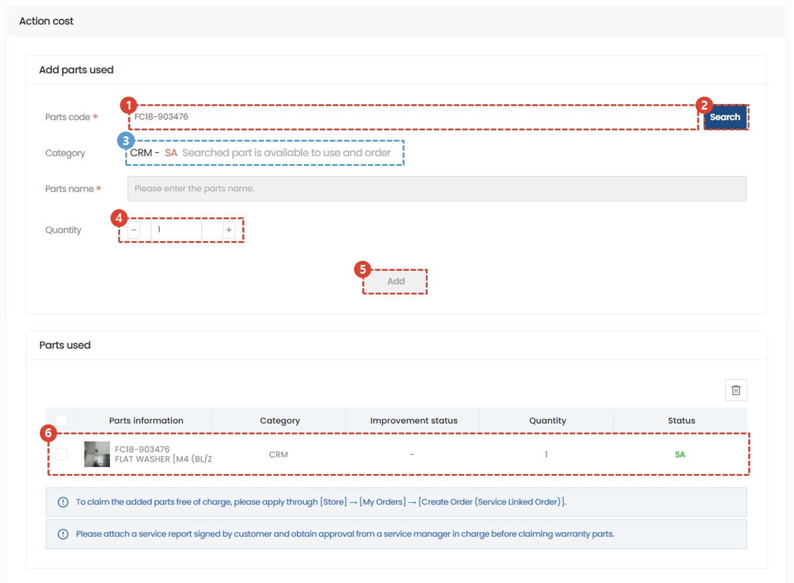

1. Enter the part code to add the parts required for the task.
1. Click the Search button.
1. Check if the available parts are correct.
1. Check the required quantity.
1. Click the Add button.
1. Check the added used parts.
 
 

### Register target facility information

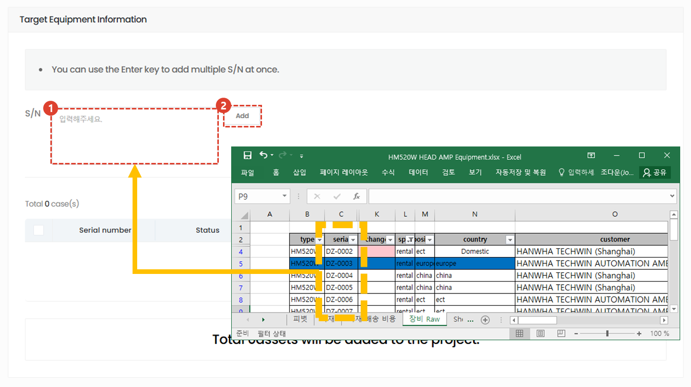

1. Copy the name of the equipment to be retrofitted and paste it into the S/N field.
1. Click the Add button. Once the addition is complete, you can check the list of equipment added in the list below.
 
 

### Registering attachments and registering projects

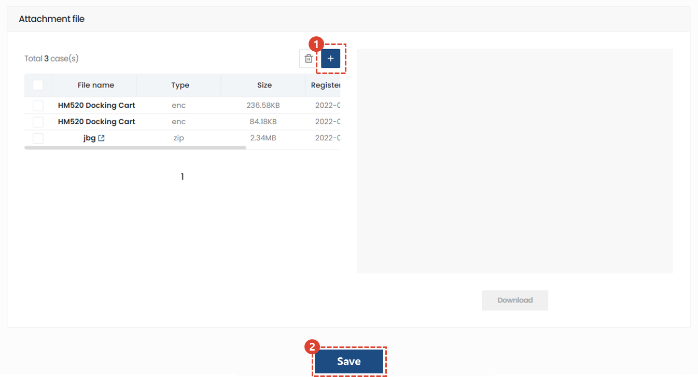

1. Add related attachments. (e.g. Retrofit proposal, list of relevant equipment, etc.)
1. Click the Save button to complete project registration.
 
 

</ValidateTextByToken>

## Project Modification and Processing

<ValidateTextByToken dispTargetViewer={false} dispCaution={true} validTokenList={['head', 'branch', 'seller', 'agent']}>
 
 

### Project List

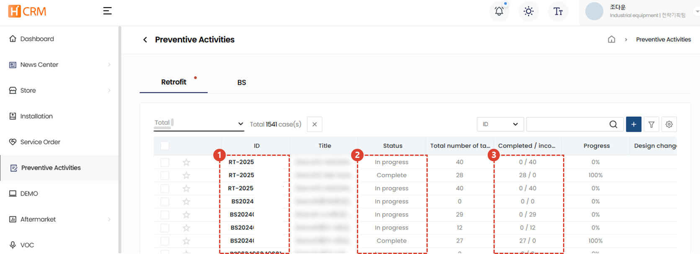

1. You can check the registered Retrofit list. Click on the ID that needs to be modified to go to the details page.
1. You can check the progress status. Projects in the completed status cannot be modified or canceled.
1. You can check the number of equipment in the completed and incomplete status.
 
 

### Modify basic information

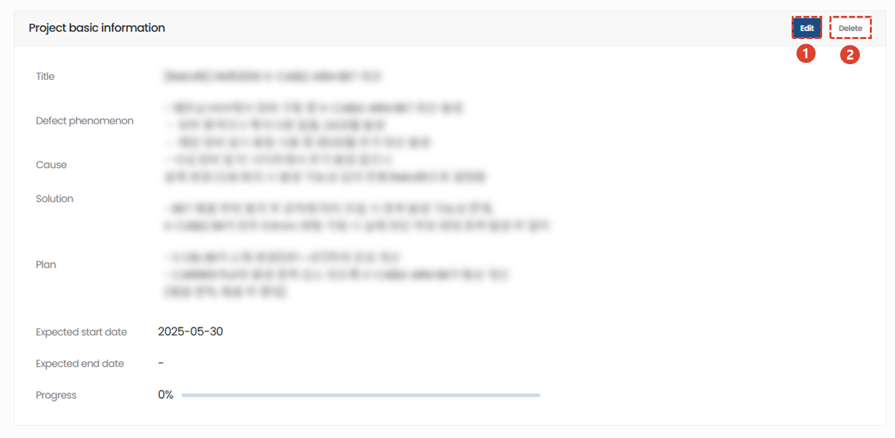

1. Click Edit to edit the contents.
1. Click Delete to delete the project.
    :::warning
    Please note that when you click Delete, all information will be deleted.
    :::
 
 

### Modify used parts

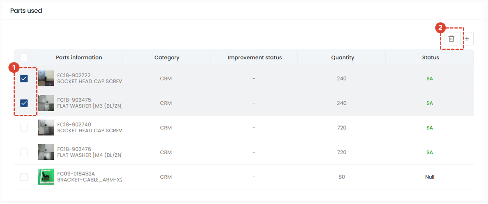

1. Select the part that needs to be deleted.
1. Click the button to delete the part.
 
 

### Add and process target equipment

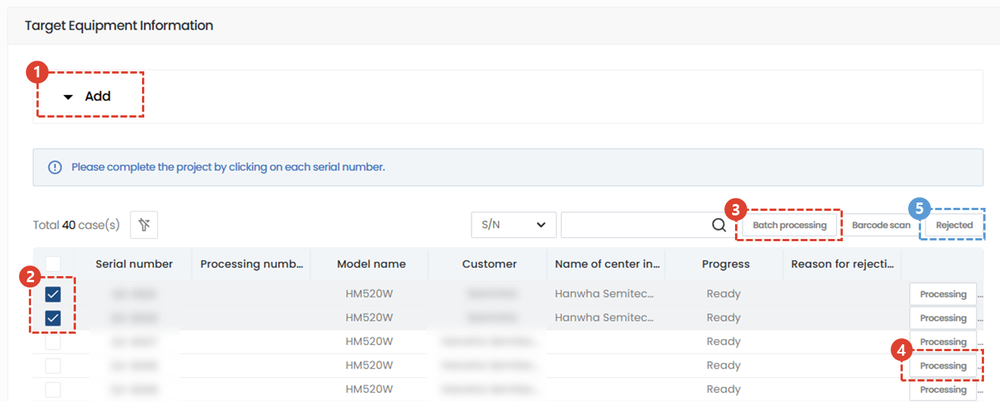

1. Click the Add tab to add equipment.
1. You can select multiple items to be processed or disabled and work on them in batches.
1. When selecting batch processing, all selected equipment will be processed.
    :::info
    When you click the Confirm button, all selected equipment will be processed in batches. 
    

    :::

1. You can process retrofits one by one by clicking the Process button.
    :::info
    When you click the Confirm button, the equipment will be processed in batches. 
    

    :::

1. When you select a facility and click the Proceed button, the facility will be excluded from the progress items.
    :::info
    You can enter a reason for the inability to proceed and then process it as inaccessible.
    

    :::
 
 

## Cancel project
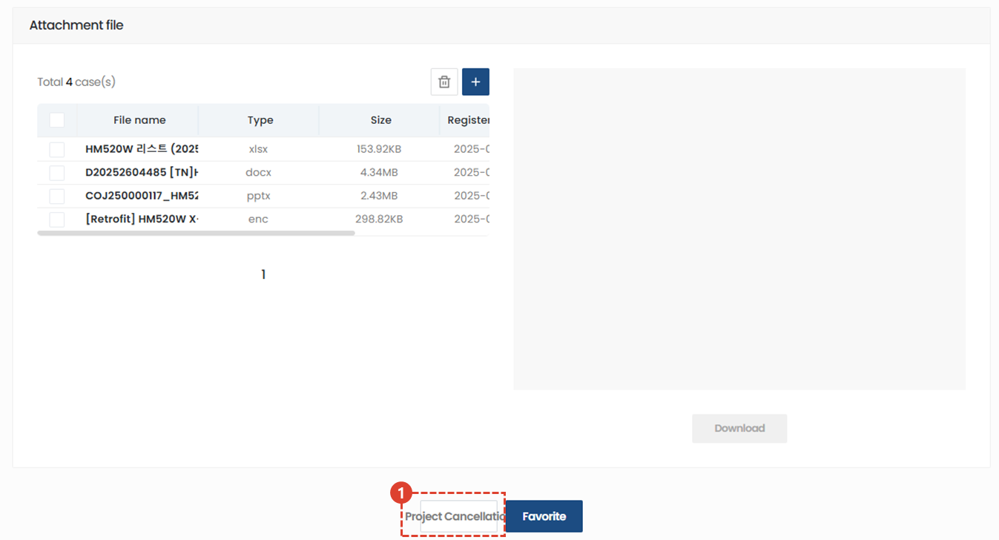
1. You can cancel by pressing the Cancel Project button at the bottom of the screen.

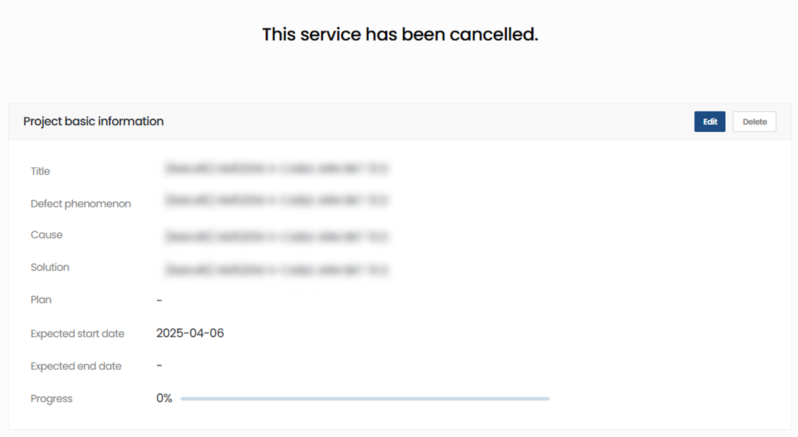

1. You can check whether or not it has been cancelled and the reason.
1. All functions are unavailable for cancelled projects.

</ValidateTextByToken>