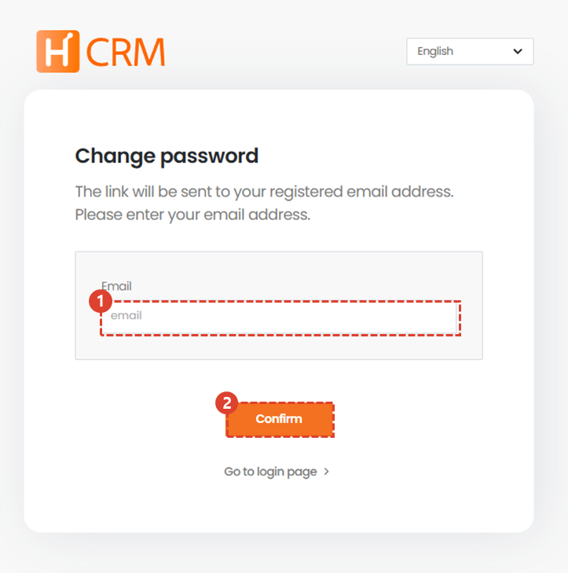
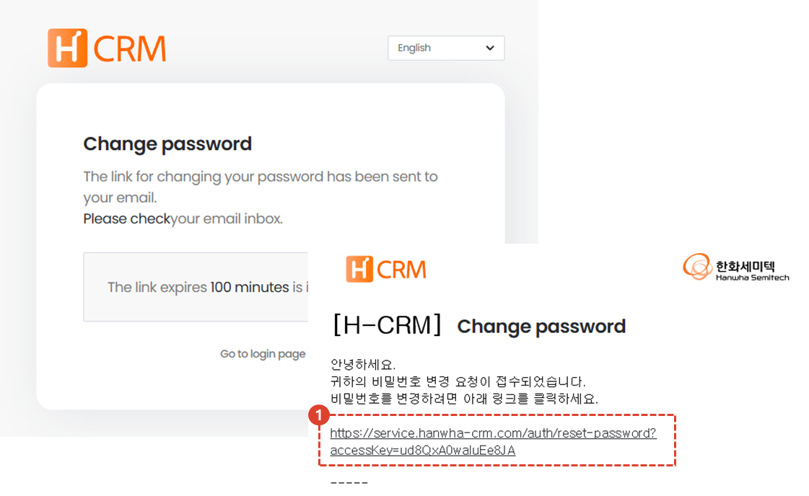
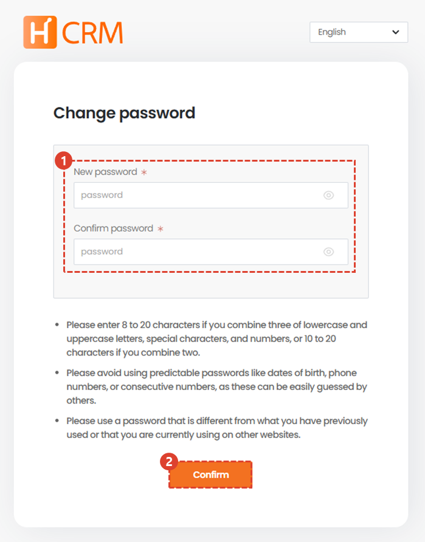

import loginWindow from "./img/019.png";
import ValidateTextByToken from "/src/utils/getQueryString.js";

# Reset Password

When logging in from an **external network**, we will guide you through the password reset process in case you have lost your password.

<ValidateTextByToken dispTargetViewer={true} dispCaution={true} validTokenList={['head', 'branch', 'agent', 'customer']}>

## Move Page

1. On the login screen, click the [Find Password] button.
 
 

## Enter your user email

1. Enter the email address of the account you want to initialize.
    :::tip
    If you have lost your ID (email), please refer to the [Find ID(email)](./find-email.md)page.
    :::
1. Enter your email address and click the [Confirm] button.
 
 

1. Click the link in the email you received.
 
 

## Reset Password

1. Enter your new password.
2. Click the [Confirm] button.

</ValidateTextByToken>