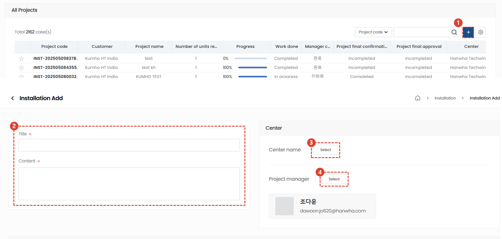
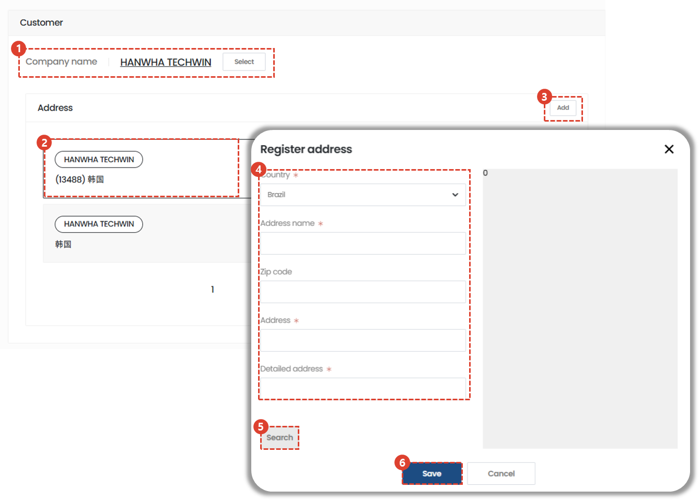
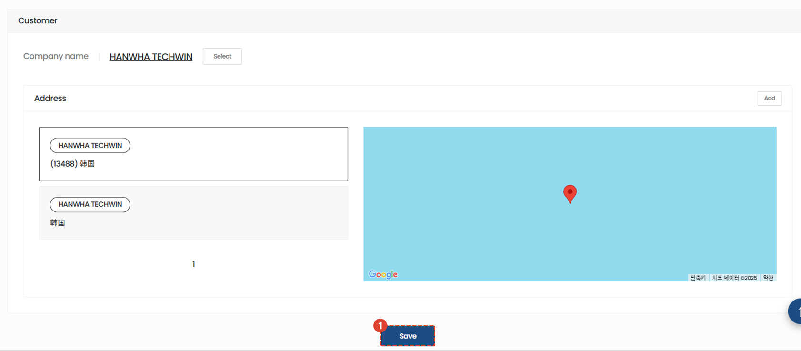

import ValidateTextByToken from "/src/utils/getQueryString.js";
import StrongTextParser from "/src/utils/textParser.js";
import text from "/src/locale/ko/SMT/tutorial-02-installation/01-create-project.json";

# Create a project

We guide you through the process of performing installation and commissioning work on assets delivered to customers.

<ValidateTextByToken dispTargetViewer={true} dispCaution={true} validTokenList={['head', 'branch', 'agent']}>

## Create a project - 1/3

1. Click the + button on the list.
1. Please enter your content
1. Select the center that will manage and carry out the installation and commissioning.
1. Select a project manager for the selected center.
 
 

## Create a project - 2/3

1. Select the customer company that will be the installation and test drive target.
1. Select where you want to perform the installation.
1. If there is no installation address, click the Add button to register the address.
1. Enter your address information.
1. After you finish entering your address and click the search button, the address will appear on the map.
1. Click the Save button.
 
 

## Create a project - 3/3

1. Click the Save button for the installation test drive project.

</ValidateTextByToken>
