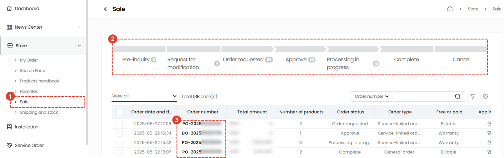
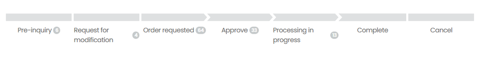
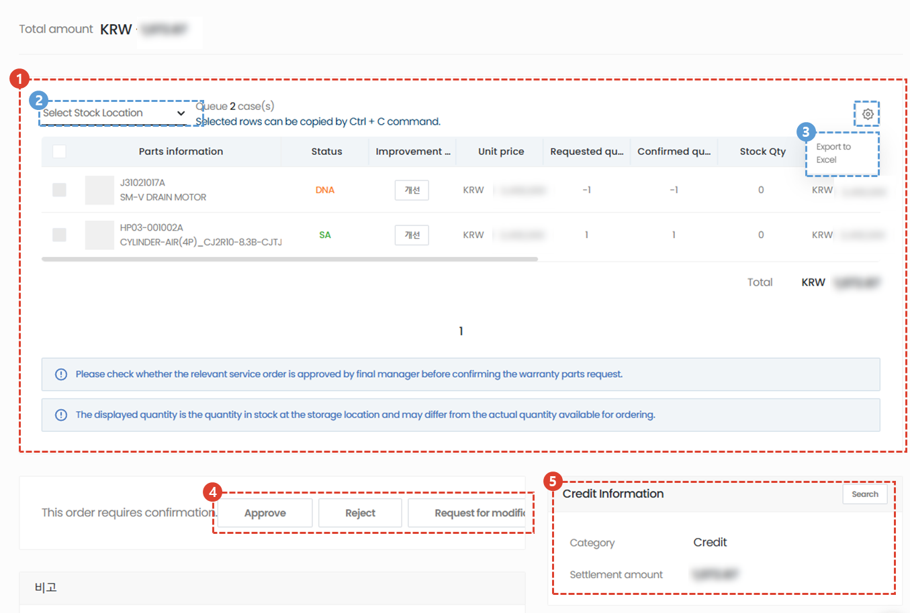
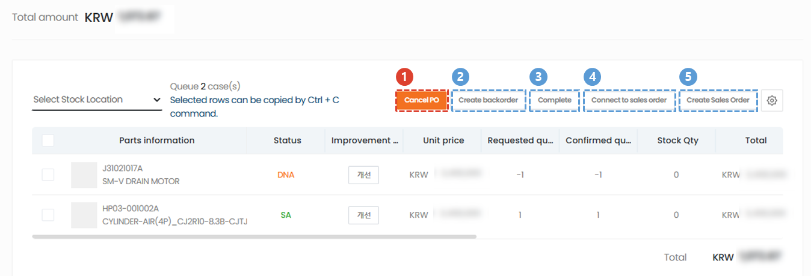
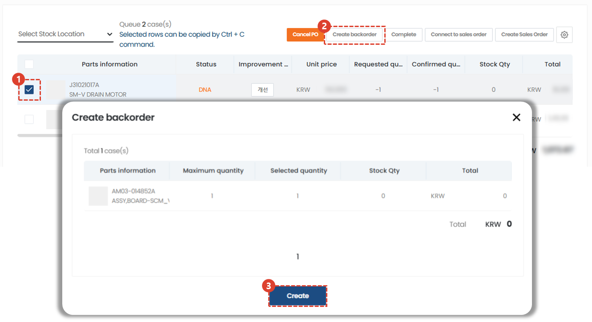
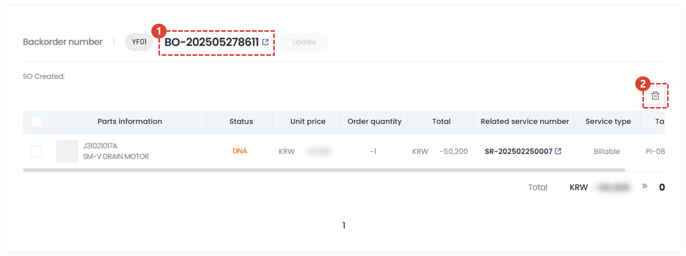
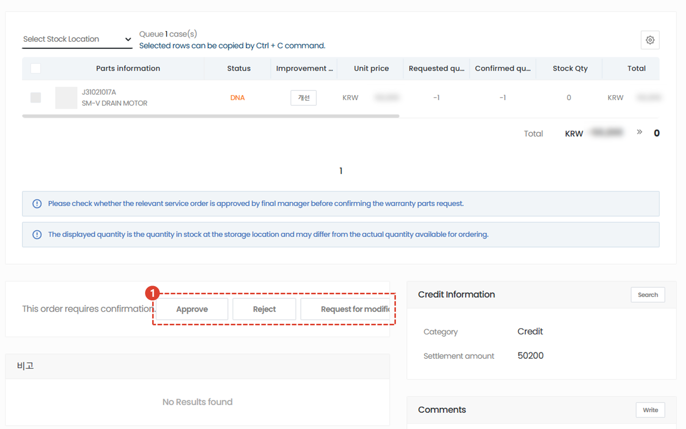
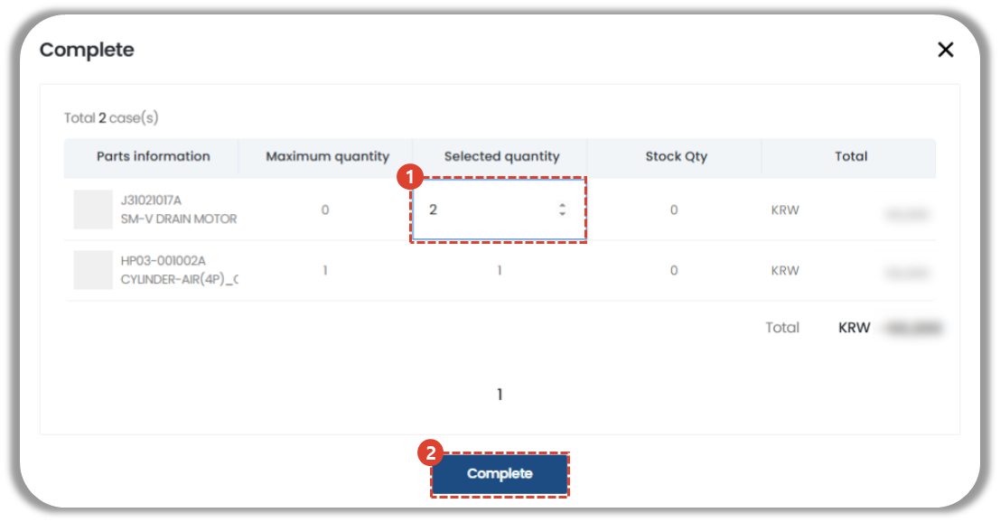
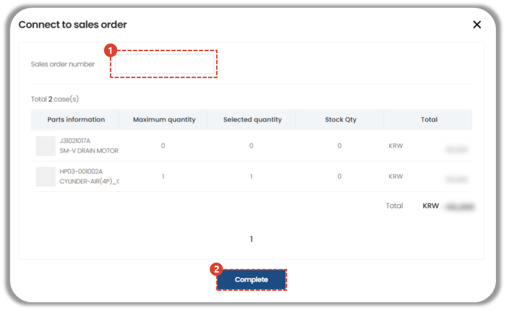
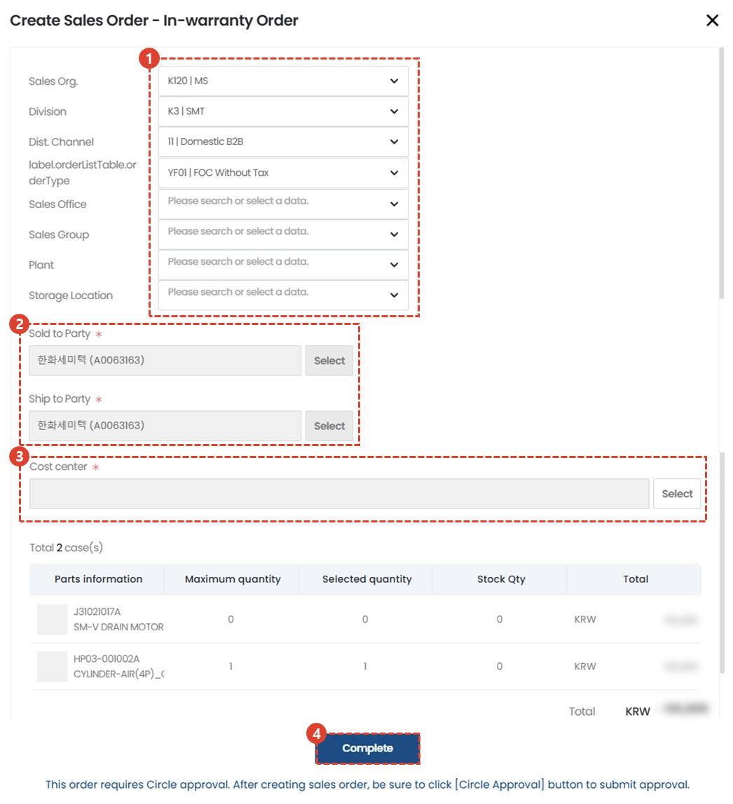

import ValidateTextByToken from "/src/utils/getQueryString.js";
import Cancle from "./img/057.png";
import back_order from "./img/058.png";
import circle from "./img/062.png";

# Oder processing

<ValidateTextByToken dispTargetViewer={true} dispCaution={false} validTokenList={['head', 'branch', 'seller', 'agent']}>
We will guide you through the processing procedure for received orders.
 
## Order list

1. Store - Select the Sales menu.
1. Check the status of your order in the order list.
    :::info
    The list of items that can be checked in the order list is as follows:
    - Order information
    - Order number
    - Total amount
    - Number of products
    - Order status
    - Order type
    - Paid/free distinction: Paid/free distinction is made based on the service order type, and the approval center staff can change it if necessary.
    - Application center
    - Approval center
    - Orderer information (name, email, mobile phone number)
    - Inquiry
    - Customer information (customer company name, customer company staff name, staff email and mobile phone number)
1. Click on the order number to enter the details page.
 
 

### Order Status

- Inquiry before ordering: This is a comment written while the buyer has temporarily saved the order form.
    :::warning
        A reply to the order processing manager's comments is required.
    :::
- Modification Request: This is an order in which the seller has requested the buyer to modify the order.
- Order Received: This is an order in which the buyer has received the order from the seller.
- Approved: This is an order approved by the seller.
- In Progress: This is displayed as In Progress when an SO is issued.
- Completed: This is displayed as Complete when a DO number is assigned to all order items.
- Cancelled: This is an order that has been cancelled.
</ValidateTextByToken>
 
 

## Oder processing - step 1
<ValidateTextByToken dispTargetViewer={false} dispCaution={true} validTokenList={['head', 'branch']}>

1. Check the information of the ordered item.
     You can check the part information, part status, whether it has been improved, unit price, requested quantity, confirmed quantity, stock Qty, total, related service number, service type, final administrator approval, target S/N, and notes from the list.
1. You can check the inventory of a specific material warehouse by selecting the Storage Location.
1. You can output the order list to Excel.
1. After you have confirmed the contents, choose whether to approve the order.
    - Approve: Approve the order. Click here to see the process after approval.
    - Reject: The order is rejected/cancelled.
    You must enter a reason for rejecting the order, and an email will be sent to the order writer when you enter it.
    - Modification request: Request to modify the order.
    You must enter a reason for requesting a modification (such as changing quantity, changing price, or changing part code), and an email will be sent to the order writer when you enter it.
1. You can check the buyer's credit information in relation to this.
 
 

## Oder processing - step 2

Approved orders can be processed in the following five ways:
1. **Cancle PO** : If there is a reason such as a change in the free or paid status of order information, you can cancel the PO.
    :::info
        

        If there is a reason such as a change in the order information, such as a change in the free or paid status, you can cancel the PO. Cancelled orders can be requested for modification and re-approval.
    :::
1. [**Create backorder**](#create-backorder) : Used when an intermediary seller needs to reorder parts from an order to the head office.
1. [**Complete**](#complete) : This button is used by non-corporate agency hubs to process orders received from other agencies. When the Complete Processing button is pressed, the order will be marked as completed to the buyer.
1. [**Connect to sales order**](#connect-to-sales-order) : Use this when you have already placed a sales order in SAP and want to enter the information.
1. [**Create Sales order**](#create-sales-order) : Use this when issuing a sales order based on this order form.
 
 

</ValidateTextByToken>

### Create backorder

<ValidateTextByToken dispTargetViewer={false} dispCaution={true} validTokenList={['head', 'branch', 'seller']}>

Backorder is a menu used by intermediaries (corporations or material bases such as Amtest) to respond to buyer's order request and then place an order with the head office to replenish inventory. Based on this order, an order is created for the head office.
:::info
Backorder creation is only possible when requesting free materials.
:::

1. Check the parts items to be ordered to the head office to secure inventory.
1. Click the Create Backorder button.
1. Check the quantity of parts to be created as a backorder. You can double-click the selected quantity to edit it. 
 Click the Create button to create a backorder.
    :::info
    

    Once the SO is saved, you must submit the Circle request by pressing the Circle Payment Submission button.
    :::
 
 

Once the backdoor is created, the order details will appear at the bottom of the parts list.
1. You can check the backorder details by clicking the backdoor number.
2. You can cancel a created backorder by clicking the Delete button.
</ValidateTextByToken>
 
 

<ValidateTextByToken dispTargetViewer={false} dispCaution={true} validTokenList={['head']}>
:::info

1. The head office material delivery manager will review the backorder information and then proceed with approval/rejection/modification request.
 The subsequent process is identical to creating a sales order.
:::
 
 
</ValidateTextByToken>

### Complete
<ValidateTextByToken dispTargetViewer={false} dispCaution={true} validTokenList={['head', 'branch', 'seller']}>
The Complete Process button is used by non-corporate agency hubs to process orders received from other agencies. Its purpose is to record the processing results.

1. Enter the quantity of parts to be ordered.  The maximum quantity is entered, and if modification is required, double-click to modify.
1. Click the Complete button to complete the process.
    :::warning
        

    :::
 
 
</ValidateTextByToken>

### Connect to sales order
<ValidateTextByToken dispTargetViewer={false} dispCaution={true} validTokenList={['head']}>

1.Enter the sales order number issued by the internal system.
1. Click the Complete button to link the sales order.
 
 
</ValidateTextByToken>

### Create Sales order
<ValidateTextByToken dispTargetViewer={false} dispCaution={true} validTokenList={['head']}>

1. Select values ​​for order issuance.
2. Select the company to which you will make payment and the company to which you will receive delivery.
3. Select a cost center.
4. Click the Done button. 
 
 
</ValidateTextByToken>