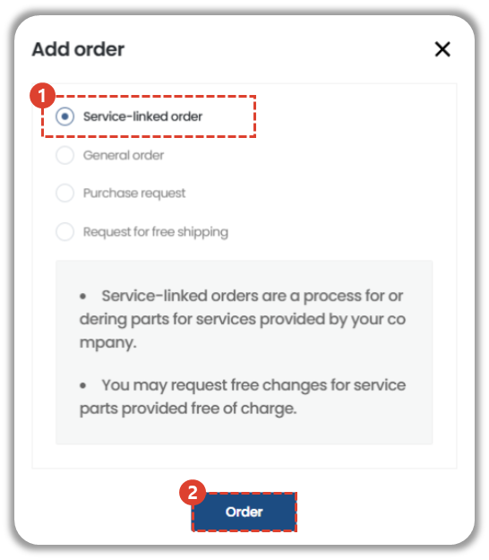
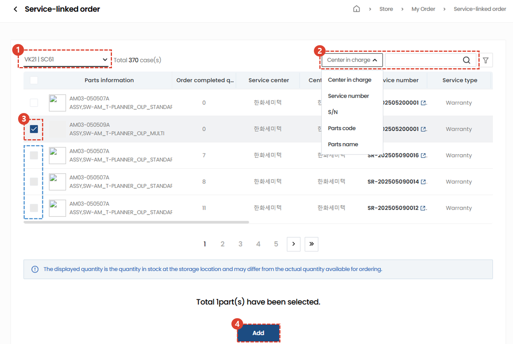
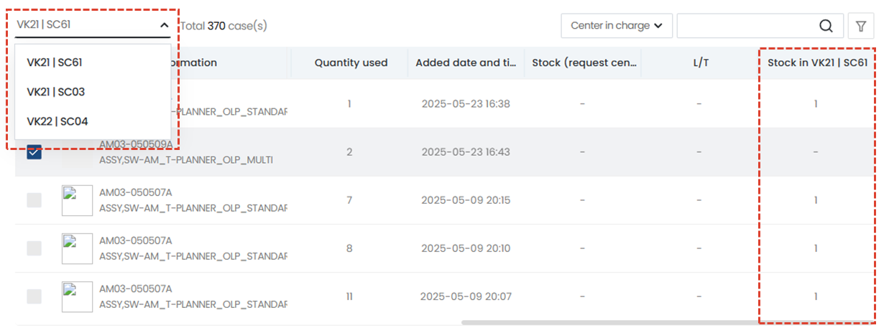
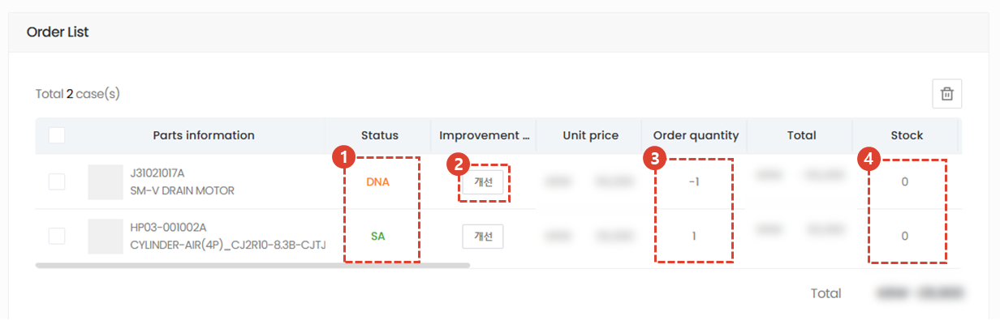
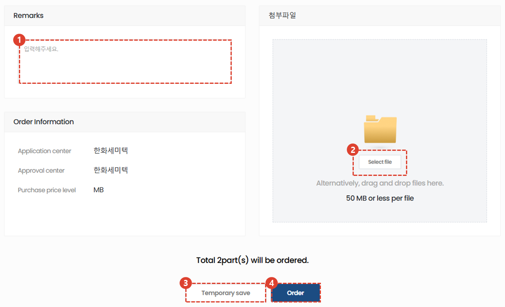
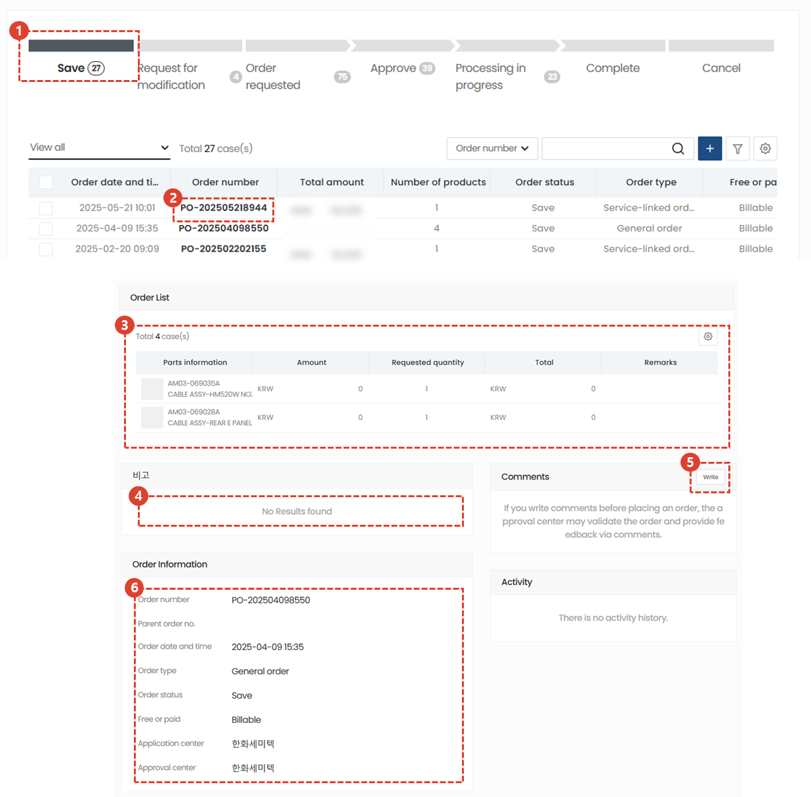
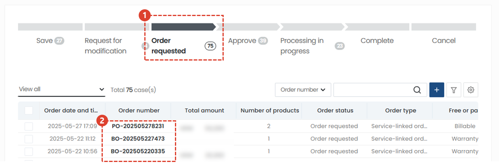
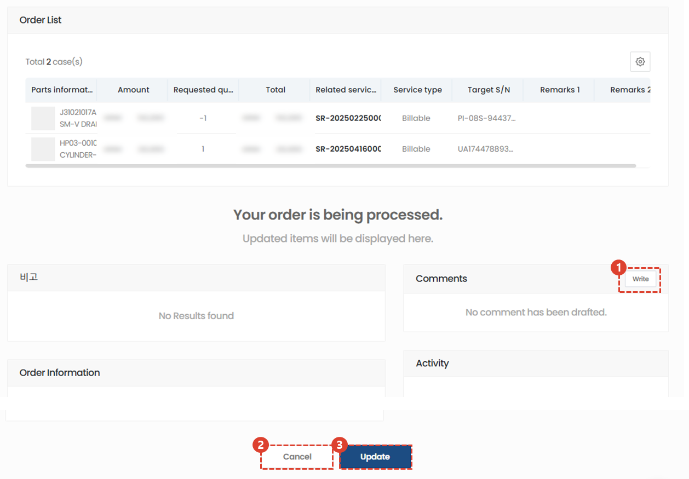

import ValidateTextByToken from "/src/utils/getQueryString.js";
import StrongTextParser from "/src/utils/textParser.js";
import text from "/src/locale/ko/SMT/tutorial-03-store/01-create-order-buyer.json";

# Service-linked order

<ValidateTextByToken dispTargetViewer={true} dispCaution={true} validTokenList={['head', 'branch', 'agent']}>

Creates paid/free orders for parts used in service order/installation/commissioning projects.
## Add order

1. Click Service-linked order button
1. Click order button
 
 

## Add Parts

1. Select a Storage Location to check inventory in a specific materials warehouse.
    :::info
        When you select a Storage Location, you can check the inventory held in that warehouse.
         예) **Business unit code**|**Storage Location** : **VK21**|**SC03**
        
    :::
1. Detailed searches are possible using the responsible center, service number, S/N, part code, and part name.
1. Select the item for which you wish to proceed with the service linking order.
:::note
By default, the checkbox is enabled. Parts that have already been added to that service will have their checkbox disabled.
:::
1. Click the Add button to add a part.
 
 

## Check order list and enter additional information

1. If the value of the Status column is SNA/DNA, the order cannot be processed.
    - If the status is No Information, it means that the material manager has not updated yet, so you can proceed.
1. For SNA/DNA, you can check the improvements.
1. You can check the order quantity and double-click to modify it.
1. You can edit the notes by double-clicking them.
1. You can check the inventory quantity in the Seller Center.
 
 

## Enter additional information and create an order form

1. Enter the overall remarks for the order form.
1. If you have an attachment, add the file.
1. If the order is not confirmed, click Save Draft. If you click the Save Draft button, the entered data will not be lost even if you leave the page.
:::info
    
    1. For draft orders, they will remain in the save stage in the list.
    1. You can check your saved orders.
    1. The order list and notes column cannot be modified. To modify, click the Modify button at the bottom.
    1. Enter a message to communicate with the seller.
    1. Order information is displayed.
    1. To process a temporarily saved order, click the Edit button, then click the Order button on the edit page that appears.
:::

4. To create an order, click the Order button.
 
 

## Order requested

1. For orders that have been completed, the order will remain in the Order Received stage on the list.
1. You can check your order by clicking on the order number.
 
 

1. Enter a message to communicate with the seller.
1. You can modify your order until the seller approves it.
1. Orders may be cancelled until the seller approves the order.
</ValidateTextByToken>
