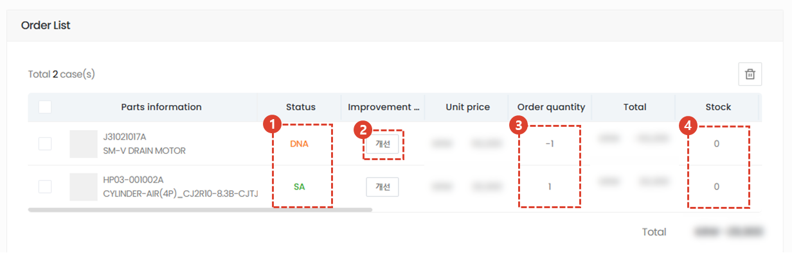

import ValidateTextByToken from "/src/utils/getQueryString.js";
import StrongTextParser from "/src/utils/textParser.js";
import text from "/src/locale/ko/SMT/tutorial-03-store/01-create-order-buyer.json";

# General order
<ValidateTextByToken dispTargetViewer={true} dispCaution={true} validTokenList={['head', 'branch', 'agent']}>
General order is a procedure for ordering (paid PO) by directly adding parts that are not related to the service.
 This is a general paid service parts order menu that adds parts through direct input, import from the interest list, Excel upload, etc.
 
 

## Add order

1. Click the General Order button.
1. Click order button
 
 

## Add Parts

1. You can add PO application parts by searching for part codes.
    :::info
     → Searched normally 
     → Not searching normally (cannot proceed)
    :::
1. Enter the quantity.
1. Enter any special details related to the part you are applying for.
     Example) Related documents, special parts information, delivery address, etc.
1. It will be added when you press the Add button.
1. Bulk upload is possible via Excel.
:::note

1. You can get the excel form. 
1. Add a file by entering data into Excel.  
    - (Required Input)**Parts Code** : Enter the part code.
    - (Required Input)**Quantity** : Enter the number of parts.
    - **Price** : Enter Special Price only when selling at a price other than the regular price. If not entered, the regular price will be automatically applied.
    - **Remarks** : Enter the note details.
:::
 
 

## Check order list and enter information

1. If the value of the Status column is SNA/DNA, the order cannot be processed.
    - If the status is No Information, it means that the material manager has not updated yet, so you can proceed.
1. For SNA/DNA, you can check the improvements. **(TBD)**
1. You can check the order quantity and double-click to modify it.
1. You can check the inventory quantity in the Seller Center.
:::info
    The list list displays parts information/status/improvement status/unit price/order quantity/total/stock as well as responsible center/remarks/MOQ and L/T.
:::
 
 

## Enter additional information and create

1. Enter the overall remarks for the order form.
1. If you have an attachment, add the file.
1. If the order is not confirmed, click Save Draft. If you click the Save Draft button, the entered data will not be lost even if you leave the page.
:::info
    
    1. For draft orders, they will remain in the save stage in the list.
    1. You can check your saved orders.
    1. The order list and notes column cannot be modified. To modify, click the Modify button at the bottom.
    1. Enter a message to communicate with the seller.
    1. Order information is displayed.
    1. To process a temporarily saved order, click the Edit button, then click the Order button on the edit page that appears.
:::
1.To create an order, click the Order button.
 
 

## Order completed

1. For orders that have been completed, the order will remain in the Order Received stage on the list.
1. You can check your order by clicking on the order number.
 
 

1. Enter a message to communicate with the seller.
1. You can modify your order until the seller approves it.
1. Orders may be cancelled until the seller approves the order.
 
 

</ValidateTextByToken>
