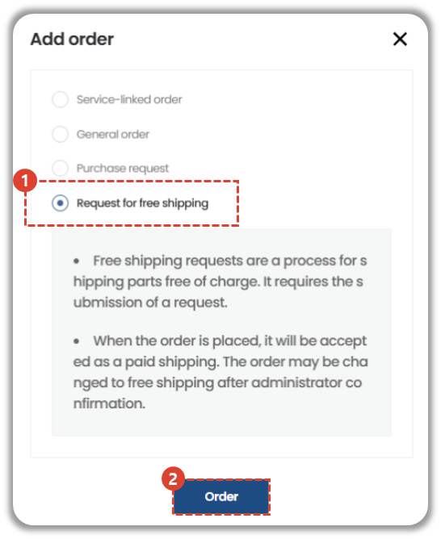
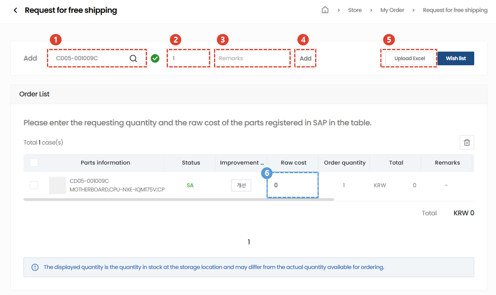
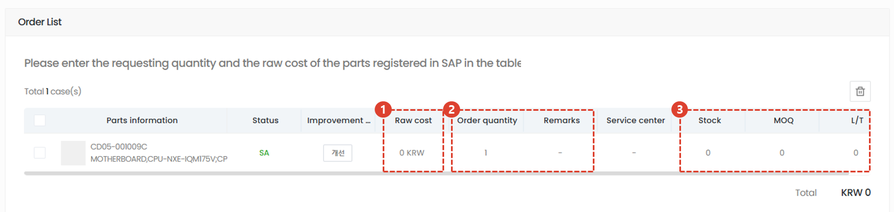
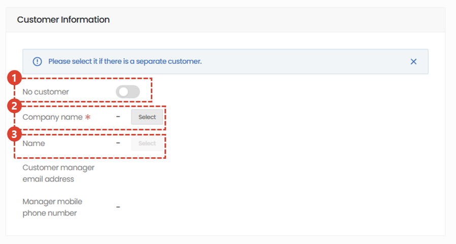
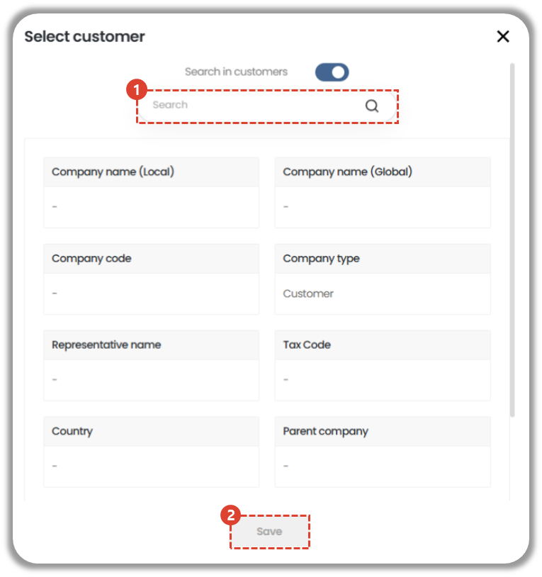
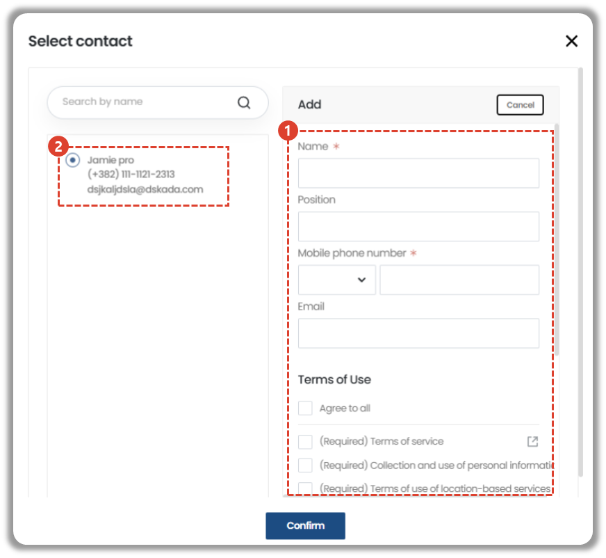
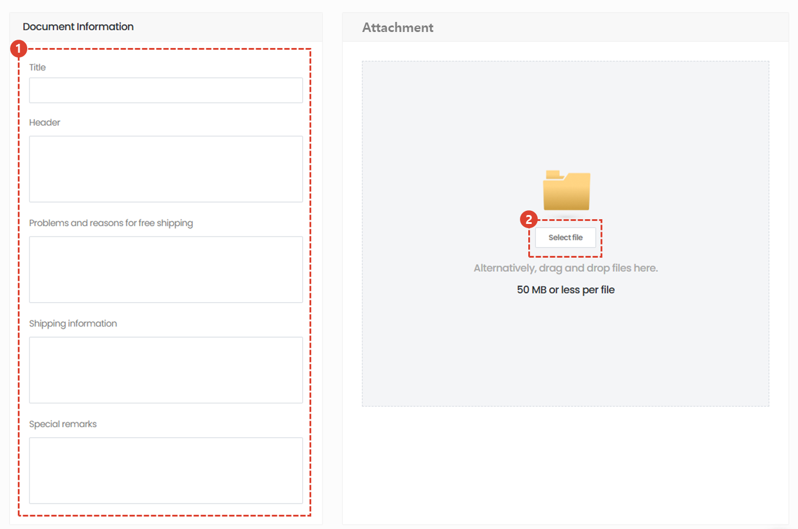
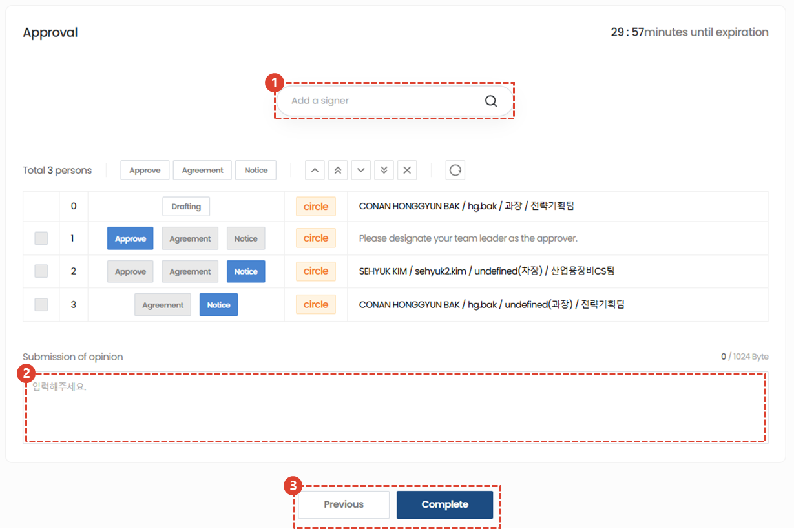

import ValidateTextByToken from "/src/utils/getQueryString.js";
import StrongTextParser from "/src/utils/textParser.js";
import text from "/src/locale/ko/SMT/tutorial-03-store/01-create-order-buyer.json";

# Request for free shipping
Although this is not a service-related order, it is used in special situations where materials must be shipped free of charge. 

<ValidateTextByToken dispTargetViewer={true} dispCaution={true} validTokenList={['head', 'branch']}>

1. Select Request for free shipping.
1. Click order button
 
 

### Add Parts

1. You can add PO application parts by searching the part code..
    -  → Searched normally
    -  → Not searching normally (cannot proceed)
1. Enter the quantity.
1. Enter any special details related to the part you are applying for. 
     Example) Related documents, special parts information, delivery address, etc.
1. It will be added when you press the Add button.
1. Bulk upload is possible via Excel.
1. For free shipping inquiries, please enter the cost price registered in SAP.
 
 

## Check the order parts list

1. The cost can be modified by double-clicking it.
1. You can also double-click on the order quantity and notes to edit them.
1. You can check the inventory, MOQ, and L/T (Lead Time) of the material approval center of the orderer (draft originator) by linking with the company's internal system.
 
 

## Add information

1. If there is no customer information, enable the toggle button.
 For material orders from training centers, etc., select No Customer.
2. Click the [Select] button to load customer information. (Required)
3. Click the [Select] button to retrieve the customer company's contact information. (Optional value)
 
 

## Add information - Selct customer

1. Search by entering the customer name.
1. Click save button
 
 

## Add information - Select a customer representative

1. If there is no contact information in the list, enter the customer contact information to register.
1. Select the added contact person from the list.
 
 

## Writing a proposal

1. Enter the product information.
2. If you have an attachment, please attach the file.
 
 

## The person who is the best

1. Search for payment lines (circle users are searched).
1. Enter your opinion on the product.
1. Click complete button
</ValidateTextByToken>