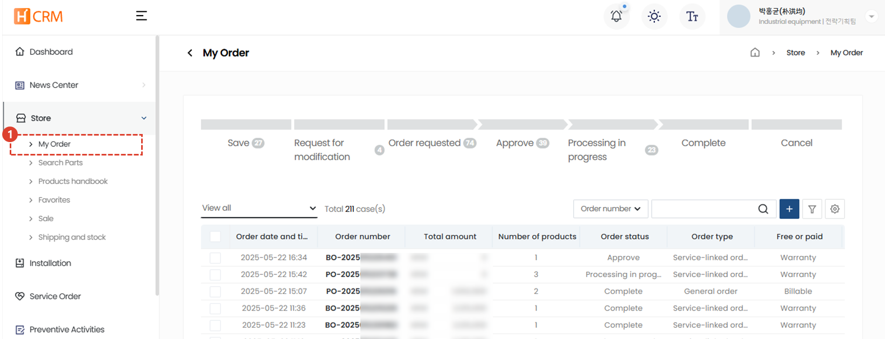
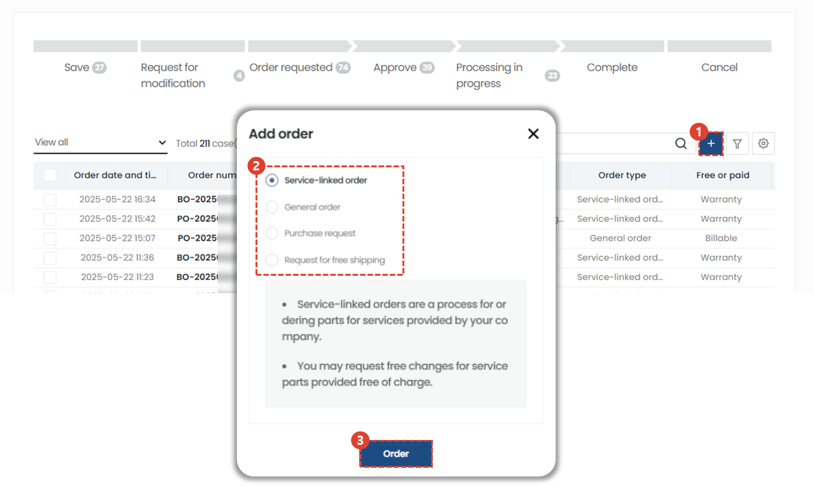

import ValidateTextByToken from "/src/utils/getQueryString.js";
import StrongTextParser from "/src/utils/textParser.js";
import text from "/src/locale/ko/SMT/tutorial-03-store/01-create-order-buyer.json";

# My Order

Guide to the My Orders menu in the store.

<ValidateTextByToken dispTargetViewer={true} dispCaution={true} validTokenList={['head', 'branch', 'agent']} >

## Order List

1. Store - Select the My Orders menu.
1. View the order list.
 
 

## Order List - Order Status

- Save: The order is currently saved temporarily.
- Request for Modification: An order in which the seller has requested the buyer to make a modification.
- Order requested: An order that has been created by the customer and received by the seller.
- Approve: An order that has been approved by the seller.
- Precessing in progress: An order is an order that has been approved and is in the process of being delivered to the purchaser.
- Complete: This is an order form that has been delivered to the customer.
- Cancle: This is an order that has been cancelled by the customer.
 
 

## Create an order

1. Click the + button to create an order form.
1. Choose one of four types of order creation methods:
    - Service-linked order : When ordering parts used in service orders (especially when requesting free materials), use it.
    - General order: Used when creating a general paid PO.
    - Purchase request: This menu is for corporate users. This menu is used when creating a paid PO for a corporation.
    - Request for free shipping: (For head office use only) You can think of it as creating a general free shipping request written in a circle in CRM.
1. After selecting the type, click the Order button.

</ValidateTextByToken>
