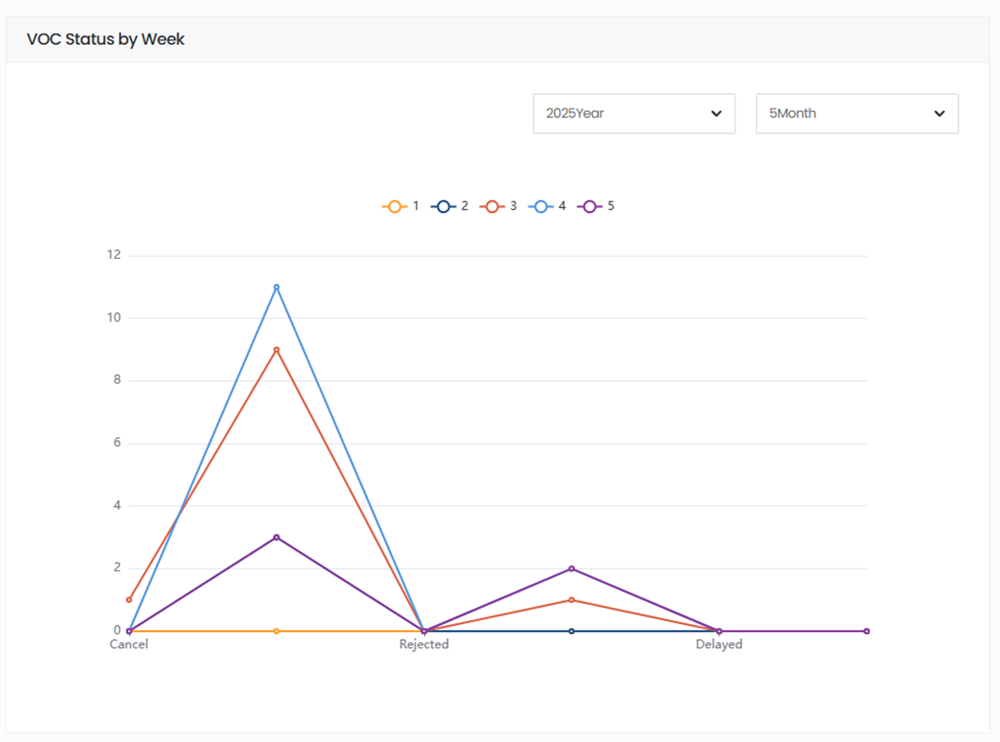
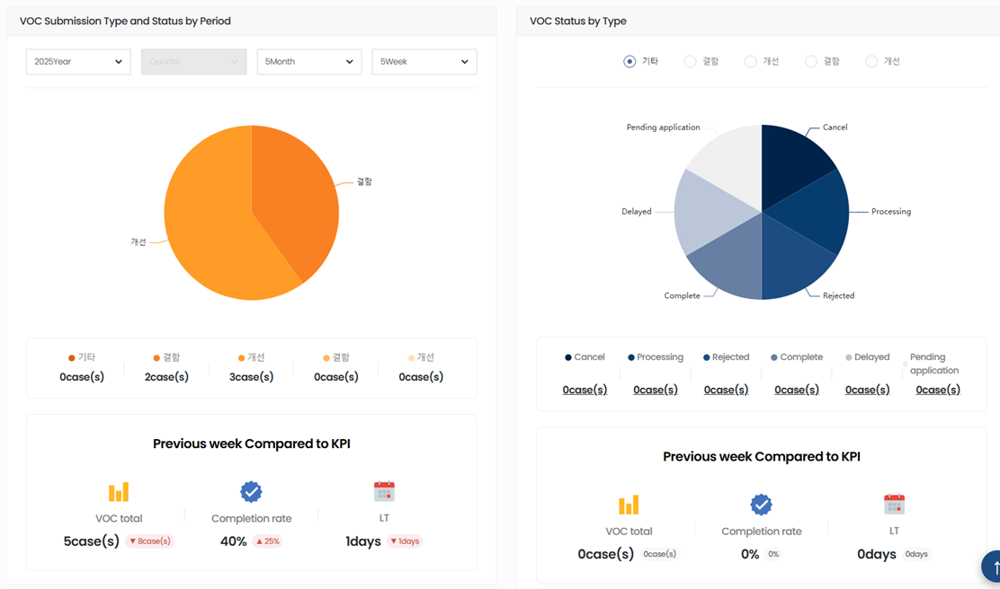

import ValidateTextByToken from "/src/utils/getQueryString.js";

# Outline

<ValidateTextByToken dispTargetViewer={true} dispCaution={false} validTokenList={['head']}>
The VOC dashboard allows you to check the progress of your VOC.

 
 

## Status of indicators
### Status by parking lot
 
Displays the status of VOC reception and processing by week.
 
 

### Status by period and type
 
Displays the status of VOC receipt and processing by period or type.
</ValidateTextByToken>