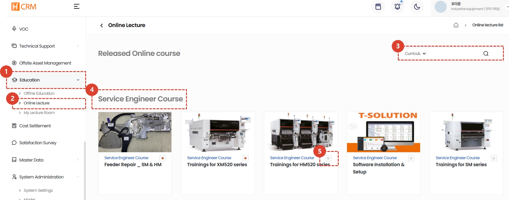
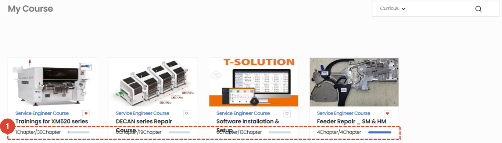
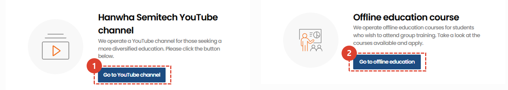
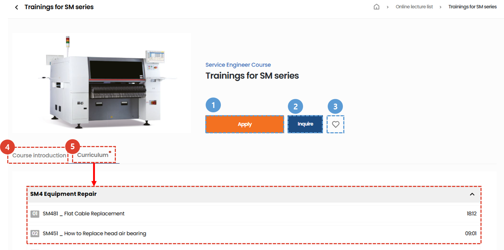
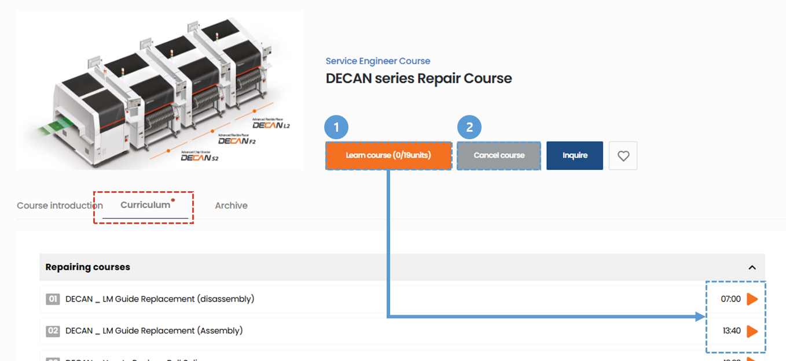
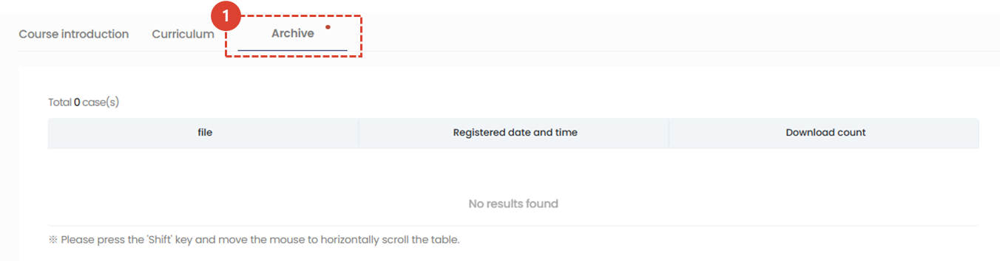
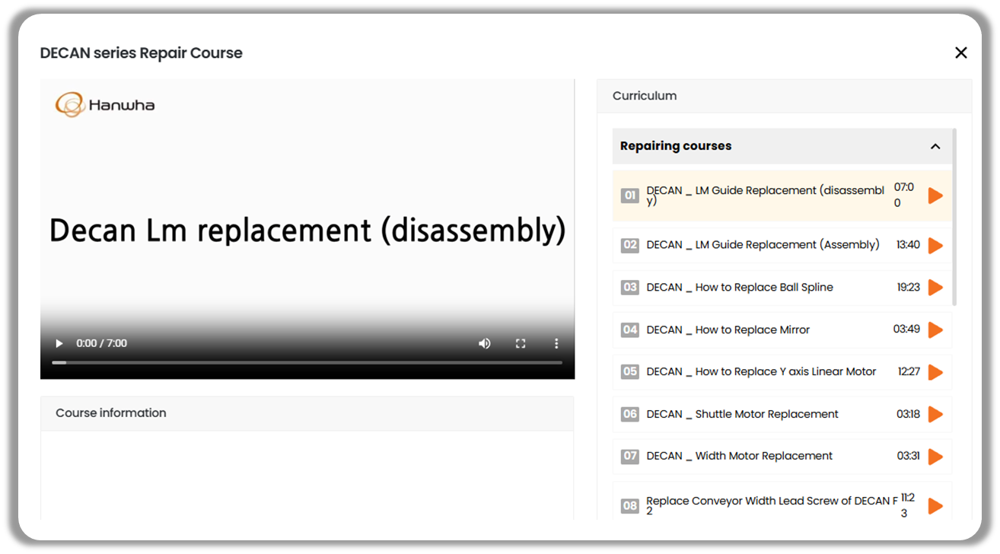
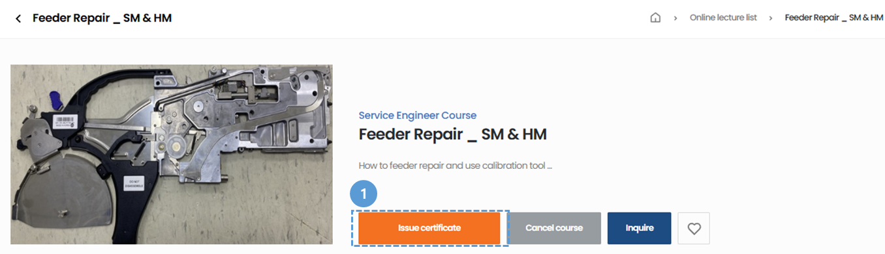
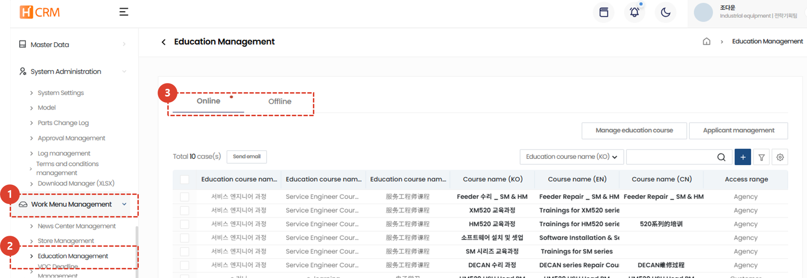

import ValidateTextByToken from "/src/utils/getQueryString.js";
import qna from "./img/005.png";
import Popup1 from "./img/014.png";
import Popup2 from "./img/016.png";
import Popup3 from "./img/018.png";

# Online Education
Introduction to online courses and guidance on how to register

<ValidateTextByToken dispTargetViewer={true} dispCaution={true} validTokenList={['head', 'branch', 'seller', 'agent', 'customer']}>

## List of online training courses
### Online courses

1. Click the **Education** menu.
1. Click the **Online Education** menu to view available online courses.
1. Select a course type from the Selectbox and search using your desired keyword.
1. This is a list of online courses. Click the title to go to the course details page.
1. Click the **♡** button to save the course to **My Classroom > My Interested Courses**.
 
 

### My Course

1. Here's a list of courses you're currently enrolled in. Click on a course title to go to its details page and check your course status.
 
 

### YouTube and group training

1. Click the **Go to YouTube Channel** button to go to the Hanwha Precision Machinery YouTube channel.
1. Click the [**Go to Group Training**](./02-offline-lecture.md) button to go to the group training page.
 
 

## Course Details
### Before Applying

1. Click the **Course Registration** button to register for the course.
1. Clicking the **Contact Us** button will open the online education inquiry page in a new tab. You can submit your inquiry there.
    :::info
    

    Once you've completed and saved your inquiry, the training staff will review it and send you a response.
    :::
1. Clicking the **♡** button will save the course to [My Classroom > My Interested Courses](./03-my-lecture.md).
1. Click the **Course Introduction** tab to view an introduction to the course.
1. Select the **Curriculum** tab to view a list of videos for the course.
 
 

### After registering for the course

1. You can play Clicking the lecture by clicking the **Enroll** button or the **Play** button in the curriculum.
1. You can cancel your registration by clicking the **Cancel Registration** button.
    :::warning
    

    If you cancel a course, **all your registration records for that course will be deleted**.  
    :::
1. You can move by selecting the Course Introduction / Curriculum / Resource Room tab.
 
 

1. You can download the materials shared by the training manager by clicking on the material name.
 
 

1. You can check the list of currently enrolled courses and the curriculum on the course registration screen.
    :::warning
    

     After completing the video course, you must click the **Confirm** button in the course completion pop-up to **complete the course**.
    :::
    :::tip
    Once you've completed all courses, a pop-up will appear with instructions for issuing a certificate of completion.
     Clicking the **Confirm** button will take you to the certificate issuance page. (To be developed)
    :::
 
 

### Course completed

1. If you complete all courses, the "Issue Certificate" button will be activated, allowing you to download your certificate. (To be developed)
</ValidateTextByToken>

<ValidateTextByToken dispTargetViewer={true} dispCaution={false} validTokenList={['head']}>

## Online Education Management
:::info
This guide explains how to **create courses and manage students after a course**.
:::

1. Click **Task Management**.
1. Click **Training Management**.
1. Click the[**Online Training Courses**](/SMT/tutorial-13-task-management/02-manage-training.md) tab to manage training courses, training locations, and participants.
</ValidateTextByToken>