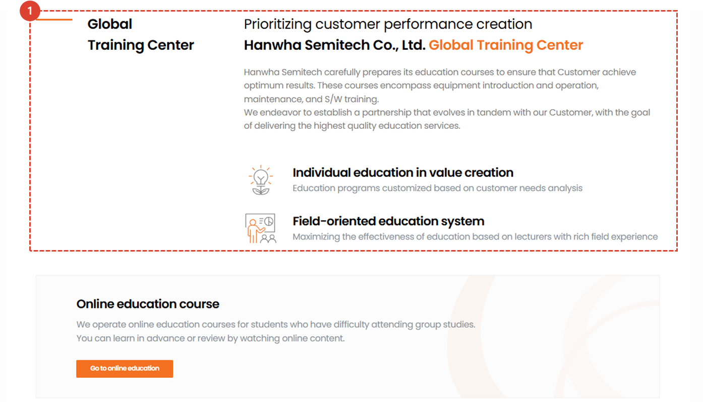
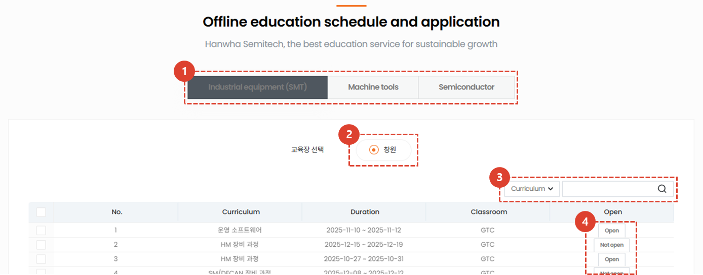
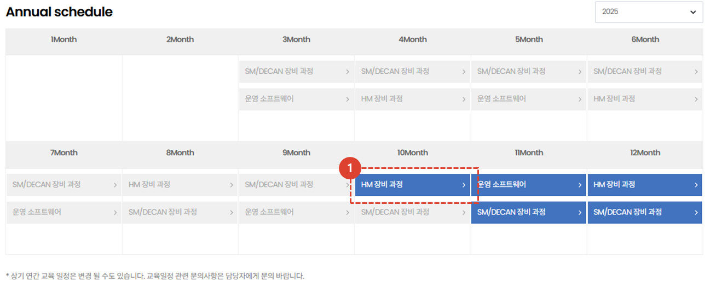
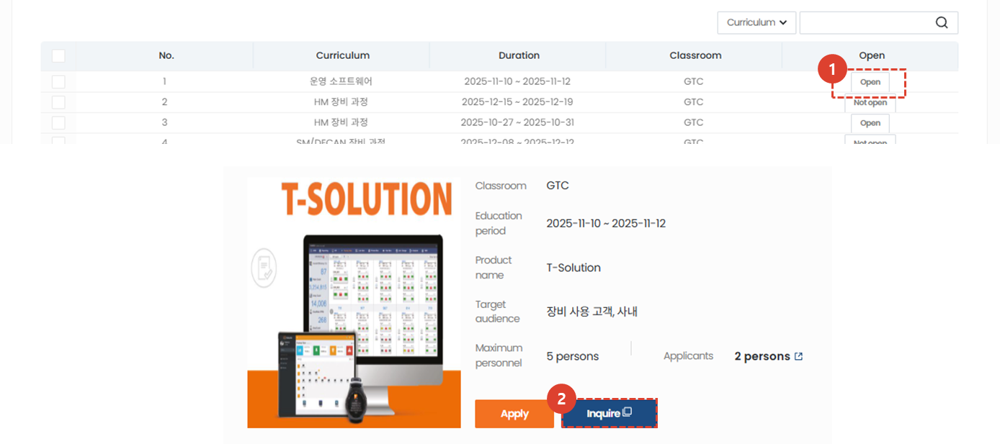
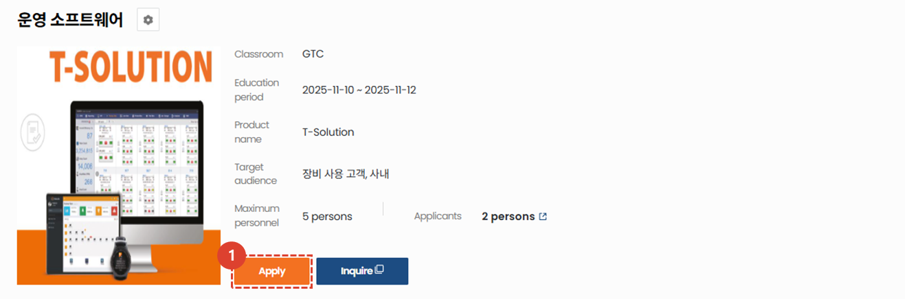
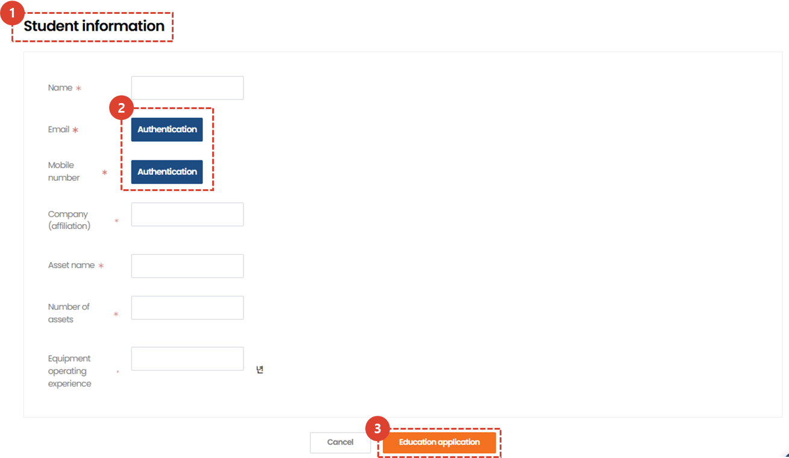

import ValidateTextByToken from "/src/utils/getQueryString.js";
import qna from "./img/005.png";

# Group Training
This section provides an introduction to group training (offline training) courses and explains the registration process.
<ValidateTextByToken dispTargetViewer={true} dispCaution={false} validTokenList={['head', 'branch', 'seller', 'agent', 'customer']}>

## Main Page
### Introduction

1. Introduction to the group lecture page.
1. Click the [**Go to Online Lecture**](./01-online-lecture.md) button to go to the online lecture page.
 
 

### Group training schedule and application

1. You can select a **business division**.
1. You can select your desired **training location**.
1. Here's a list of offline training programs currently available, based on your selected business division and training location. Clicking [**Apply**](#detail-page) will take you to the details page.
1. After selecting the type in the Selectbox, you can **search** using your desired keyword.
 
 

### Annual Schedule

1. You can view the annual schedule at a glance. Click [**Course Title**](#training-application) to go to the details page.
1. You can view the annual schedule by year.
 
 

## Detail Page
### List

1. Clicking the **Apply** button will take you to the [**Training Application Page**](#training-application).
    :::tip
    - You cannot click the Apply button outside of the training application period.
    :::
1. Clicking the **Contact Us** button will open the inquiry page in a new tab. You can submit your inquiry there.
    :::info
    

    Once you've written and saved your inquiry, the training staff will review it and send you a response.
    :::
 
 

### Training Application

1. Clicking the **Apply** button will take you to the [Application Page](#application-page).
::tip
- You cannot click the Apply button outside of the training application period.
:::
 
 

### Application Page

1. You must enter your applicant information for offline training.
1. You must verify your email address and phone number.
1. After entering all required information, click the "Apply for Training" button to complete your offline training application. The application results will be sent to the applicant's email address after administrator review.
</ValidateTextByToken>

<ValidateTextByToken dispTargetViewer={true} dispCaution={false} validTokenList={['head']}>

## Group training management
:::info
We provide guidance on **Course creation and student management after training** for group training.
:::

1. Click **Task Menu Management**.
1. Click **Training Management**.
1. Click the [**Group Training Courses tab**](/SMT/tutorial-13-task-management/02-manage-training.md) to manage training courses, locations, and participants.
</ValidateTextByToken>