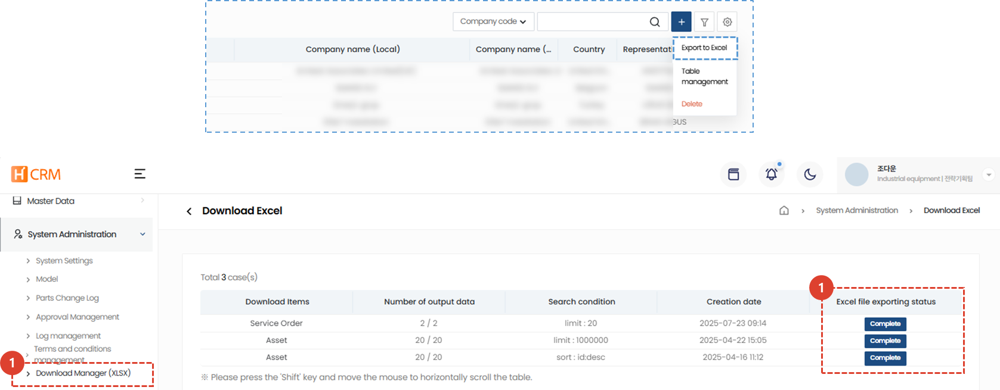

import ValidateTextByToken from "/src/utils/getQueryString.js";

# Excel Download

This page guides you to review and download the list extracted from H-CRM in Excel.

<ValidateTextByToken dispTargetViewer={true} dispCaution={false} validTokenList={['head', 'branch', 'seller', 'agent', 'customer']}>

1. Select **Download Excel** from the **System Management** tab. You can check the extracted data by clicking **Excel Output** within ServiceCRM.
1. If the Excel extraction status is **Completed**, click to download.

</ValidateTextByToken>