import ValidateTextByToken from "/src/utils/getQueryString.js";
import filterList from "./img/002.png";
import searchList from "./img/017.png";
import tableFilter from "./img/006.png";
import createLabor from "./img/013.png";
import filter1 from "./img/126.png";
import filter2 from "./img/057.png";
import filter3 from "./img/128.png";
import filter4 from "./img/059.png";
import table1 from "./img/129.png";
import table2 from "./img/061.png";
import popup1 from "./img/064.png";
import popup2 from "./img/066.png";
import popup3 from "./img/070.png";
import popup4 from "./img/074.png";

# Customer

Guide to managing Customer data.

<ValidateTextByToken dispTargetViewer={true} dispCaution={false} validTokenList={['head', 'branch', 'seller', 'agent']}>

## List Page
    :::tip The data below will be displayed in the list
        The **Registered Channel** column displays the location where the data was generated.
        - **MDG**: Customer information numbered from MDG
        - **4CUST**: Customer information migrated from the 4CUST system
        - **CRM**: Customer information created in the H-CRM service module
        - **SALES-CRM**: Customer information created in the H-CRM sales module
    :::
 
 

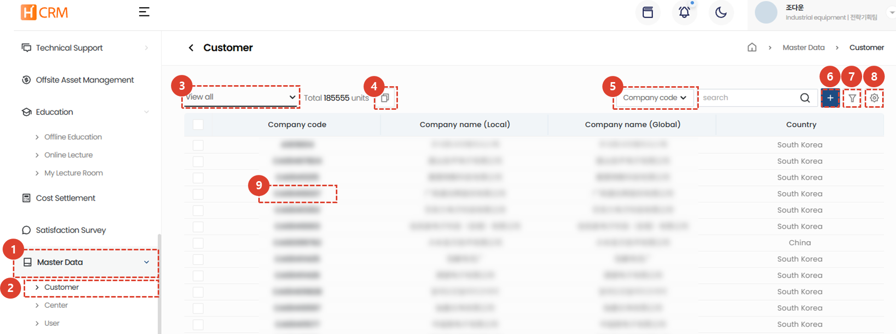
1. Click the **Standard Information** menu.
1. Click the **Customer** menu to display a list of customer data.
1. Use [**List Filtering**](#list-filtering) to display only customers that meet specific criteria.
1. You can [**Connect Customer Codes**](#linking-customer-codes) for multiple customers of the same customer.
1. Enter a [**Search Term**](#search) to search for the desired data.
1. You can **Create a New Customer**.
1. You can search for data by entering [**Multiple Filters**](#advanced-search).
1. You can [**Excel Export**](#excel-export), [**Table Management**](#table-management), or [**Delete**](#delete) customer information.
1. Click [**Customer Code**](#detail-page) to view detailed customer information.
 
 

### List Filtering
:::tip
Here's how to filter by user/department or by recent entries.
:::
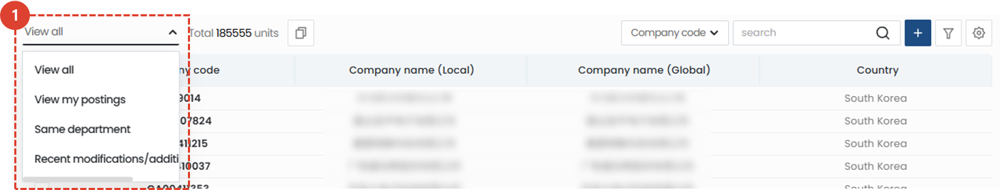
1. Select your desired filtering method. The corresponding list will appear immediately after selection.
 
 

### Search
:::tip
Here's how to search tables.
:::

1. Select a search filter and then search.
 
 

### Advanced Search
:::tip
Here's how to apply **multiple** search filters.
:::
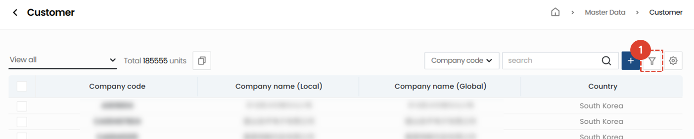
1. Click the **Filter button**.
 
 

1. Select a filter.
1. Enter a search term.
1. Click the **+** button to add search terms.
1. Click the **Search** button to view the results.
 
 

### Excel Export
:::tip
Here's how to export a list to Excel.
:::

1. Click the Excel export button.
 
 

1. Select **Output Options**.
1. Click the **OK** button, then access the [**System Management > Excel Download**](/SMT/tutorial-12-system-management/03-export-data.md) menu to download the Excel file.
 
 
 
### Table Management
:::tip
This guide explains how to display columns, change the columns displayed, and change their order.
:::

1. Click **Table Management** to change the items and order displayed in the table.
 
 

1. Click the toggle button for the items you want to appear in the table so that they turn blue.
1. You can drag the list icons to change the column positions.
1. Click **Close** to change the table to reflect the selected content.
 
 

### Delete
:::warning
Here are instructions for deleting your customer account.
 Please proceed with caution, as deletion is **difficult to recover**.
:::

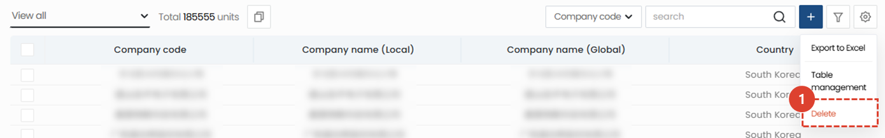
1. Click the **gear** button.
1. Click the **delete** button.
 
 

1. Click the **Delete** button in the pop-up window to delete the customer.
 
 

## Customer Registration
:::warning
When registering a new customer, please ensure that there are no existing registered customers to avoid duplicate registrations.
:::
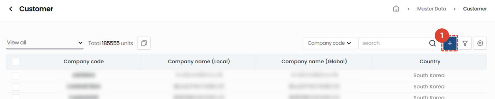
1. Click the **+** button.
 
 

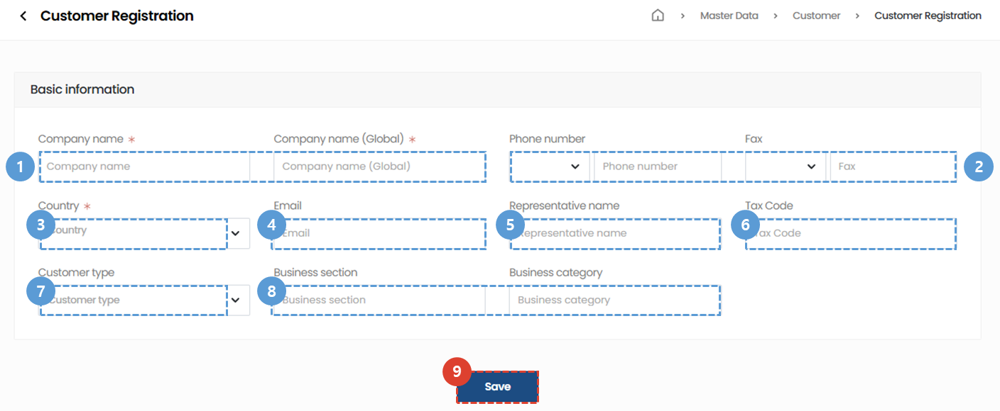
1. Enter the **Company Name** you wish to register.
1. Enter your **Phone Number** and **Fax Number**.
1. Select the **Country** of the customer you wish to register.
    :::warning
    Please enter the location where the equipment will be installed, not the country where the customer's headquarters is located.
    :::
1. Enter the **Email** of the customer contact person.
1. Enter the **Representative Name**.
1. Enter the **Business Registration Number**.
1. Select the **Customer Type**.
1. Select the **Industry** and **Business Type**.
1. Click the **Save** button to complete customer registration.
 
 

## Linking Customer Codes
:::tip
**If you have multiple registered customers,** we'll show you how to link them together into a single customer.**
 This prevents issues with order history or assets being scattered across multiple registrations.
:::

### On the list page
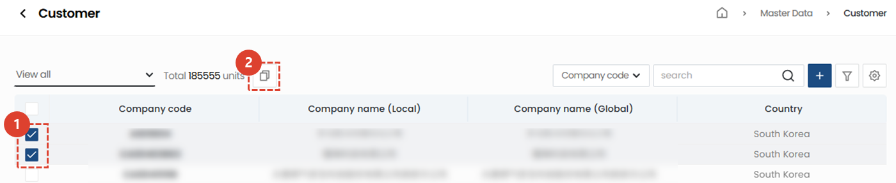
1. **Check** multiple customers you need to bundle.
1. Click the **copy icon**.
 
 

1. Click the **Confirm** button to complete the customer connection.
 
 

### On the details page
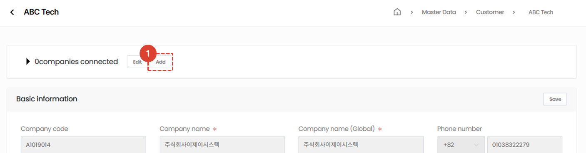
1. Click the **Add** button to select the customer to connect. 
 
 

1. Search for the client you want to connect to.
1. After confirming that the search results are correct, click the **Save** button.
:::tip
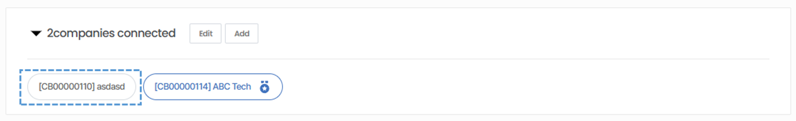
Once the customer connection is complete, it will be displayed as above. 
:::
 
 

### Change of representative company
:::info
Here's how to change the company you want to display as the representative among your linked companies.
:::
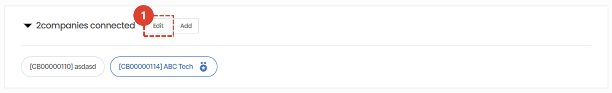
1. Click the **Edit** button.
 
 

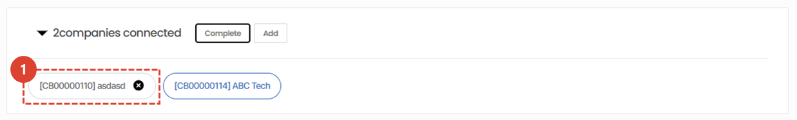
1. **Select** a representative company.
 
 

1. Click the **Change** button.
 
 

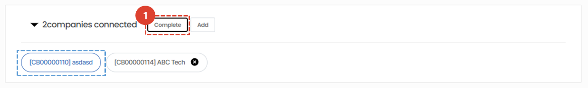
1. Click the **Finish** button.
:::info
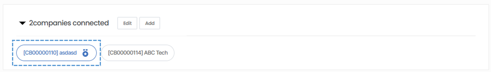
The customer designated as a representative is displayed as in the image above.
:::
 
 

## Detail Page
### Basic Information
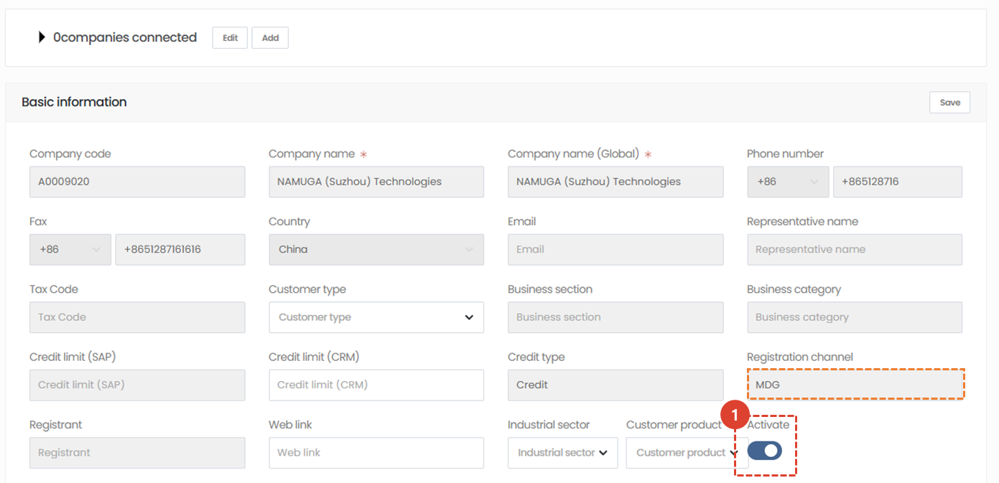
:::warning
Most basic information for customers registered in MDG cannot be modified.
 Any changes to basic information not marked in blue must be **made in MDG**.
:::

1. Only customers with the Activation checkbox can be searched for in service orders, technical support, etc.
 For customers no longer providing services, deactivate the Activation button.
 
 

### Additional Information - Address
:::warning
If you access a domain in China, the map UI will not be displayed.
:::

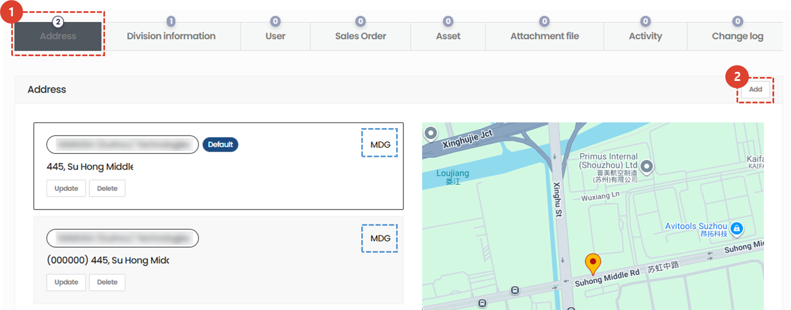
1. Click the **Address** tab in Additional Information to display the address information registered with your company.
    :::tip
    The registered channel for the address is displayed as a blue box.
    :::
1. Click the **Add** button to add a new customer address.
    :::info How to Add a New Customer Address
        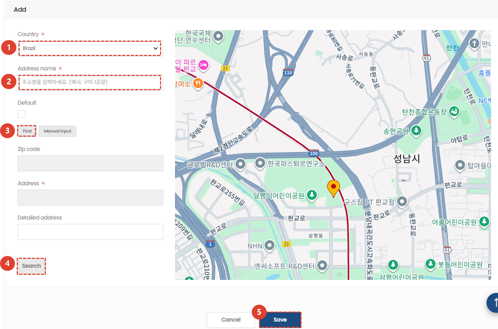
        1. Add the **Country** of the address you wish to register.
        1. Enter the **Address Name**.
        1. Click the **Find** button to search for an address.
        1. After searching or manually entering the address, click the **Search** button to view the map.
        1. Click the **Save** button to complete address registration.
    :::
 
 

### Additional Information - Organization Information
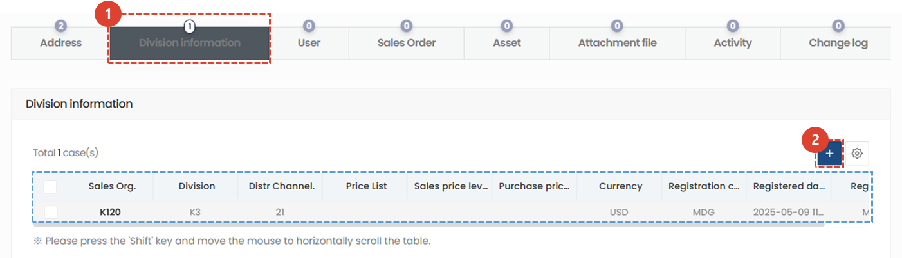
1. Click the **Organization Information** tab to view registered organization information.
1. If additional organization information is needed, click the **+** button to add it.
    :::info
    The required fields for adding organization information are the same as for MDG.
    :::
 
 

### Additional Information - User
:::info
Displays CRM account information for users registered under the selected client company.
:::

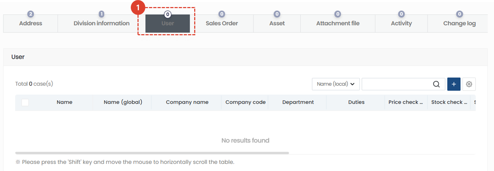
1. Click the **Users** tab to view users. Client representatives can click the **+** button to register users on your behalf.
</ValidateTextByToken>
 
 

### Additional Information - Sales Order

<ValidateTextByToken dispTargetViewer={false} dispCaution={true} validTokenList={['head', 'branch']}>
:::info
Displays a list of sales orders issued to the selected customer.
:::
:::warning Permission Notification
Only users with the **View Sales Orders** permission can view this tab. For inquiries regarding permissions, please contact your CRM representative.
:::
 
 

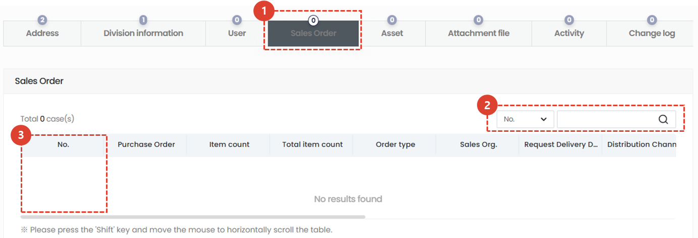

1. Click the **Sales Orders** tab to view a list of sales orders issued to the customer.
1. You can search by Sales Number or Purchase Order Number.
1. Click the Sales Number to go to the order details page.
    :::warning
    Accessing the Sales Order Details page requires special permissions.
    :::
</ValidateTextByToken>
 
 

### Additional Information - Assets

<ValidateTextByToken dispTargetViewer={false} dispCaution={true} validTokenList={['head', 'branch', 'seller', 'agent']}>
:::info
    Displays a list of assets held by the selected client.
:::

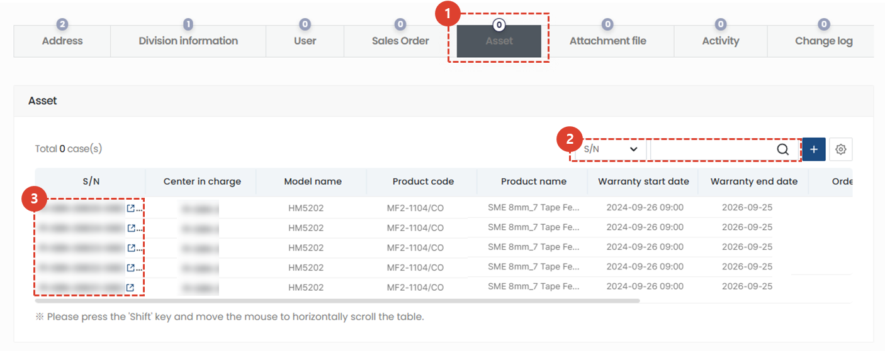
1. Click the **Assets** tab.
1. You can search for assets.
    :::tip Asset Search Filter List
    S/N / Model Name / Model Name (G) / Product Code / Product Name / Product Name (G) / Customer Name / Customer Name (G) / Customer Code / Customer Representative Name / Responsible Center Name / Responsible Center Name (G) / Responsible Center Code / Warranty Period (Months) / NC No. / Order Number / Registrant / Modifier / Subasset
    :::
1. Click on an asset's **S/N** to go to the **details page**.
 
 

### Additional Information - Attachments
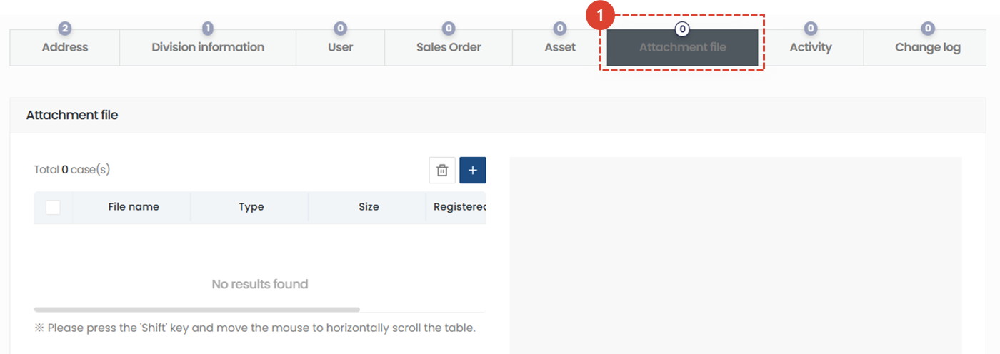

1. Click the **Attachments** tab to attach or view related files.
 
 

### Additional Information - Activities
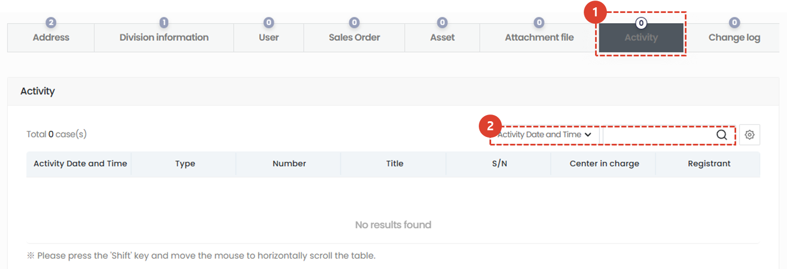
1. Click the **Activities** tab to view service activity details for the client.
1. You can search for activities.
    :::tip Activity Search Filter List
    Activity Date/Type/Number/Title/S/N/Responsible Center/Registered Person
    :::
 
 

### Additional Information - Change History
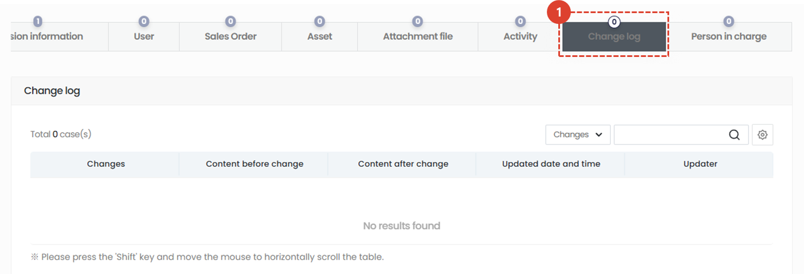
1. Click the **Change History** tab to view the change history, including your company's information.
 
 

### Additional Information - Contact Person
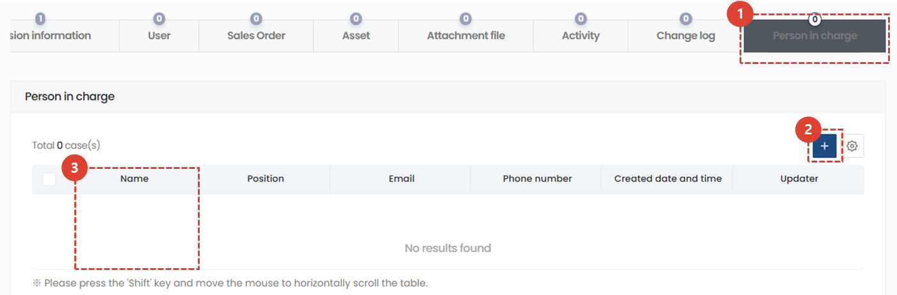
1. Click the **Contact Person** tab to view or add contact person information for your client.
1. Click the **Add** button to add contact person information for your client.
1. Click the name to view or edit contact person details.
</ValidateTextByToken>
