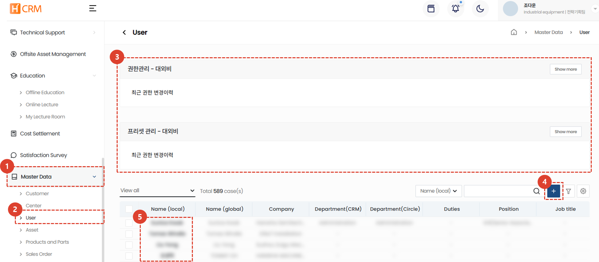
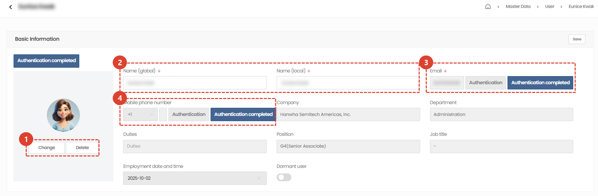
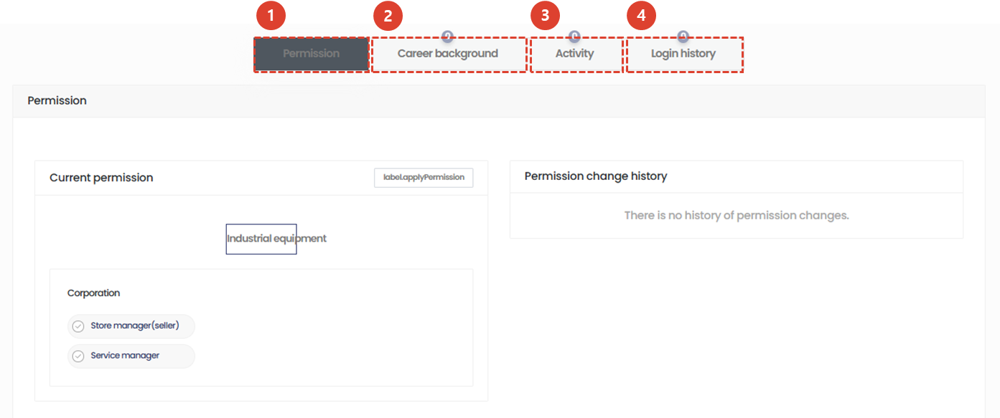

import ValidateTextByToken from "/src/utils/getQueryString.js";
import filterList from "./img/002.png";
import searchList from "./img/053.png";
import tableFilter from "./img/006.png";
import createLabor from "./img/013.png";
import filter2 from "./img/057.png";
import table2 from "./img/061.png";

#User

Guide to managing H-CRM user account data.

<ValidateTextByToken dispTargetViewer={true} dispCaution={true} validTokenList={['head']}>

## List

1. Click the **Base Information** menu.
1. Click the **User** menu to view the user list.
1. List Filtering : You can filter data based on the fiter items.
1. Displays the total number of **product and component data**.
1. You can search for the desired data by entering a search term. You can search data based on the multiple search filters.
1. Perform detailed filtering.
    

    1. Select a filter.
    1. Enter a search term.
    1. Click the **+** button to add search terms.
    1. Click the **Search** button to view the results.
1. Perform custom functions on a preset data list.
    - **Excel export**: Outputs the currently filtered results data list to an Excel file.
    - **Table Management**: Set table view options.
        

        1. Click the toggle button for the items you want to appear in the table so that they turn blue.
        1. You can drag the list icons to change the column positions.
        1. Click **Close** to change the table to reflect the selected content.
1. Go to the [User Details Page](#details-Page).

 
 

## Detail Page
### Basic Information

:::info
Except for items 1-4, information cannot be directly edited by the user.
:::
1. You can change/delete your user profile picture.
1. Enter the user name that will be displayed to global users and the user name that will be displayed to local users.
    :::warning
    If you are a Circle user, attempting to access the Circle main page via a link will reset your Circle user information.
    :::
1. Displays your email address and verification status. Click the **Verify** button to re-verify your email address.
1. Displays your mobile phone number and verification status. Click the **Verify** button to re-verify your mobile phone number.
 
 

### Additional Information

:::info
This area allows you to view additional information, such as user permissions, entered experience, activity history, and login history.
:::
1. The **Permissions** tab allows you to check the user's permissions. To change permissions, contact your administrator.
1. The **Career** tab allows you to enter and manage your work experience. Click the Experience tab and then the **+** button to enter your company, responsibilities, position, and start and end dates.
1. (TBD) The **Activity** tab displays your CRM activity history.
1. This tab allows you to view your CRM **login history**. You can view the login date and time, IP address, and country of origin.
</ValidateTextByToken>