import ValidateTextByToken from "/src/utils/getQueryString.js";
import filterList from "./img/002.png";
import searchList from "./img/017.png";
import tableFilter from "./img/006.png";
import createLabor from "./img/013.png";
import filter1 from "./img/056.png";
import filter2 from "./img/057.png";
import filter3 from "./img/058.png";
import filter4 from "./img/059.png";
import table1 from "./img/060.png";
import table2 from "./img/061.png";
import popup1 from "./img/064.png";
import popup2 from "./img/066.png";
import popup3 from "./img/070.png";
import popup4 from "./img/074.png";

# Center

This guide provides guidance on registering and managing service providers, such as agencies and corporations, as a center.

<ValidateTextByToken dispTargetViewer={true} dispCaution={false} validTokenList={['head', 'branch']}>

## List Page
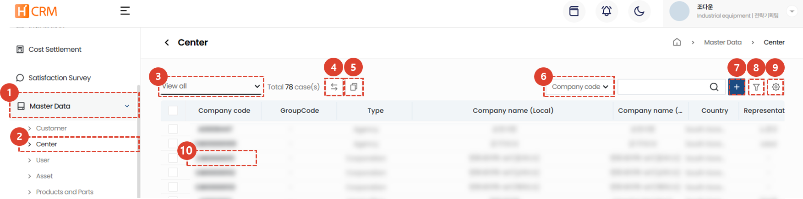
1. Click the **Standard Information** menu.
1. Click the **Center** menu to display a list of centers.
1. Use [**List Filtering**](#list-filtering) to display only center that meet specific criteria.
1. You can **Transfer** assets managed by a selected center to another center. This menu is currently being prepared for opening.
1. You can [**Link Center Codes**](#center-connection) for multiple center.
1. You can [**Search**](#search) to search for desired data.
1. You can [**Create a New Center**](#center-registration).
1. You can [**Register Multiple Filters**](#advanced-search) to search for data.
1. You can [Excel export](#excel-export), [Table Management](#table-management), and **delete** center information.
1. Click [**Center Company Code**](#detail-page) to view detailed center information.
</ValidateTextByToken>
 
 

### List Filtering
:::tip
Here's how to filter by user/department or by recent entries.
:::
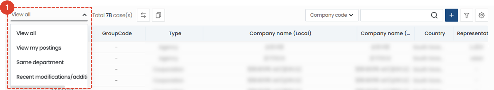
1. Select your desired filtering method. The corresponding list will appear immediately after selection.
 
 

<ValidateTextByToken dispTargetViewer={true} dispCaution={false} validTokenList={['head', 'branch']}>

### Search
:::tip
Guide to table search methods.
:::

1. **Select** a search filter and then search.
 
 

### Advanced Search
:::tip
Here's how to apply **multiple** search filters.
:::
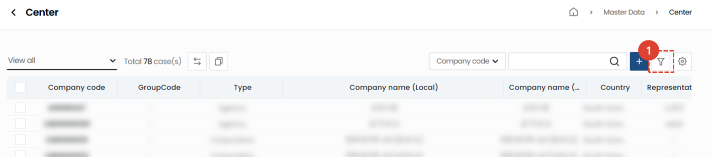
1. Click the **Filter button**.
 
 

1. Select a filter.
1. Enter a search term.
1. Click the **+** button to add search terms.
1. Click the **Search** button to view the results.
 
 

### Excel Export
:::tip
Here's how to output a list to Excel.
:::

1. Click the Excel Output button.
 
 

1. Select **Output Options**.
1. Click the **OK** button, then access the [**System Management > Excel Download**](/SMT/tutorial-12-system-management/03-export-data.md) menu to download the Excel file.
 
 
 
### Table Management
:::tip
This guide explains how to display columns, change their order, and change the columns that are displayed.
:::

1. **테이블관리**를 클릭하여 테이블에 보여질 항목 및 순서를 변경할 수 있습니다. 
 
 

1. Click the toggle buttons for the items you want to appear in the table so they turn blue.
1. You can drag the list icons to change the column positions.
1. Click **Close** to change the table to reflect the selected content.
 
 

## Center Registration
:::warning
To register a center, you must first register as a vendor.
When registering a new center, please ensure that no centers are already registered to avoid duplicate registrations.
:::

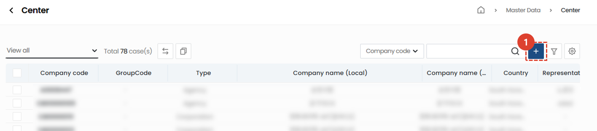
1. Click the **+** button.
 
 

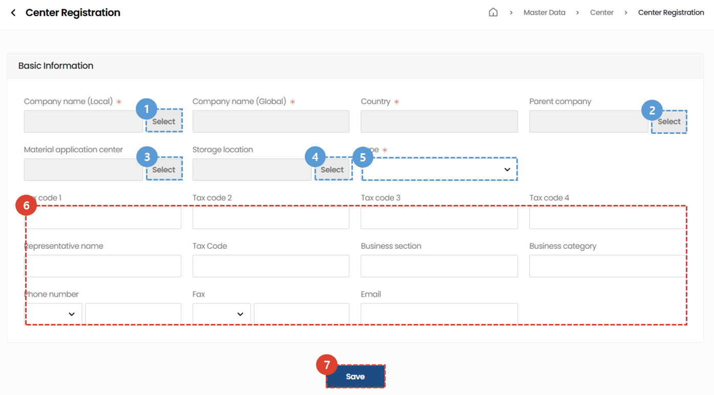
1. Select the **Company Name** you wish to register.
    :::info
    When you select a company name, the information entered as the client company will be automatically filled in.
    :::
1. Select the **Parent Company** of the center.
1. Select the **Material Request Center**.
1. Select the **Storage Location** for the materials.
1. Select the **Type** of the center. The options for the type are as follows:
    :::tip Type List
        - Headquarters
        - Corporation
        - Agency
        - Agency Base
    :::
1. Enter other center information.  The information entered when selecting a company will be automatically filled in. You can edit it manually if necessary.
1. After completing the information, click the **Save** button to complete center registration.
 
 

## Center Connection
:::tip
**If you have multiple identical centers registered**, here's how to **group them into a single center**.**
 This prevents scattered order history and assets from being registered in multiple centers.
 

- If you have centers with similar names and different codes, you can use the **Grouping** feature to group them. In this case, the following service data generated based on each code will be displayed in a consolidated manner.
    - Sales Orders
    - Activity History
        - Service History
        - Parts Order History
        - VOCs, etc.
    - Inquiry History
    - CRM User and Customer Service Representative Accounts
    - Center Address
    - Managed Assets
:::

### On the list page
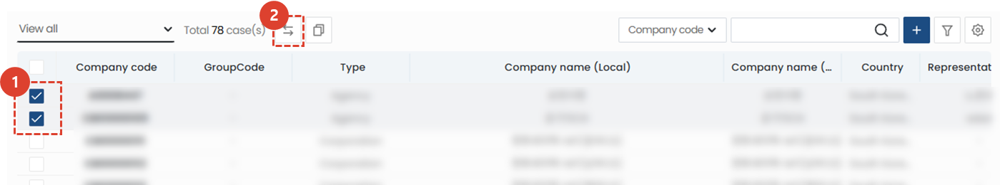
1. **Check** multiple centers that require a bundle.
1. Click the **copy icon**. 
 
 

1. Click the **Confirm** button to complete the customer connection.
 
 

### On the details page

1. Click the **Add** button to select the client you want to connect to. 
 
 

1. Search for the client you want to connect to.
1. Confirm the search results are correct, then click the **Save** button.
:::tip

Once the client connection is complete, the screen will appear as shown above.
:::
 
 

### Changing the Representative Company
:::info
Here's how to change the representative company among the linked companies.
:::

1. Click the **Edit** button.
 
 

1. **Select** the representative company.
 
 

1. Click the **Change** button.
 
 

1. Click the **Complete** button.
::info

The designated customer company will be displayed as shown in the image above.
::

 
 

## Detail Page
### Basic Information
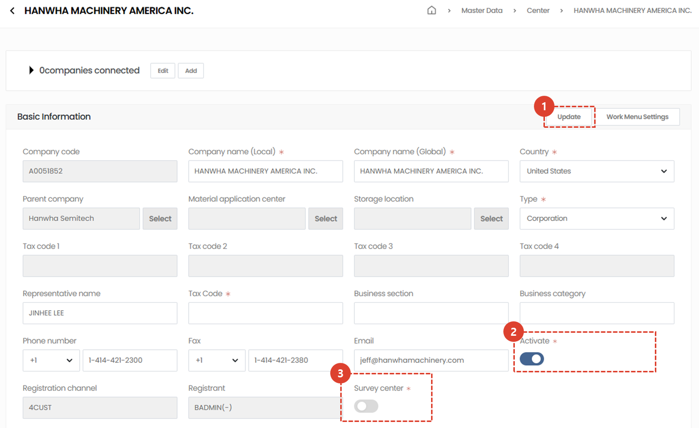

1. If there are any changes, enter them and click the **Edit** button to save.
    :::info
    - Select a **parent company** from the center list to set it.
        - Service centers have a tree structure with hierarchies.
        - Service assets from sub-centers are shared with the parent center.
    - Set a **parent center dedicated to service parts orders** that will process service parts orders.
    - Specify or add a **service parts warehouse number** for the selected center. Inventory quantities will be managed based on the service warehouse number set here.
        - Selecting a storage location from the list: Available inventory quantities in the internal system will be automatically synced.
        - Entering the location manually: Inventory quantities will be managed directly in the CRM system.
    - Select a **company type**. You can choose from **headquarters, corporation, agency, branch office, or customer company**. For agencies with regional branches, you can register and use the following: 
        - Dooly Agency (HQ) **[Agency]**  
            └ Dooly Agency (Central) **[Base]**  
            └ Dooly Agency (Southern) **[Base]**
    :::
1. You can register services, VOCs, etc. in CRM only if **Activate** is checked.
1. If **Service Satisfaction Survey Center** is checked, a service satisfaction survey will be automatically sent to customers when services such as installation and test runs are performed at the center.
 
 

### Additional Information - Address
:::warning
    If you access a domain in China, the map UI will not be displayed.
:::
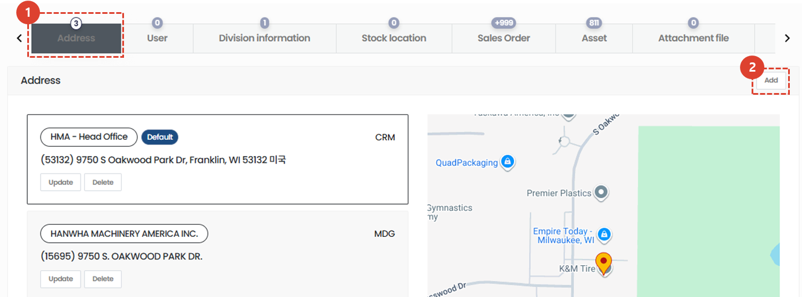
1. Clicking the **Address** tab in Additional Information will display the address information registered with your company.
    :::tip
    The registered channel of the address is displayed as a blue box.
    :::
1. Click the **Add** button to add a new customer address.
    :::info How to Add a New Customer Address
    
    1. Add the **Country** of the address you wish to register.
    1. Enter the **Address Name**.
    1. Click the **Find** button to search for an address.
    1. After searching or manually entering the address, click the **Search** button to view the map.
    1. Click the **Save** button to complete address registration.
    :::
 
 

### Additional Information - User
:::info
    Displays the CRM account information of users registered under the selected client company.
:::
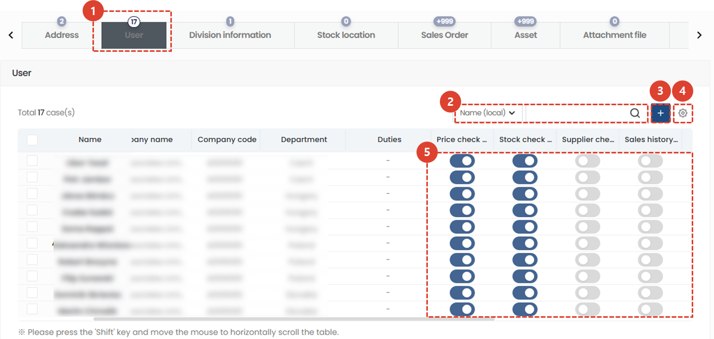
1. Click the **User** tab in Additional Information to display user information for centers registered in the CRM.
1. You can use the filter to search for users.
1. The administrator of the center can create a user account by clicking the **+** button.
1. Click the **gear** button to **delete** users or **manage tables**.
1. You can **grant** permissions for each user. To grant permissions, click the toggle button so it turns **blue**.
    ::tip Permission Types
    - Price Inquiry Permission
    - Inventory Inquiry Permission
    - Supplier Inquiry Permission
    - Sales History Inquiry Permission
    :::
 
 

### Additional Information - Organization Information
:::info
This menu sets the sales and purchase price tables for service parts.
:::
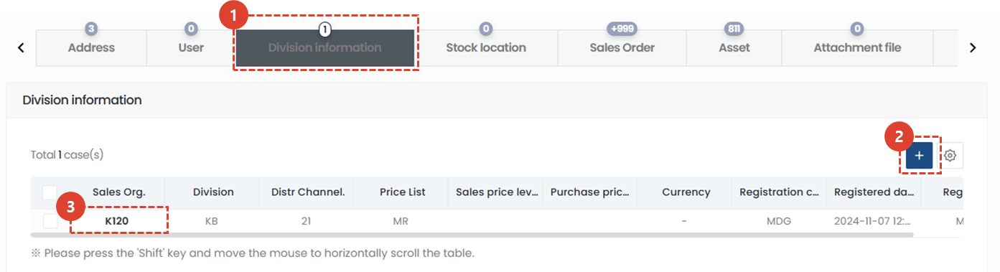
1. Click the **Organization Information** tab in Additional Information.
1. Click the **+** button to add organization information.
1. You can view and edit the organization information details page.
 
 

#### Adding and Editing Organization Information
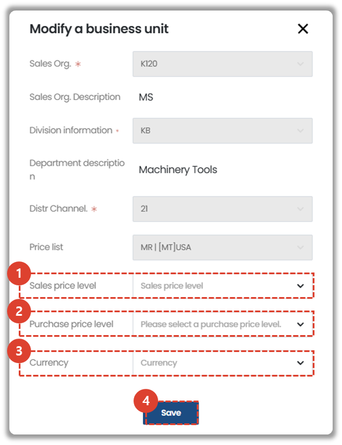
:::info
When registering new organization information, all items below must be entered.
- Sales Org.
    - K120: All organizations that transact in USD, including Hanwha Precision Machinery's headquarters
    - K603: All organizations that transact in CNY, including Hanwha Precision Machinery's Chinese subsidiary
- Organization Information
    - K3: Industrial Equipment Division
    - KB: Machine Tool Division
    - KD: Semiconductor Equipment Division
- Distribution Channel
    - 11: Domestic
    - 21: Export
- Price List
    - Select based on the service department's specific criteria.
- Selling Price Level: This is the price level the selected center uses when selling service parts. Select from the Price List.
- Purchase Price Level: This is the price level the selected center uses when purchasing service parts from the Material Approval Center. Select from the Price List.
:::
1. **Selling Price Level** can be modified.
1. **Purchase level** can be modified.
1. **Currency** can be modified.
 
 

### Additional Information - Inventory Locations
:::info
You can add and manage inventory locations in the center.
:::
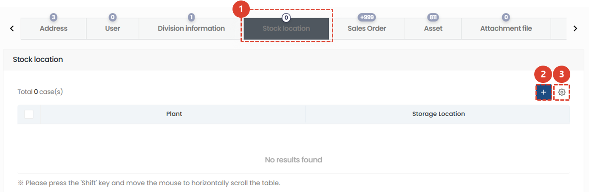
1. Click the **Inventory Locations** tab in Additional Information.
1. To add a new inventory location, click the **+** button.
1. Click the **gear** button to delete an inventory location. 
 
 

### Additional Information - Sales Orders
:::info
Displays a list of sales orders issued to the selected customer.
:::

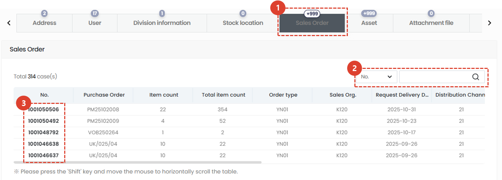
1. Click the **Sales Orders** tab in Additional Information.
1. You can search by sales order number.
1. You can access the sales order details page.
    :::warning
    You need special permission to access the sales order details page.
    :::
</ValidateTextByToken>
 
 

<ValidateTextByToken dispTargetViewer={false} dispCaution={true} validTokenList={['head', 'branch', 'seller', 'agent']}>

### Additional Information - Assets
:::info
Displays a list of sales orders issued to the selected customer.
:::
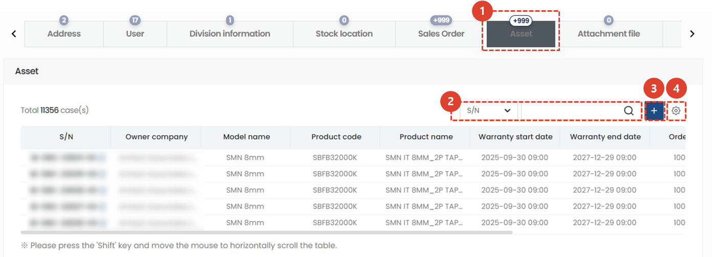
1. Click the **Assets** tab in Additional Information.
1. You can search by asset information, such as S/N.  Clicking S/N will take you to the asset details page.
1. You can add assets held by the center or owned by a customer under management.
1. Click the **gear** button to edit the items or order displayed in the table.
 
 

### Additional Information - Attachments
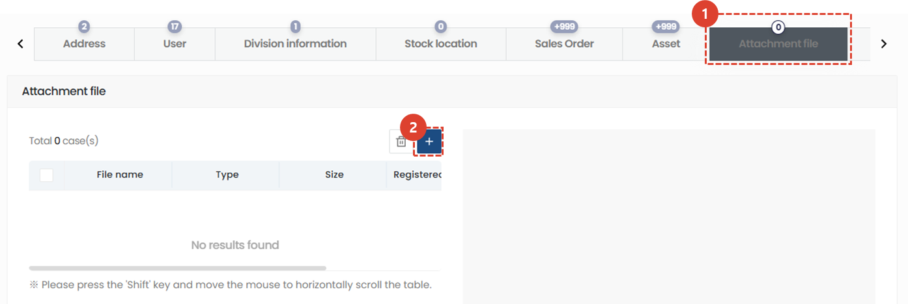
1. Click the **Attachments** tab in the Additional Information section. You can attach and view related files.
1. Click the **+** button to add attachments.
</ValidateTextByToken>
 
 
<ValidateTextByToken dispTargetViewer={false} dispCaution={true} validTokenList={['head']}>

### Additional Information - Company Hierarchy
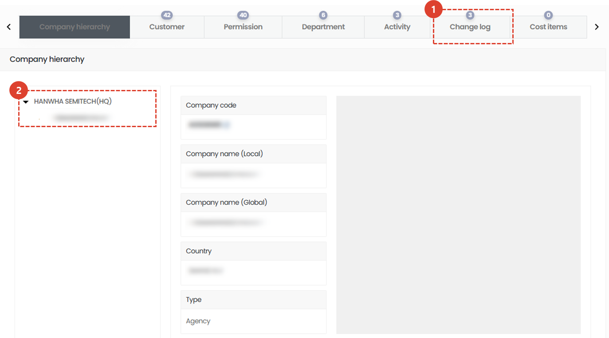
1. Click the **Company Hierarchy** tab in Additional Information.
1. You can view the hierarchy there.
</ValidateTextByToken>
 
 
<ValidateTextByToken dispTargetViewer={false} dispCaution={true} validTokenList={['head', 'branch', 'seller', 'agent']}>

### Additional Information - Clients
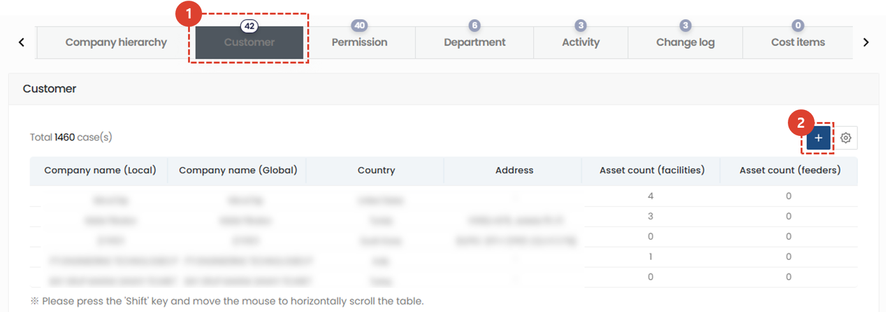
1. Click the **Clients** tab in the Additional Information section to display the following clients:
    - Clients managed by the selected center
    - Clients managed by centers below the selected center
1. Click the **+** button to add a client.
 
 

### Additional Information - Permissions
:::info
A list of permissions available within the center is displayed.
:::
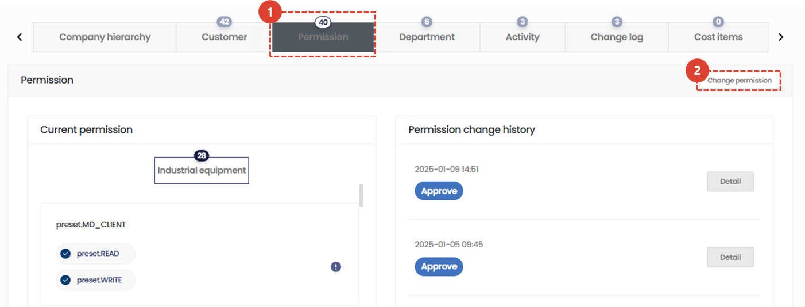
1. Click the **Permissions** tab in Additional Information.
1. If permissions need to be changed, click the **Change Permissions** button to make the changes.
    ::warning
    **Change Permissions** is only accessible to those with **Permission Management** (system administrators).
    :::
 
 

### Additional Information - Departments
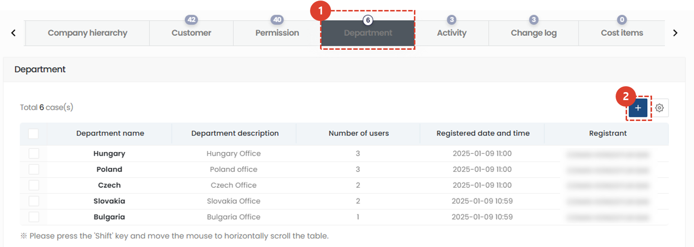
You can manage "departments" to efficiently perform service tasks.
1. Click the **Departments** tab in Additional Information.
1. Click the **+** button to add a department.
 
 

### Additional Information - Activities
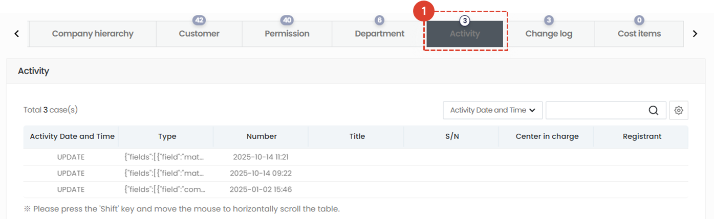
1. Click the **Activities** tab in Additional Information to view updated information for the center.
 
 

### Additional Information - Change History
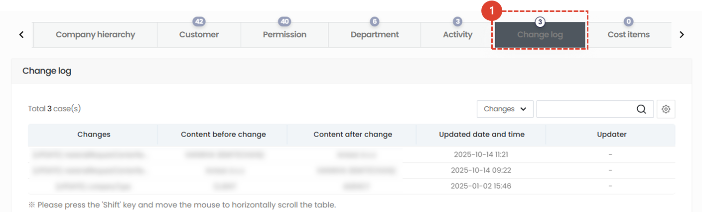
1. Click the **Change History** tab in Additional Information. You can view changes made to the center.
 
 

### Additional Information - Items
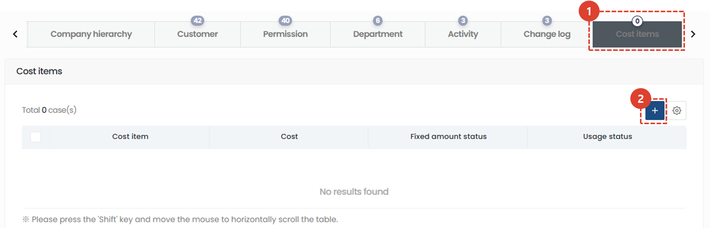
1. Click the **Items** tab in Additional Information. You can register and use item groups, such as technical fees or basic dispatch fees.
1. To add an item group, click the **+** button.
</ValidateTextByToken>
