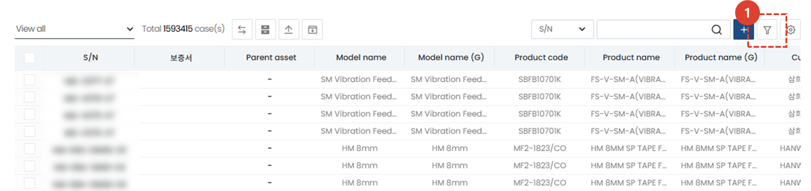
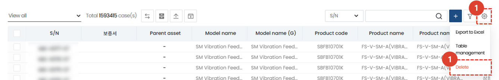
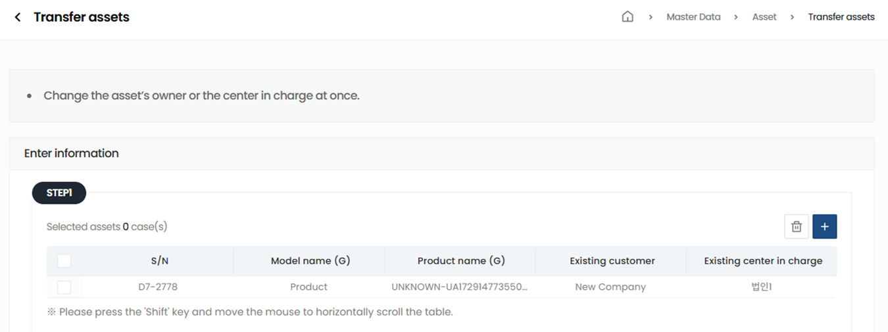
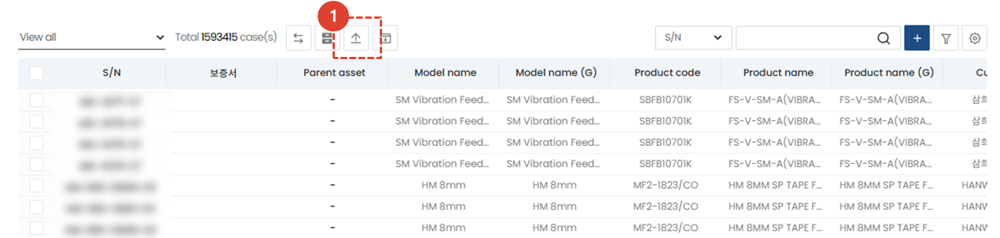

import ValidateTextByToken from "/src/utils/getQueryString.js";
import filterList from "./img/002.png";
import searchList from "./img/053.png";
import tableFilter from "./img/006.png";
import createLabor from "./img/013.png";
import filter1 from "./img/097.png";
import filter2 from "./img/057.png";
import filter3 from "./img/099.png";
import filter4 from "./img/059.png";
import table1 from "./img/101.png";
import table2 from "./img/061.png";
import popup1 from "./img/064.png";

# Assets

Guide to asset data management.
<ValidateTextByToken dispTargetViewer={true} dispCaution={true} validTokenList={['head', 'branch', 'seller', 'agent']}>

## List Page

1. Click the **Standard Information** menu.
1. Click the **Asset** menu to display a list of asset data.
    :::tip
    Agency users can also **check other agencies' assets with key information masked** from the list.
    :::
1. If there's a request to change the client or center that owns the asset, it will appear in [**Transfer Requested Assets**](#Asset-Transfer) and require administrator approval.
1. Use **List Filtering** to display only clients that meet certain criteria.
1. This is the **Asset Transfer** button, used when a change is required for the client or center that owns the asset.
1. (Agency only) This button allows you to **show or hide masked assets from other agencies**.
1. This is the **Bulk Upload Assets** button. You can upload multiple assets at once using Excel.
1. Enter a **search term** to search for the data you want.
1. You can **register a new asset**.
1. You can **register multiple filters** to search data.
1. You can **export to Excel**, **manage tables**, or **delete** assets.
1. Click the S/N to view asset details.
    :::warning Note for dealer users
    Detailed information is not available for **other dealers' assets**, as key information has been masked.
    :::

### List Filtering
:::tip
Here's how to filter by user/department or by recent entries.
:::

1. Select your desired filtering method. The corresponding list will appear immediately after selection.
 
 

### Search
:::tip
Here's how to search tables.
:::

1. Select a search filter and then search. 
 
 

### Advanced Search
:::tip
Here's how to apply **multiple** search filters.
:::

1. Click the **Filter button**.
 
 

1. Select a filter.
1. Enter a search term.
1. Click the **+** button to add search terms.
1. Click the **Search** button to view the results.
 
 

### Excel Output
:::tip
Here's how to export a list to Excel.
:::

1. Click the Export to Excel button.
 
 

1. Select **Output Options**.
1. Click the **OK** button, then access the [**System Management > Excel Download**](/SMT/tutorial-12-system-management/03-export-data.md) menu to download the Excel file.
 
 
 
### Table Management
:::tip
This guide explains how to display columns, change the columns displayed, and change their order.
:::

1. Click **Table Management** to change the items and order displayed in the table.
 
 

1. Click the toggle button for the items you want to appear in the table so that they turn blue.
1. You can drag the list icons to change the column positions.
1. Click **Close** to change the table to reflect the selected content.
 
 

### Delete
:::warning
Here are instructions for deleting your client account.
 Please proceed with caution, as deletion is **difficult to recover**.
:::

1. Click the **gear** button.
1. Click the **delete** button.
 
 

1. Click the **Delete** button in the pop-up window to delete the customer.
 
 

## Asset Transfer
:::info
If a client or center holding assets requires a transfer, you can perform an **asset transfer**.
Current asset transfers are reflected in the system within 30 minutes. Future asset transfers will be completed upon approval from each business unit.
:::
### Asset Transfer Method

1. **Check** the assets you wish to transfer.
1. Click the **Transfer Assets** button.
 
 

Review the asset transfer information. If you have additional assets to transfer, click the **+** button to add more assets.
 
 

1. Select the **customer or center to which you wish to transfer**.
 
 

1. After confirming your selection, click the **Next** button.
 
 

1. After finalizing the details, click the **Complete** button.  The asset information will be updated within 30 minutes of completing the asset transfer.
 
 

## Asset Registration
### Single Item Registration

1. Click the **+** button.
 
 

1. Enter the S/N.
1. Click Select to select the **Product Name**.
1. Click Select to select the **Model**.
1. Select the **Customer**. The customer code will be automatically entered when selected.
1. Select the **Responsible Center**. The responsible center code will be automatically entered when selected.
1. Enter the **Warranty Period** (e.g., 12 months, 24 months) and **Warranty Start Date**. The warranty end date will be automatically entered.
1. Enter the **Manufacturing Date** of the asset.
1. Enter the **Shipping Date**.
1. Enter the **Installation Date**.
1. After entering the asset information, click the **Save** button.
 
 

### Bulk Asset Registration
:::tip
Here's how to bulk register a large number of assets.
:::

1. Click the **Upload Assets** button.
:::info Upload Method
**Download the Excel template** and enter your asset information in the format. And upload the Excel file containing your asset information.
:::
 
 

## Detail Page
### Basic Information

:::info
The default values ​​entered when registering the asset are displayed, and you can additionally enter information for items 2-6.
:::
1. The **Supplier** information entered in the SO is displayed.
1. You can enter the **Installation Location** of the asset.
1. Enter the detailed **Options** of the asset.
1. Enter any additional information in **Remarks**.
1. Enter **Special Notes** for the asset.
1. You can manage the **Used Status** by checking the **Used Status**, as if the asset had been transferred and become a used product.
1. Click the [**Transfer**](#asset-transfer) button to transfer the asset.
1. If there are any changes, click the **Save** button to save the changes.
 
 

### Additional Information

Additional information about the asset appears.
- Additional Information: You can manually enter and manage the previous information for SW, MMI, RD, Vision, Opti, IT, and Basic IT.
- Ancillary Assets: You can view information such as the S/N, model name, and product code for the corresponding asset's ancillary assets.
- Service History: You can view the service history performed on the corresponding asset and check the details.
- BS/Retrofit History: You can view the BS/Retrofit activity history and check the details.
- Warranty Period Management: If the warranty period needs to be modified, click the **+** button on the Warranty Period Management tab to edit it. When modifying the warranty period, you must provide a detailed **reason for the warranty period change**.
- Design Change History: You can view the design change history related to the asset.
- VOC History: View and check detailed VOC history related to an asset.
- Certificate Issuance History: View the issuance history of certificates, such as warranties (Machine Tool Division only).
- Service Technical Data: View service technical data related to the asset, if available.
- Transfer History: View any asset transfer history.
</ValidateTextByToken>