import ValidateTextByToken from "/src/utils/getQueryString.js";
import filterList from "./img/002.png";
import searchList from "./img/003.png";
import tableFilter from "./img/006.png";
import createLabor from "./img/013.png";
import filter1 from "./img/056.png";
import filter2 from "./img/057.png";
import filter3 from "./img/122.png";
import filter4 from "./img/059.png";
import table1 from "./img/124.png";
import table2 from "./img/061.png";
import popup1 from "./img/064.png";
import popup2 from "./img/066.png";
import popup3 from "./img/070.png";
import popup4 from "./img/074.png";

# Products and Parts

Guide to managing product and parts data.

<ValidateTextByToken dispTargetViewer={true} dispCaution={true} validTokenList={['head', 'branch', 'seller', 'agent']}>

## List Page
:::tip Viewable Data
- Product and part code data collected from MDG
- Data automatically generated for system mapping in H-CRM
:::

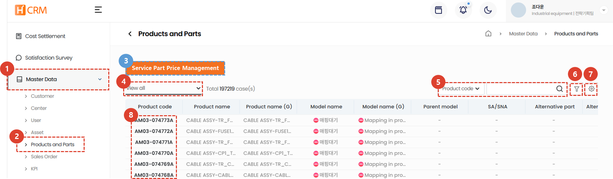
1. Click the **Standard Information** menu.
1. Click the **Products & Parts** menu.
1. Click **Service Parts Price Management** to view price information.
1. Use [**List Filtering**](#list-filtering) to display only customers that meet specific criteria.
1. Enter [**Search Word**](#search) to search for the desired data.
1. Enter [**Multiple Filters**](#advanced-search) to search for data.
1. You can [**Excel Export**](#excel-export) and [**Table Management**](#table-management).
1. Click [**Product Code**](#detail-page) to view detailed information about the product code.
 
 

### List Filtering
:::tip
Here's how to filter by user/department or by recent entries.
:::
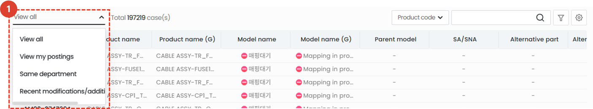
1. Select your desired filtering method. The corresponding list will appear immediately after selection.
 
 

### Search
:::tip
Guide to searching tables.
:::

1. **Select** a search filter and then search.
 
 

### Advanced Search
:::tip
Here's how to apply **multiple** search filters.
:::
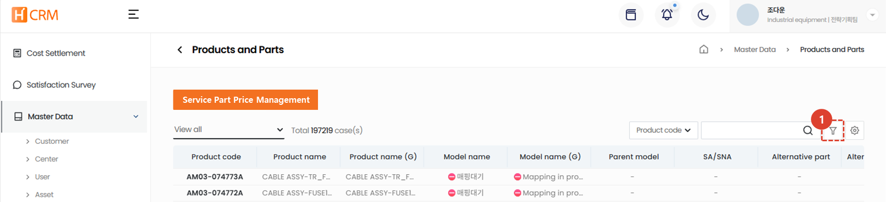
1. Click the **Filter button**.
 
 

1. Select a filter.
1. Enter a search term.
1. Click the **+** button to add search terms.
1. Click the **Search** button to view the results.
 
 

### Excel Export
:::tip
Here's how to export the list to Excel.
:::

1. Click the Export to Excel button.
 
 

 
1. Select **Output Options**.
1. Click the **OK** button, then access the [**System Management > Excel Download**](/SMT/tutorial-12-system-management/03-export-data.md) menu to download the Excel file.
 
 
 
### Table Management
:::tip
This guide explains how to display columns, change their order, and change the columns that are displayed.
:::

1. Click **Table Management** to change the items and order displayed in the table.
 
 

1. Click the toggle button for the items you want to appear in the table so that they turn blue.
1. You can drag the list icons to change the column positions.
1. Click **Close** to change the table to reflect the selected content.
 
 

## Detail Page
### Basic Information
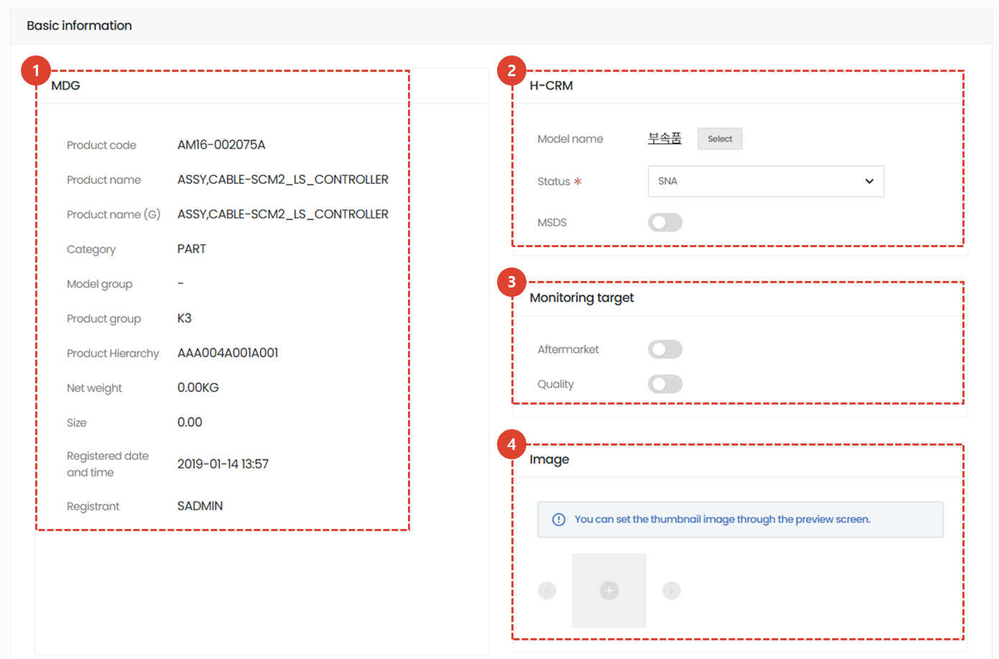
1. Displays information interfaced with MDG. This information cannot be modified.
1. Displays additional information that can be processed for use in H-CRM.
    - **Model Name**: Click the [Select] button to select a model.
        :::info
        Models are managed on the [**Model Management Page**](/SMT/tutorial-12-system-management/01-model-manage.md).
        :::
    - **Status**: Sets the serviceability status of the product/part.
        - **SA**: Service is available.
        - **DNA**: Service is available with inventory at each branch, but additional orders to headquarters are no longer possible.
        - **SNA**: Service is not available. Please use a replaceable service part to provide service.
            :::warning
            Some products and parts may not have a status listed. In this case, service orders can be submitted, but please note that the status may be changed by the administrator. 
            :::
    - **MSDS**🚧: Abbreviation for Material Safety Data Sheet. Used only for components requiring disclosure of Material Safety Data Sheets. When the toggle switch is turned ON, a button will appear that takes you to the MSDS details page.
1. Monitoring Target 🚧
    - Use when monitoring specific attributes of product and component data is required.
    - Details TBD
1. You can attach actual photos or related **images** of product and component data.
    ::info
    - The first image displayed will be used as the representative image.
    - You can set the representative image on the image preview screen.
    :::
</ValidateTextByToken>
 
 

### Additional Information - Plant
<ValidateTextByToken dispTargetViewer={false} dispCaution={true} validTokenList={['head', 'branch']}>

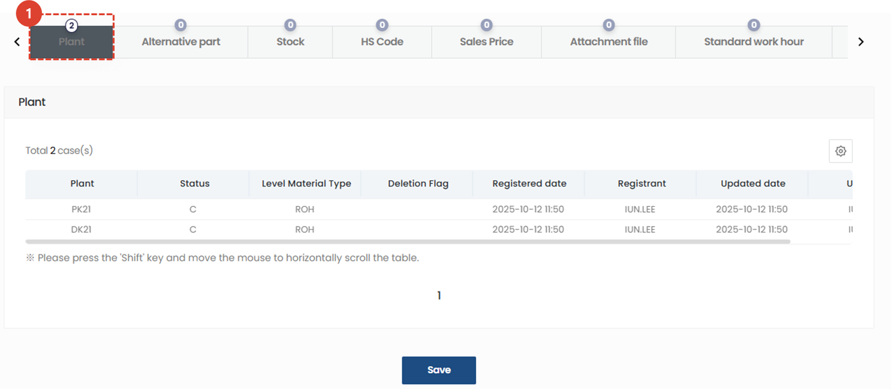
1. You can view product plant information.
    - **PK21 / VK21**: Industrial Equipment Division Plant
    - **PK22 / VK22**: Machine Tool Division Plant
    - **PK23 / VK23**: Semiconductor Equipment Division (Front Process) Plant
    - **PK24 / VK24**: Semiconductor Equipment Division (Back-Process) Plant
    :::tip
        If you wish to expand the plant to other business units, please change the MDG's reference information.
    :::

 
 

### Additional Information - alternative materials
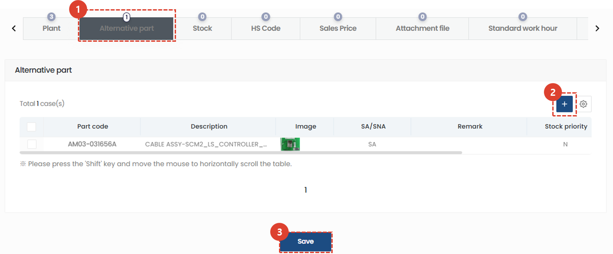
1. If there are alternative materials, you can search for information about them.
1. If you need to add an alternative material, click the **+** button to add it.
    :::info
    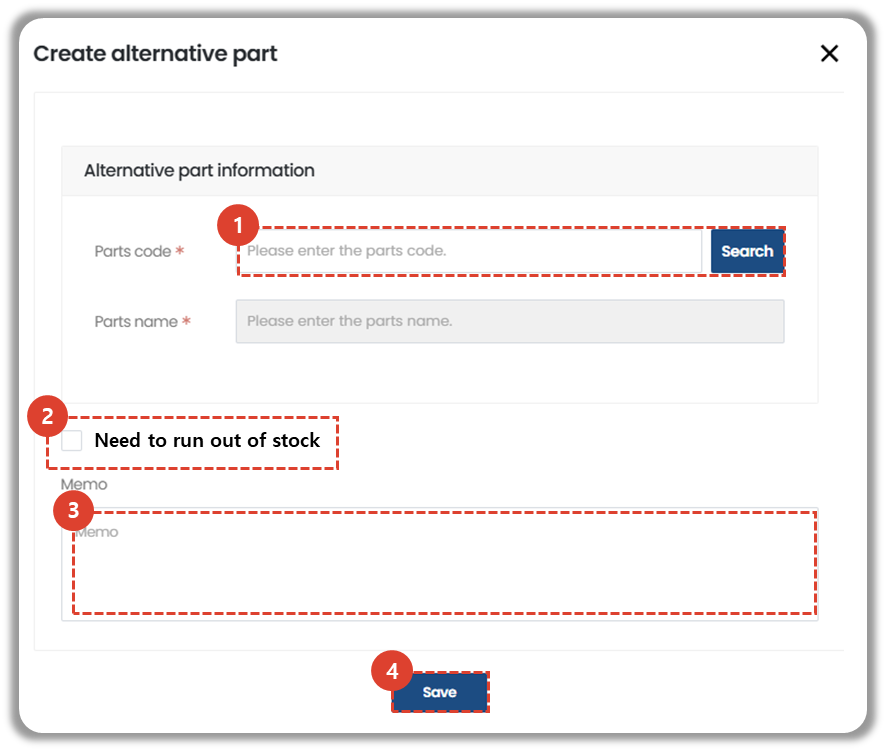
    1. Enter the replacement material information.
    1. If stock clearance of existing materials is required, check **Stock Clearance Required**.
    1. Enter other relevant information.
    1. Click the **Save** button to add the replacement material. 
    :::
1. After updating the alternative material information, you must click the **Save** button for the information to be updated.

### Additional Information - inventory
:::warning
    If the value of the inventory registration path column is **SAP**, data modification is not possible.
:::
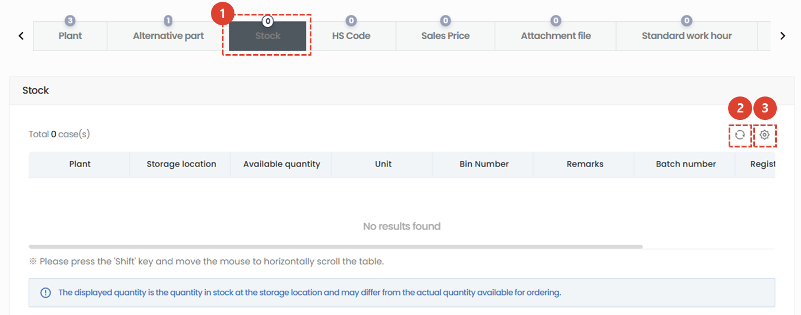
1. Displays the inventory status of the selected product/part data.
    :::info
        - Users affiliated with the headquarters will see inventory from all warehouses.
        - Users affiliated with other companies will see inventory from the following:
            - Inventory for warehouse locations set in **Center - Storage Location**
            - Inventory for storage locations manually registered and managed in **Store - Stock**
            - Inventory for warehouse locations set in **Center - Material Approval Center**
    :::
1. Click the **Refresh** button to update your inventory status.
1. Click the **gear** button to manage the inventory list table.
</ValidateTextByToken>
 
 

<ValidateTextByToken dispTargetViewer={false} dispCaution={true} validTokenList={['head', 'branch', 'seller', 'agent']}>

### Additional Information - HS Code
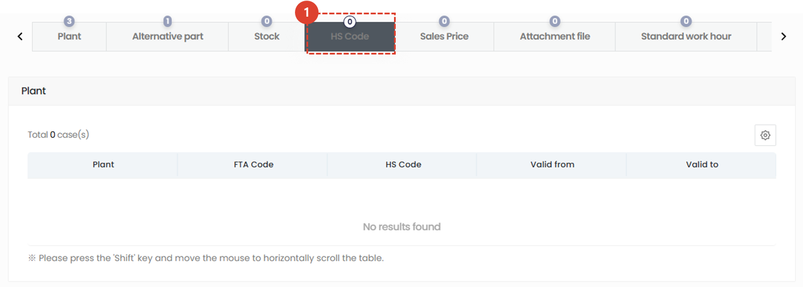
1. If there is an export of products and parts, you can check the **international tax code**.

### Additional Information - Panga
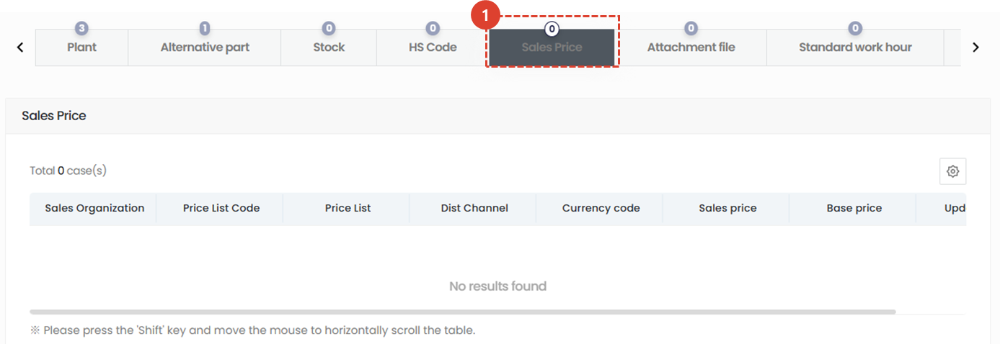
:::Warning: Viewable Price Information
- **Price Manager**: Displays price information mapped to all **Price Lists**.
- **Other Users**: Displays price information from the supply price and sales price tables set in **Standard Information-Center-Organization Information**.
:::
1. You can check the price information by clicking the Price tab.
 
 

### Additional Information - Attachments
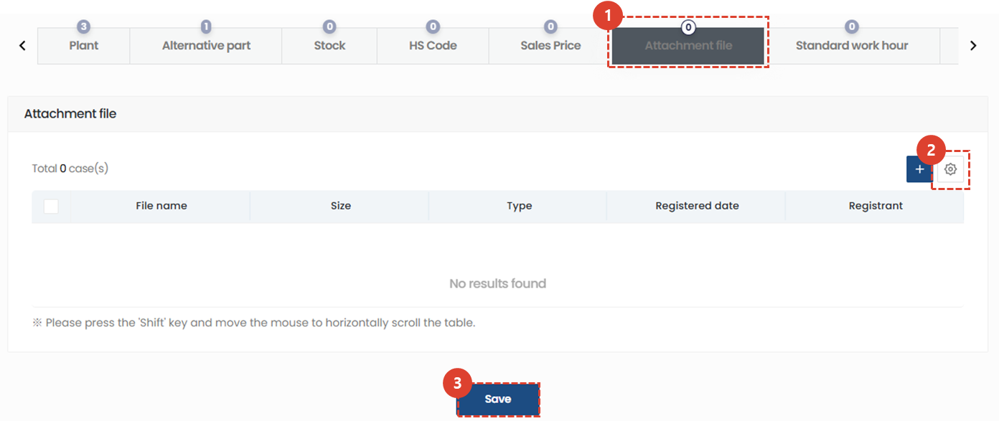
1. You can attach and view related files.
 
 

### Additional Information - Standard Air Transport Times
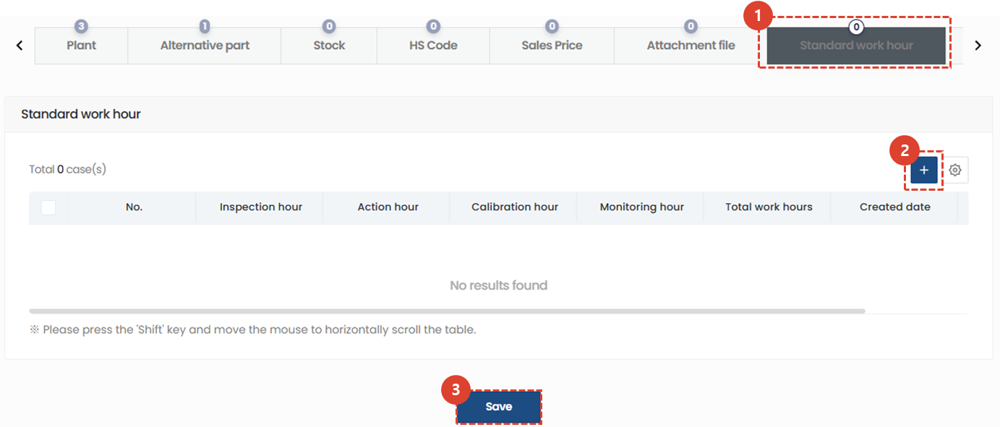
1. Click the **Standard Manpower Time** tab to register and manage the estimated standard manpower time for replacing selected service parts.
1. Click the **+** button to add a standard manpower time.
    

    - Model: Select the model to which the standard man-hours apply. **(Leaf models only)**
    - Man-hours: Enter the man-hours in hours (Hrs).
    - Notes: Enter details about the man-hours.
1. Once you've entered the standard man-hours, click the **Save** button.
</ValidateTextByToken>
 
 
<ValidateTextByToken dispTargetViewer={false} dispCaution={true} validTokenList={['head']}>

### Additional Information - Service History
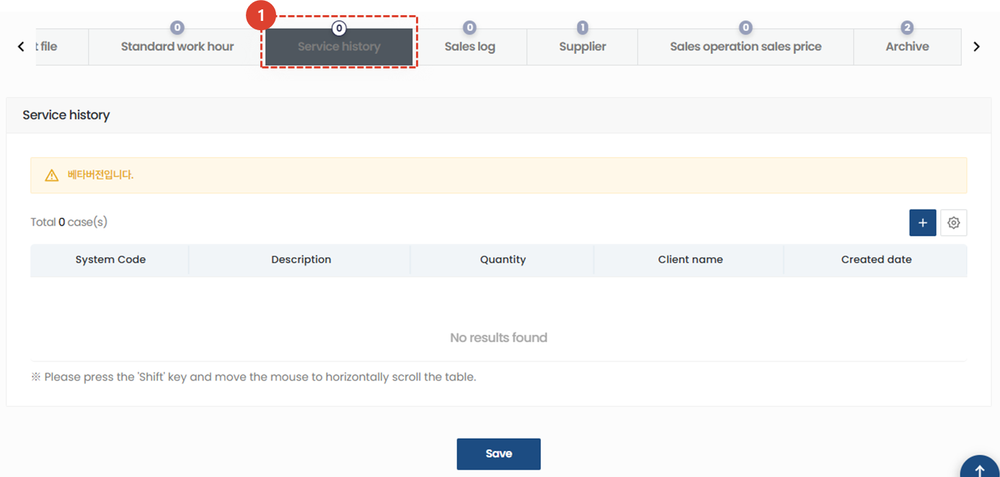
1. We plan to provide a feature that allows you to view **service history** for your assets.
 
 

### Additional Information - Sales log
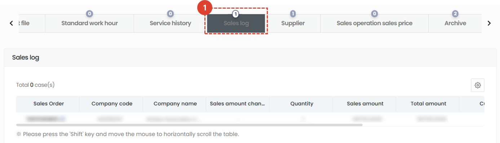
1. Displays sales order history related to the selected product or part.
 
 
 
 

### Additional Information - Supplier
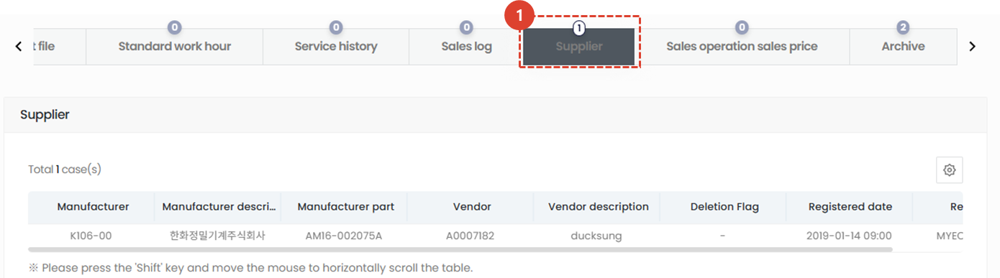
1. Displays supplier information for the selected product or part.
:::danger
    - Displays the sales price for reference when setting service part prices.
    - Use for any other purpose is prohibited.
:::
 
 

### Additional Information - Sales Price List
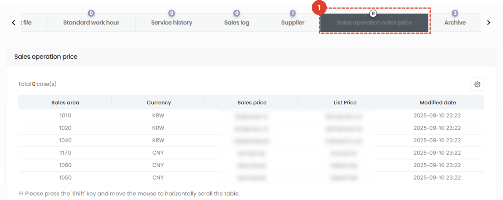
1. You can view the sales price list. Only users with price search privileges, such as headquarters sales managers and system administrators, can access the sales price list.
 
 

### Additional Information - Resource Room
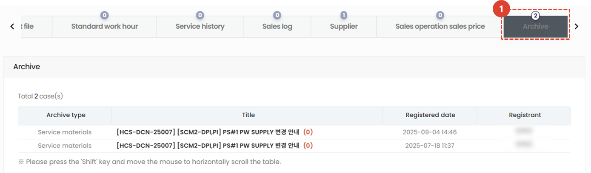
1. If data related to the product or component has been uploaded, you can check the list.
</ValidateTextByToken>