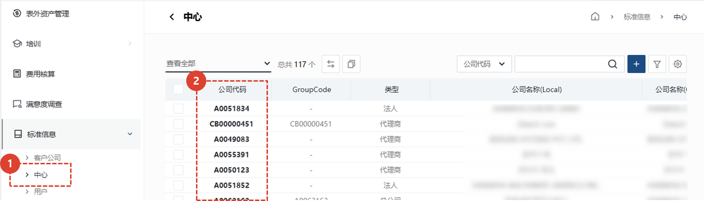
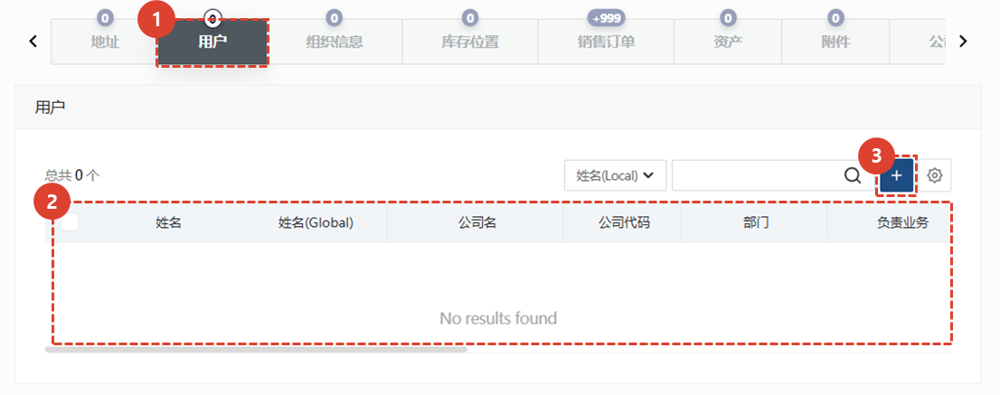
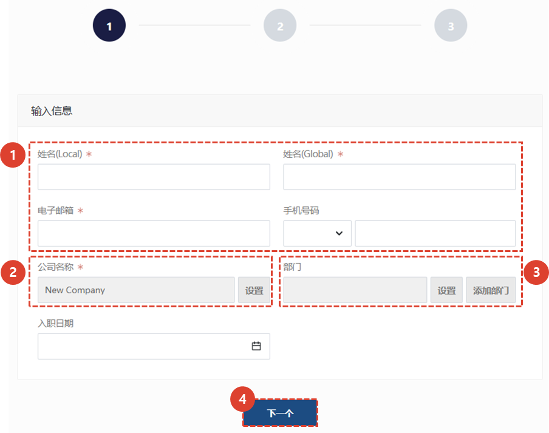
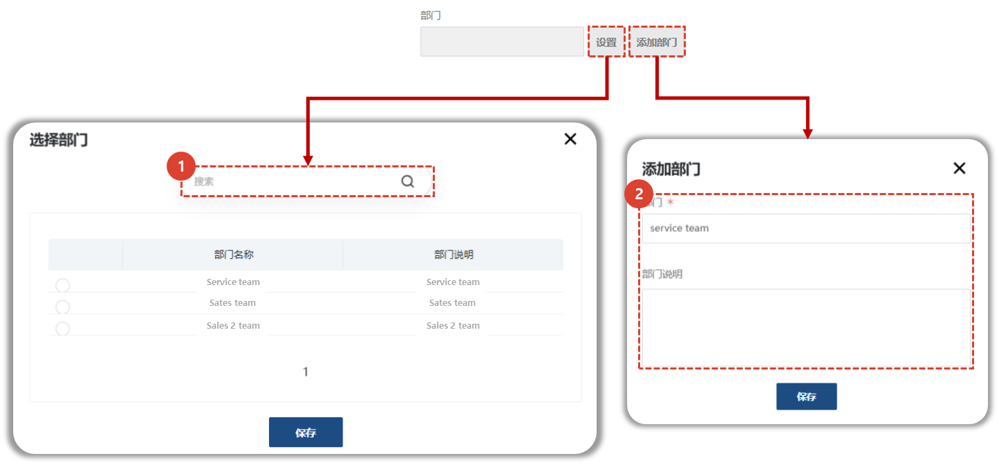
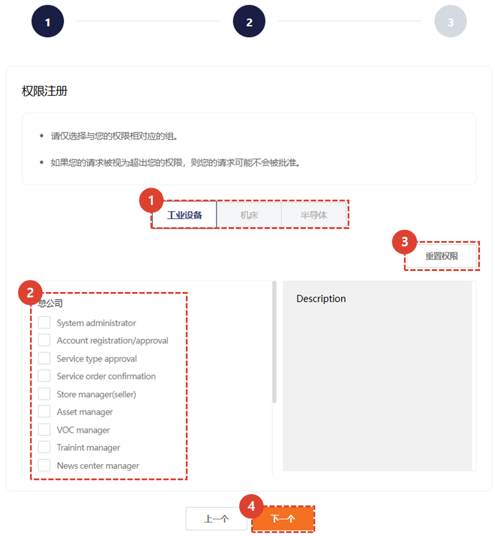
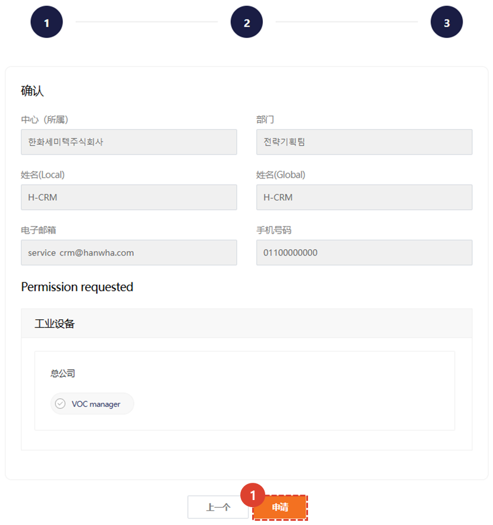
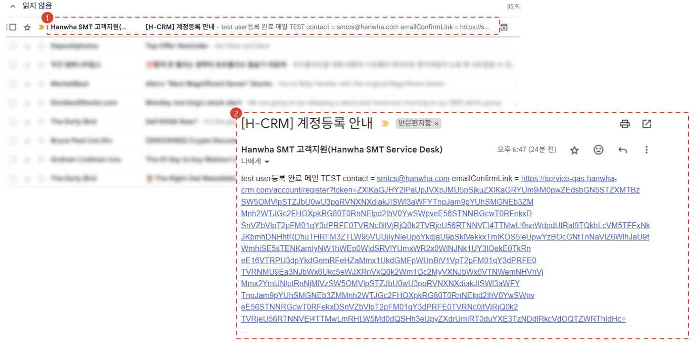

import ValidateTextByToken from "/src/utils/getQueryString.js";
import StrongTextParser from "/src/utils/textParser.js";
import text from "/src/locale/ko/SMT/tutorial-01-auth/create-a-acount-non-circle-user.json";

# 创建 CRM 账户（零售）

<!-- 메뉴단에서 번역이 안되므로 여기 하드코딩해야 함 #가 달린 헤더와 함께 -->
我们将引导您完成在**外部网络**上创建 CRM 用户帐户的步骤。

:::danger
请 Circle 用户遵循员工帐户创建程序。
:::

<ValidateTextByToken dispTargetViewer={true} dispCaution={false} validTokenList={['head', 'branch', 'agent']}>

## 大纲

经销商用户的 CRM 帐户创建场景如下

:::warning 
   - **服务代理用户**：此结构由管理员代表用户创建用户账户。
   - **一般客户用户**：可直接在 CRM 系统中创建账户。
:::
</ValidateTextByToken>
 
 

## 创建服务代理用户帐户

<ValidateTextByToken dispTargetViewer={false} validTokenList={['head', 'branch', 'agent']}>

:::info
我们将授予单独的账户创建权限，只有拥有权限的用户才可以执行账户创建任务。
:::
 
 

### 移动页面

1. 在侧边栏选择【标准信息】-【客户】或【中心】菜单。
1. 选择要添加账户的公司（客户或中心）的公司代码，进入详情页面。
 
 

1. 从底部的选项卡中选择[用户]选项卡。
1. 显示属于所选公司（客户或中心）的用户帐户列表。
1. 点击“+”按钮进入“添加用户”屏幕。
 
 

### 添加用户 (1/4)

1. 输入用户信息。
   - 名称（本地）：输入本地语言名称。
   - 名称（全球）：输入英文显示的名称。
   - 电子邮件地址：输入账户用户的电子邮件地址。
   - 手机号码：输入账户用户的手机号码。（可选）
1. 确认公司名称。默认为代表用户注册账户的用户所属机构信息。
   :::note
   拥有账户管理权限的管理员可以更改其所属公司。
   :::
3. 添加您自己的部门或从已保存的部门列表中选择。请参阅部门设置步骤。
   :::tip
   在 CRM 系统中，很多情况下都需要使用部门。设置部门可以让后续工作更加轻松。
   :::
1. 转至下一页。
 
 

### 添加用户 (2/4) - 부서 등록

1. 点击**设置**按钮，加载已保存部门列表。如果已注册的部门较多，可以使用搜索功能。在已保存部门列表中，点击您想使用的部门名称。点击**保存**按钮设置部门。
1. 点击**添加部门**按钮，添加部门。输入部门名称，并在部门描述字段中输入部门描述。点击**保存**按钮，保存部门信息。

### 添加用户 (3/4)

1. 选择一个业务部门。
1. 选择您想要分配的权限。
   :::warning
      - 请注意仅分配必要的权限。 
      - 根据安全管理员的审核结果，在帐户的最终批准阶段，可能会拒绝批准。
   :::
1. 您可以初始化所选权限。
1. 继续下一步。
 
 

### 添加用户 (4/4)

- 申请权限列表按事业部显示。
- 账户使用者为**Hanwha Semitec合作公司员工**，本人确认所输入的信息没有问题。
   :::danger
   请注意不要让您的帐户被错误发行。
   :::
1. 点击**确认**按钮。
   - 系统将向管理员发送最终批准请求通知，以便用户可以使用已创建的帐户。
   - 系统将向帐户用户发送一封额外的身份验证电子邮件。请参阅“额外身份验证”。
 
 

### 用户身份验证

1. 账户用户请检查邮箱，点击收到的**账户注册指南邮件**。
   :::tip
   如果您没有收到电子邮件，请联系代表您创建帐户的人员。
   :::
1. 单击身份验证链接。

</ValidateTextByToken>
