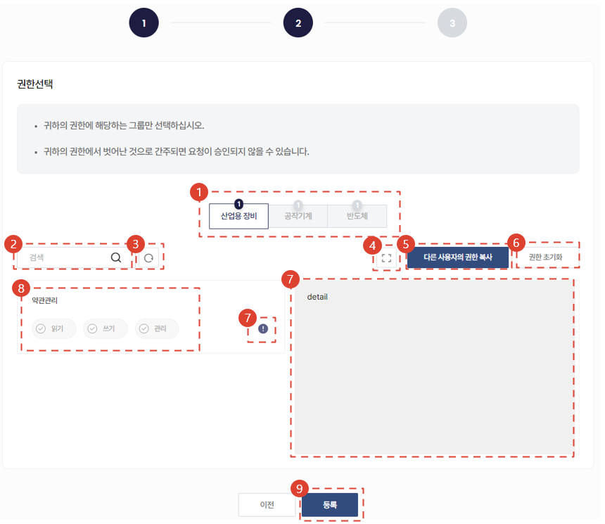
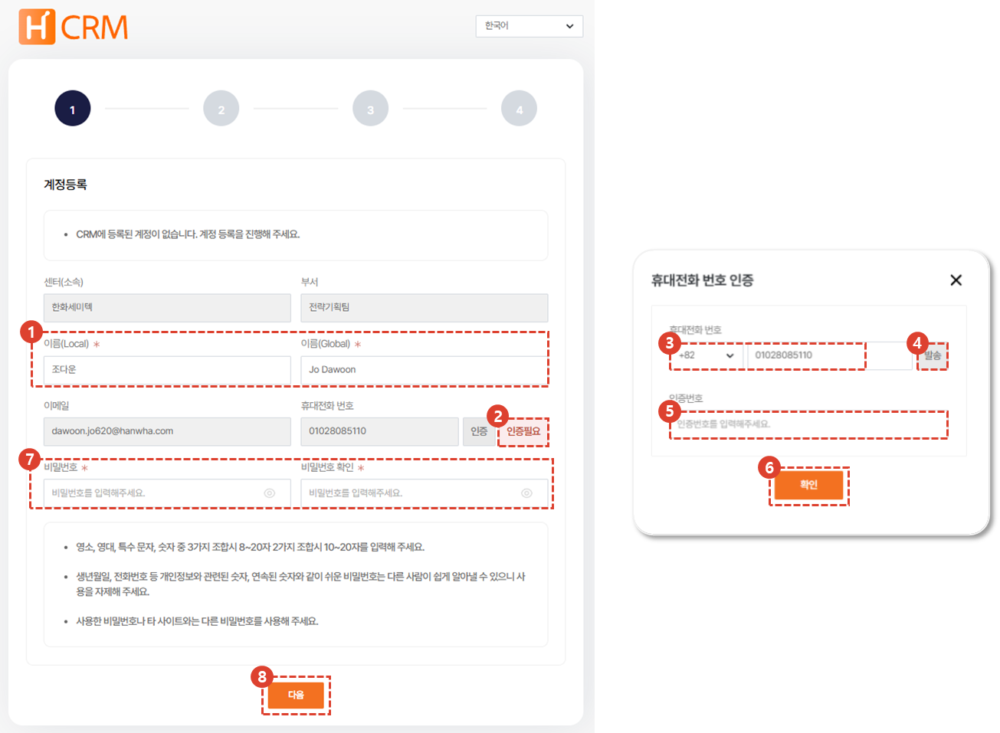

import ValidateTextByToken from "/src/utils/getQueryString.js";
import StrongTextParser from "/src/utils/textParser.js";
import text from "/src/locale/zh/SMT/tutorial-01-auth/create-a-acount-non-circle-user.json";

# 创建CRM账户（其他用户）

<!-- 메뉴단에서 번역이 안되므로 여기 하드코딩해야 함 #가 달린 헤더와 함께 -->
将为您介绍在**外部网络**中创建CRM使用账户的流程。

:::danger
<StrongTextParser text={text.warning} />
:::

<ValidateTextByToken dispTargetViewer={true} dispCaution={false} validTokenList={['head', 'branch', 'agent', 'customer']}>

## 概要

<StrongTextParser text={text.overview01} />
:::warning 
   - <StrongTextParser text={text.overview02} />
   - <StrongTextParser text={text.overview03} />
:::

</ValidateTextByToken>

## 创建CRM账户 (代理商)

<ValidateTextByToken dispTargetViewer={false} validTokenList={['head', 'branch', 'agent']}>

:::info
<StrongTextParser text={text.createAgentAccount01} />
:::

### 页面跳转

1. <StrongTextParser text={text.createAgentAccount02} />
2. <StrongTextParser text={text.createAgentAccount03} />

1. <StrongTextParser text={text.createAgentAccount04} />
2. <StrongTextParser text={text.createAgentAccount05} />
3. <StrongTextParser text={text.createAgentAccount06} />

### 用户添加（1/3）

1. <StrongTextParser text={text.step1AddUser01} />
   - <StrongTextParser text={text.step1AddUser02} />
   - <StrongTextParser text={text.step1AddUser03} />
   - <StrongTextParser text={text.step1AddUser04} />
   - <StrongTextParser text={text.step1AddUser05} />
2. <StrongTextParser text={text.step1AddUser06} />
   :::note
   <StrongTextParser text={text.step1AddUser07} />
   :::
3. <StrongTextParser text={text.step1AddUser08} />
   :::tip
   <StrongTextParser text={text.step1AddUser09} />
   :::

### 用户添加（1/3） - 部门注册

1. <StrongTextParser text={text.step1AddDept01} />
1. <StrongTextParser text={text.step1AddDept02} />
1. <StrongTextParser text={text.step1AddDept03} />
1. <StrongTextParser text={text.step1AddDept04} />
1. <StrongTextParser text={text.step1AddDept05} />
1. <StrongTextParser text={text.step1AddDept06} />
1. <StrongTextParser text={text.step1AddDept07} />

### 用户添加（2/3）

1. <StrongTextParser text={text.step2AddUser01} />
1. <StrongTextParser text={text.step2AddUser02} />
1. <StrongTextParser text={text.step2AddUser03} />
1. <StrongTextParser text={text.step2AddUser04} />
1. <StrongTextParser text={text.step2AddUser05} />
1. <StrongTextParser text={text.step2AddUser06} />
1. <StrongTextParser text={text.step2AddUser07} />
1. <StrongTextParser text={text.step2AddUser08} />
   :::warning
      - <StrongTextParser text={text.step2AddUser09} />
      - <StrongTextParser text={text.step2AddUser10} />
   :::
1. <StrongTextParser text={text.step2AddUser11} />

### 用户添加（3/3）

1. <StrongTextParser text={text.step3AddUser01} />
1. <StrongTextParser text={text.step3AddUser02} />
   :::danger
   <StrongTextParser text={text.step3AddUser03} />
   :::
1. <StrongTextParser text={text.step3AddUser04} />
   - <StrongTextParser text={text.step3AddUser05} />
   - <StrongTextParser text={text.step3AddUser06} />

### 用户额外认证(1/2)

1. <StrongTextParser text={text.step1AdditionalAuth01} />
   :::tip
   <StrongTextParser text={text.step1AdditionalAuth02} />
   :::
1. <StrongTextParser text={text.step1AdditionalAuth03} />
   :::note
   <StrongTextParser text={text.step1AdditionalAuth04} />
   :::

### 用户额外认证(2/2)

1. <StrongTextParser text={text.step2AdditionalAuth01} />
1. <StrongTextParser text={text.step2AdditionalAuth02} />
1. <StrongTextParser text={text.step2AdditionalAuth03} />
1. <StrongTextParser text={text.step2AdditionalAuth04} />
1. <StrongTextParser text={text.step2AdditionalAuth05} />
   :::note
   <StrongTextParser text={text.step2AdditionalAuth06} />
   :::
1. <StrongTextParser text={text.step2AdditionalAuth07} />
1. <StrongTextParser text={text.step2AdditionalAuth08} />
   :::note
   - <StrongTextParser text={text.step2AdditionalAuth09} />
   - <StrongTextParser text={text.step2AdditionalAuth10} />
   - <StrongTextParser text={text.step2AdditionalAuth11} />
   :::
1. <StrongTextParser text={text.step2AdditionalAuth12} />

- <StrongTextParser text={text.finalConfirm01} />
   :::tip
   <StrongTextParser text={text.finalConfirm02} />
   :::

</ValidateTextByToken>

### 批准用户 🚧

<ValidateTextByToken dispTargetViewer={false} validTokenList={['head']}>

:::info
TBD (화면작업중)
:::

</ValidateTextByToken>

## 创建CRM账户 (客户) 🚧

<ValidateTextByToken dispTargetViewer={false} validTokenList={['customer']}>

### 页面跳转 🚧

:::info
TBD (화면작업중)
:::

</ValidateTextByToken>