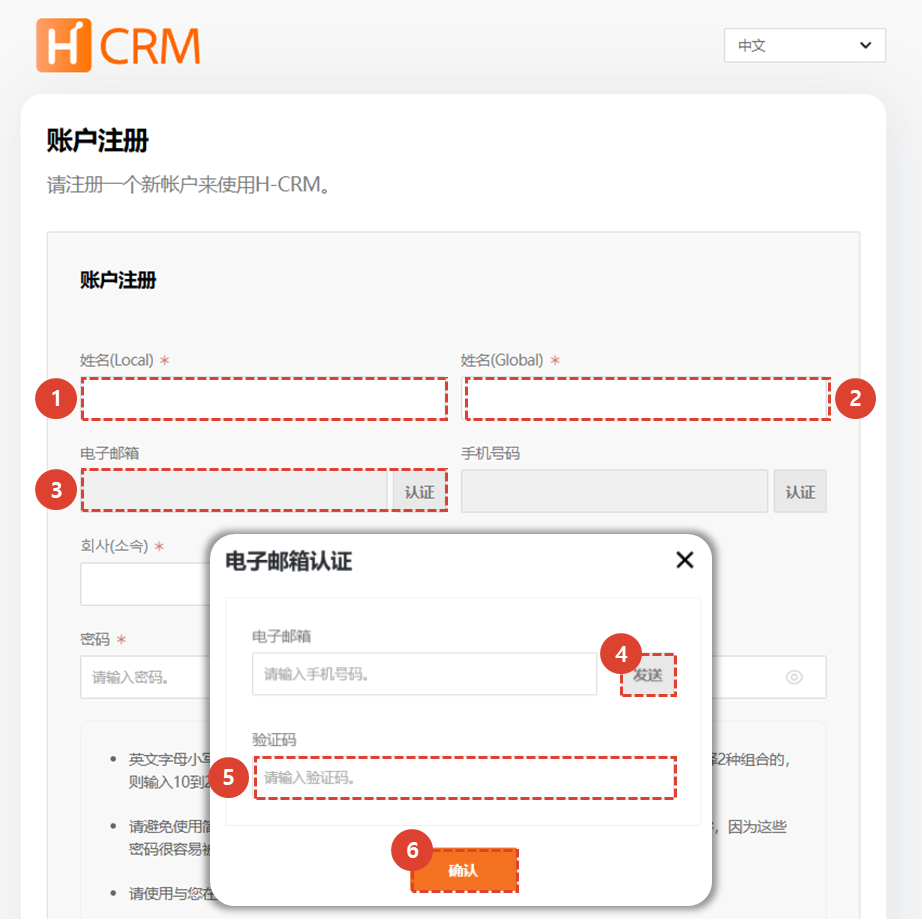
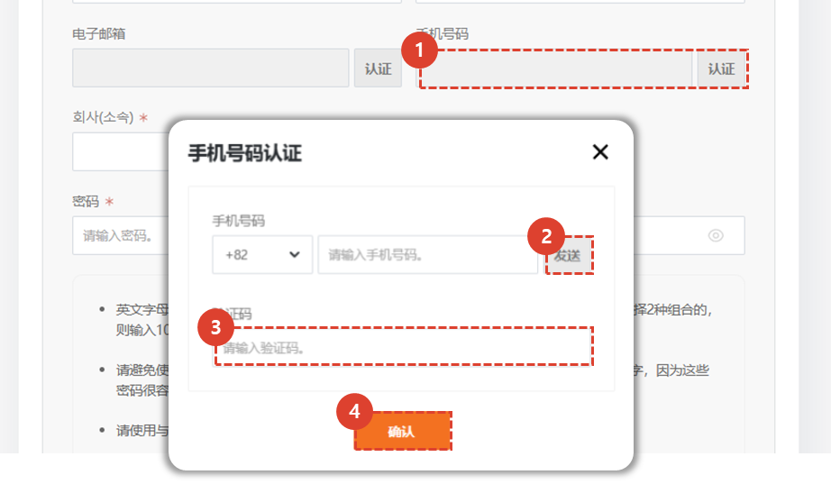
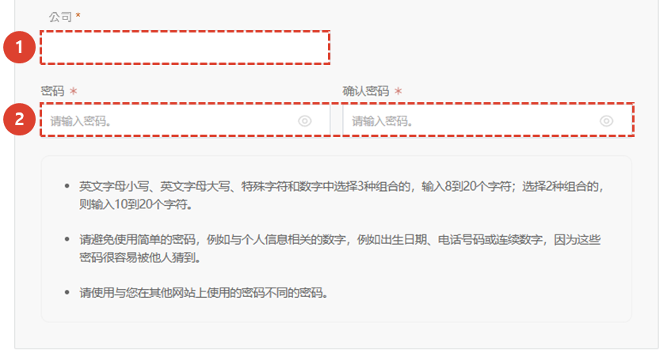
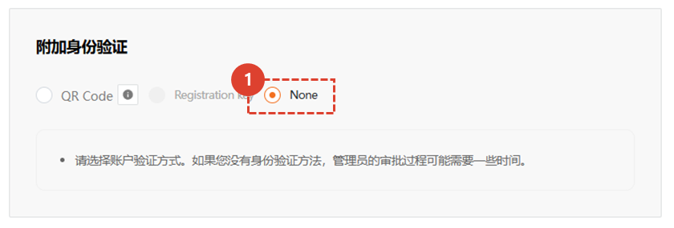
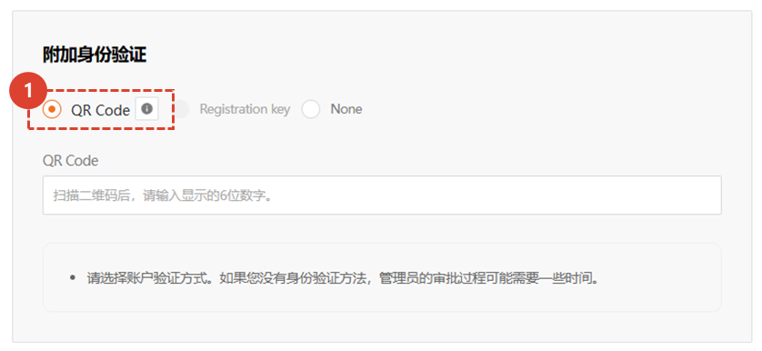
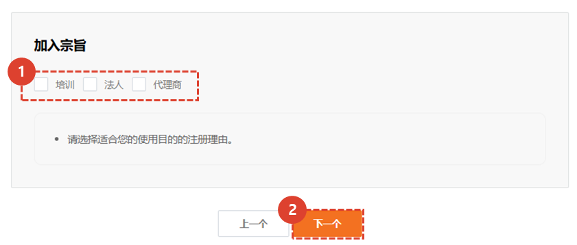
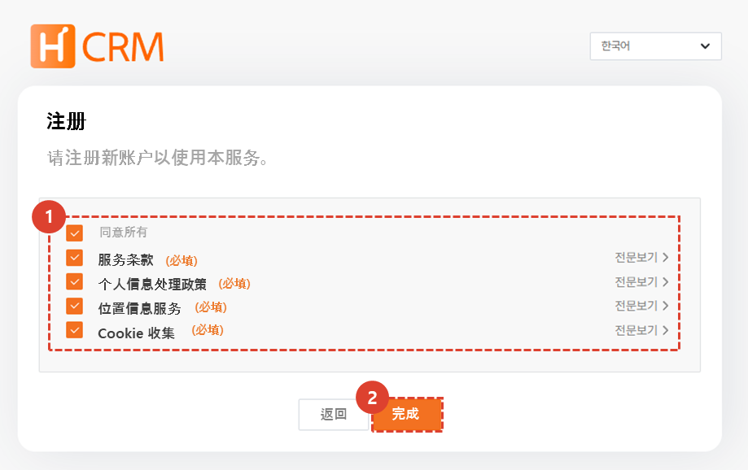

import ValidateTextByToken from "/src/utils/getQueryString.js";
import StrongTextParser from "/src/utils/textParser.js";
import text from "/src/locale/ko/SMT/tutorial-01-auth/create-a-acount-non-circle-user.json";
import MMIMobile from "./img/039.png";

# 创建 CRM 帐户（客户）

<!-- 메뉴단에서 번역이 안되므로 여기 하드코딩해야 함 #가 달린 헤더와 함께 -->
고객사의 CRM 사용 계정을 생성하기 위한 절차를 안내합니다.

:::danger
<StrongTextParser text={text.warning} />
:::

<ValidateTextByToken dispTargetViewer={true} dispCaution={false} validTokenList={['head', 'branch', 'agent', 'customer']}>

## 大纲

经销商用户的 CRM 帐户创建场景如下
:::warning 
   - **服务机构用户**：此结构由管理员代表用户创建用户帐户。
   - **客户**：您可以直接在 CRM 中创建帐户。
:::

</ValidateTextByToken>
 
 

## 创建客户账户

<ValidateTextByToken dispTargetViewer={false} validTokenList={['head', 'branch', 'agent', 'customer']}>

:::info
我们将授予单独的账户创建权限，只有拥有权限的用户才可以执行账户创建任务。
:::

### 前往会员注册画面

1. 点击**注册**。
 
 

### 输入基本信息

1. 输入**姓名**。
1. 输入**英文名**。
1. 点击**验证**。
1. 输入您希望用作ID的电子邮件地址，然后点击**发送**。
1. 输入发送到您电子邮件地址的验证码。
1. 点击**确认**完成电子邮件注册。
:::info
  
一旦身份验证完成，**身份验证**按钮将变为**身份验证完成**。
:::
 
 

1. 点击**认证**。
1. 输入您的手机号码，然后点击**发送**。
1. 输入发送到您手机的认证码。
1. 点击**确认**完成手机注册。
 
 

1. 输入**公司（附属机构）**信息。
1. 输入您的密码。
 
 

### 附加身份验证 - 无身份验证方法

1. 半导体设备及机床客户请选择**无认证方式**，工业设备客户请选择**无认证方式**或**二维码**。
 
 

### 附加身份验证-二维码身份验证

1. 选择二维码时，您使用的设备必须识别该二维码并发出识别号码。
   :::info
        
      您可以在设备的 MMI 屏幕上查看以下二维码。
      请使用手机识别二维码。
      

      1. 选择同意位置信息收集。
      1. 选择**确认**。
      1. 检查屏幕上显示的识别码，并将其输入到附加身份验证二维码字段中。
   :::
 
 

### 选择注册原因

1. 选择注册原因。
1. 选择**下一步**
 
 

### ServiceCRM 条款和条件协议

1. 检查条款和条件，然后检查协议。
:::warning 
   - 如果不同意所需的条款和条件，您将无法注册成为会员。
:::
1. 选择**完成**即可完成会员注册流程。 
:::info
   获得 CRM 管理员批准后，将会发送一封电子邮件，然后您就可以使用 CRM。
:::

</ValidateTextByToken>
