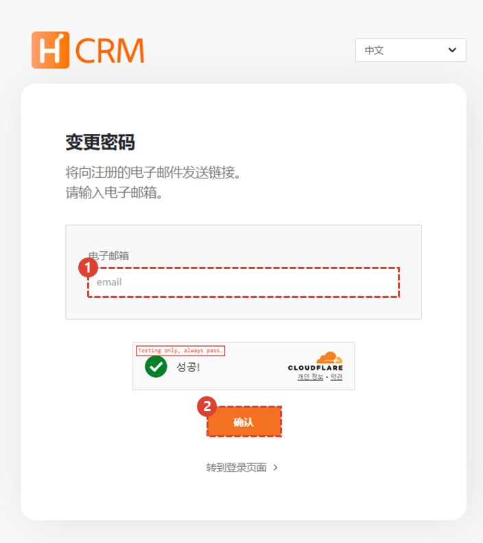
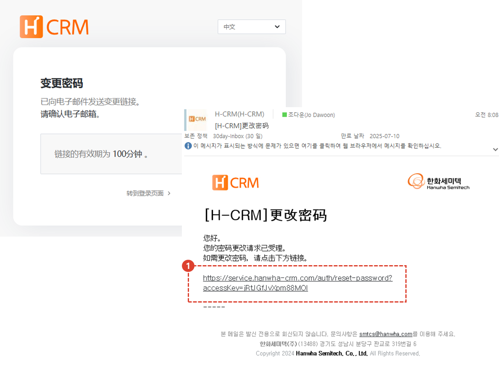
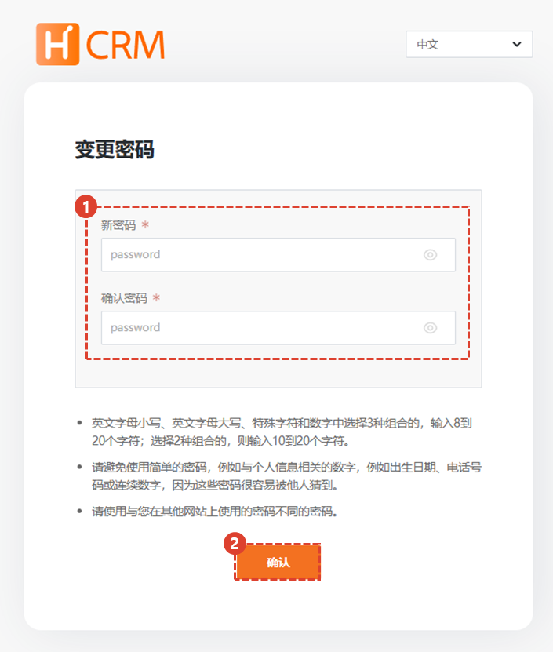

import loginWindow from "./img/019.png";
import ValidateTextByToken from "/src/utils/getQueryString.js";

# 重置密码

**从外部网络登录时**，如果您忘记了密码，我们将指导您完成密码重置过程。

<ValidateTextByToken dispTargetViewer={true} validTokenList={['head', 'branch', 'agent', 'customer']}>

## 移动页面

1.在登录屏幕上，点击[查找密码]按钮。

## 输入您的用户电子邮件

1. 输入您要初始化的帐户的电子邮件地址。
    :::tip
    如果您丢失了ID（邮箱），请参阅[查找ID（邮箱）](./find-email.md)页面。
    :::
1. 输入您的电子邮件地址，然后单击**确认**按钮。

1. 单击您收到的电子邮件中的链接。

## 重置密码

1. 输入您的新密码。
1. 点击**确认**按钮。

</ValidateTextByToken>