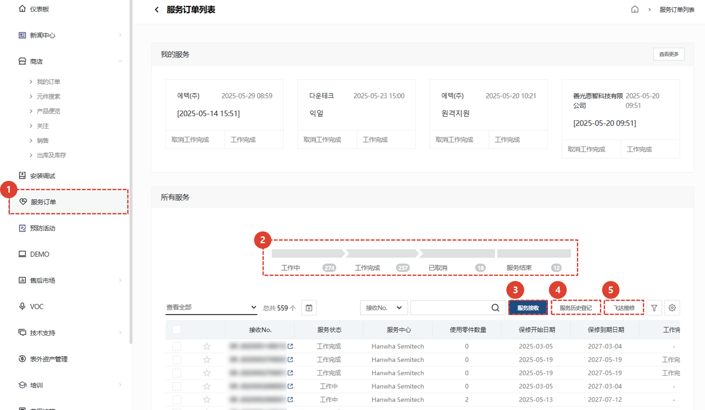
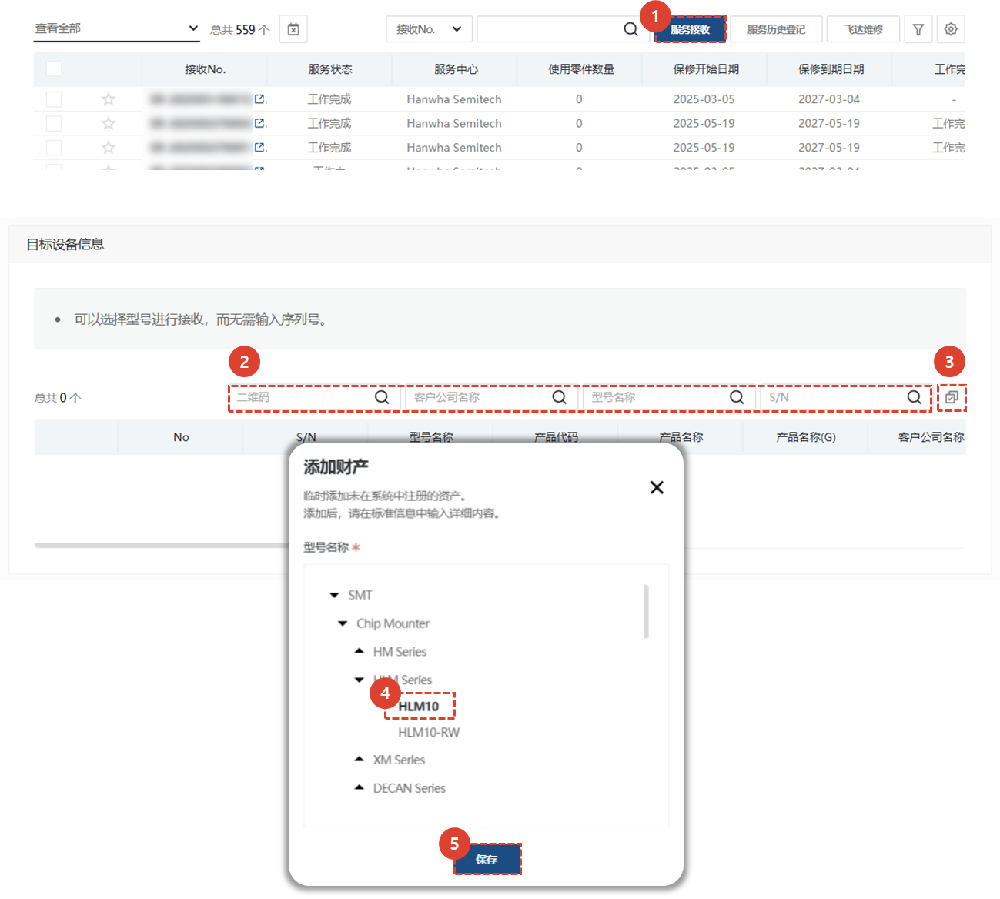
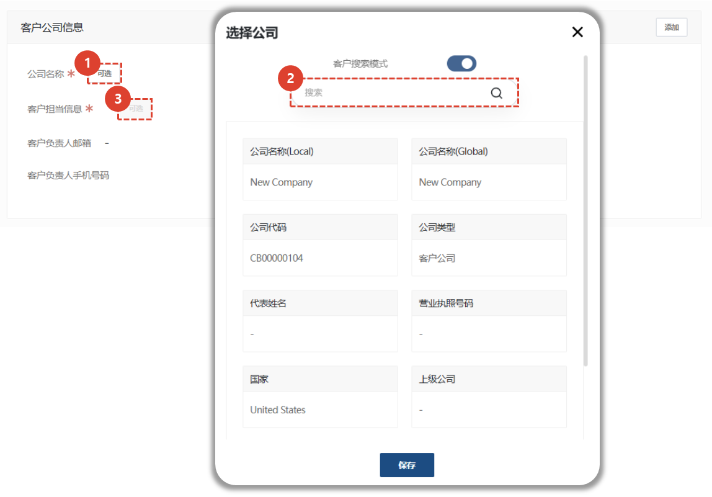
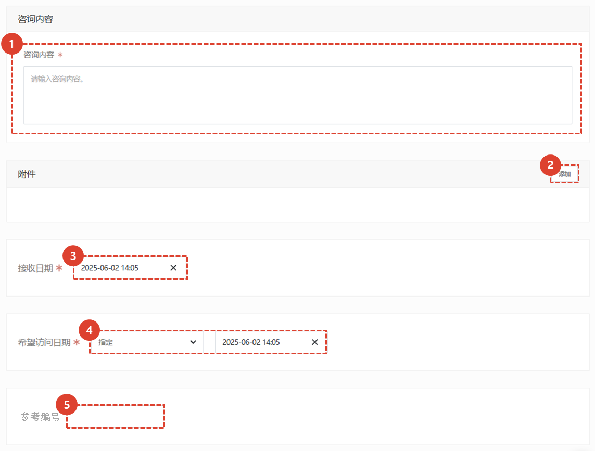
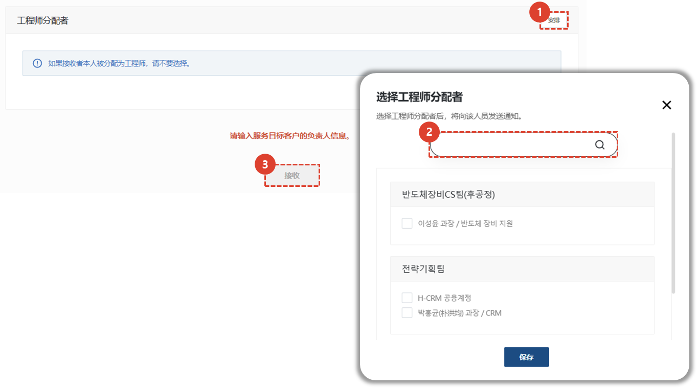
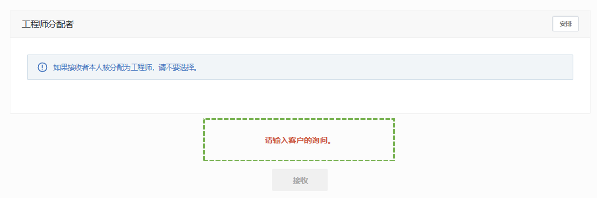

import ValidateTextByToken from "/src/utils/getQueryString.js";
import StrongTextParser from "/src/utils/textParser.js";
import text from "/src/locale/ko/SMT/tutorial-01-auth/create-a-acount-circle-user.json";

# 服务接待

我们将根据您的要求指导您完成接收和处理服务的过程。
<ValidateTextByToken dispTargetViewer={true} dispCaution={false} validTokenList={['head', 'branch', 'agent']}>

## 服务列表

1. 选择**服务**。
1. 将显示所有服务的列表。
      - 工作中 : 指示正在处理的服务数量。单击后，仅显示正在处理的服务列表。
      - 工作完成 : 表示已完成的服务数量。点击后，列表中仅显示已完成的服务。
      - 已取消 : 表示已取消的服务数量。点击后，列表中仅显示已取消的服务。
      - 服务结束 : 显示接受服务后未按正常流程处理而被终止的服务数量。点击后，列表中仅显示已终止的服务列表。
1. 服务接收 : 您可以注册成为一般服务接待员。 
      - 这适用于您仅先注册应用程序或有单独的管理员接收和注册应用程序时使用。
1. 服务历史登记 : 您可以一次性输入从服务接待到处理细节的所有内容。 
      - 适用于服务工作完成后，需要立即录入接待及工作详情时使用。
1. [飞达维修](./create-a-service-order_feeder.md) : 当您需要输入多个资产（例如喂食器）的服务历史记录时，请继续操作。与**接收**和**执行登记**不同，您只需输入**接收日期**和**行动日期**即可注册服务，无需添加移动/工作/用餐所需的时间。

## 服务接收 - 1/4

1. 选择**接收服务**。
1. 搜索并注册您希望获得服务的设备。
1. 若未找到目标设施信息，请点击按钮查找并添加相应资产。
    :::warning
        添加资产时，请仅在无法避免资产搜索时使用它。
    :::
1. 单击“保存”以反映资产。

## 服务接收 - 2/4

:::info
在上一步中选择资产后，持有该资产的客户信息将自动录入。
仅当与该资产关联的客户信息发生变更时，才会进行客户注册。
:::

1. 单击**选择**来注册您的客户信息。
    :::note
    如果您不首先搜索目标设施或资产，则无法注册为客户。
    :::
1. 查找并保存客户名称。
1. 点击**选择**设置客户的联系人。

## 服务接收 - 3/4

1. 输入您的咨询详情。
1. 点击“添加”添加附件。
1. 收据日期将自动输入为收据日期。如需更改，请点击更改。
1. 选择所需的访问日期。
1. 您可以输入与该服务相关的服务编号。
    :::note
    参考编号是一个选项卡，您可以在其中输入由机构管理的编号。
    :::

## 服务接收 - 4/4

1. 选择**分配**来分配负责的工程师。
    :::note
    负责工程师默认为收件人。
    如果收件人指定为工程师，则无需单独选择。
    :::
1. 点击**保存**分配工程师。
1. 点击**接受**完成服务申请。
    :::note
    
    服务注册所需的值显示在注册屏幕的底部，如果没有输入所需的值，**注册**按钮将被禁用。
    :::
</ValidateTextByToken>