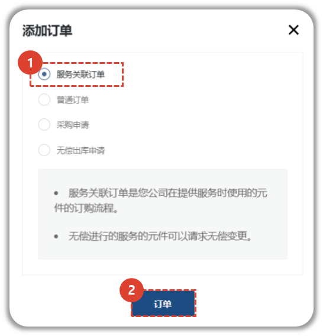
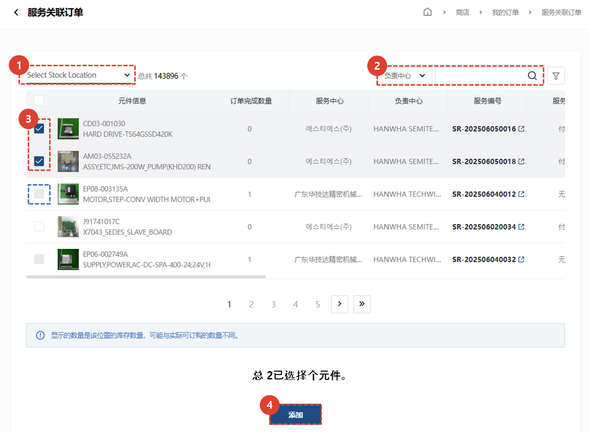
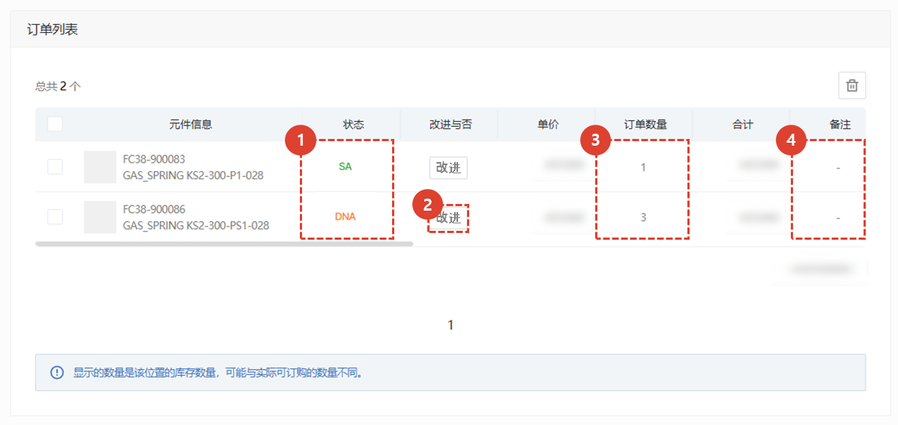
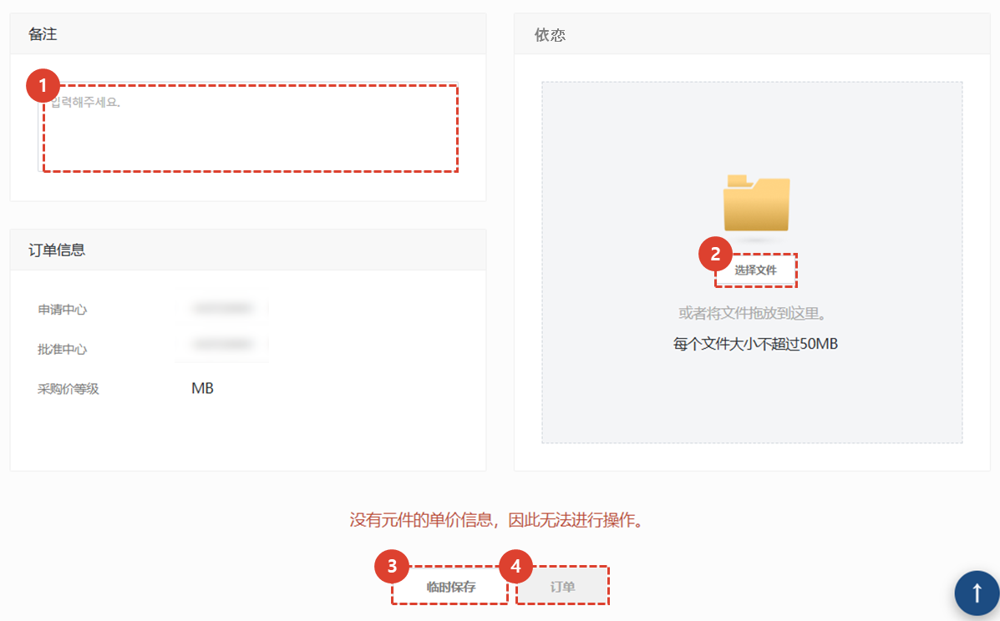
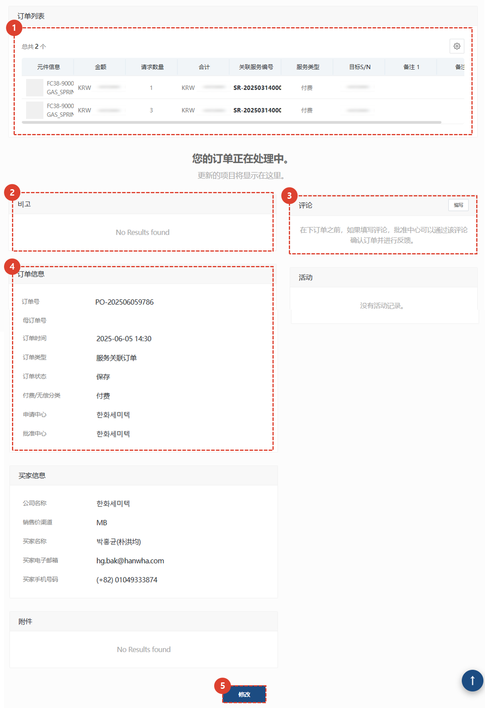
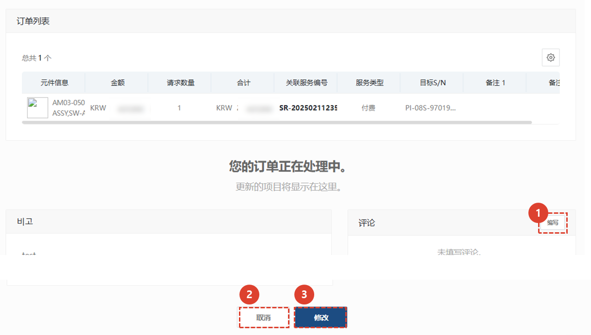

import ValidateTextByToken from "/src/utils/getQueryString.js";
import StrongTextParser from "/src/utils/textParser.js";
import text from "/src/locale/ko/SMT/tutorial-03-store/01-create-order-buyer.json";

# 填写订单 - 服务关联订单

<ValidateTextByToken dispTargetViewer={false} validTokenList={['head', 'branch', 'agent']}>

为**服务订单/安装/试驾项目**中使用的零件创建付费/免费采购订单。
<ValidateTextByToken dispTargetViewer={true} dispCaution={false} validTokenList={['head', 'branch', 'agent']} ></ValidateTextByToken>

## 添加订单

1. 点击[服务链接订购]按钮。
1. 点击[订购]按钮。
 
 

## 添加零件

1. 选择****来查看特定物料仓库的库存。 
    :::info
        当您选择“Storage Location”时，您可以检查该仓库中的库存。
         예) **Plant code**|**Storage Location** : **VK21**|**SC03**
        
    :::
1. 可以使用负责中心、服务编号、序列号、零件代码和零件名称进行详细搜索。
1. 选择要进行服务链接订单的项目。
:::note
默认情况下，该复选框处于启用状态。
已添加到该服务的部件的复选框将被**禁用**。
:::
1. 点击**添加**按钮添加一个部件。
 
 

## 查看订单列表并输入附加信息

1. 如果状态栏的值为 SNA/DNA，则无法处理订单。
    - 如果状态为 **无信息**，则表示物料管理员尚未更新，因此可以处理订单。
1. 对于 SNA/DNA，您可以查看改进的产品。
1. 您可以查看订单数量并**双击**进行修改。
1. 您可以双击备注栏进行修改。
1. 您可以在**卖家中心**查看库存数量。
 
 

## 输入附加信息并创建订单

1. 输入订单的整体备注。
1. 如有附件，请添加文件。
1. 如果订单尚未确认，请点击“保存草稿”。点击“保存草稿”按钮后，即使您离开当前页面，**您输入的数据也不会丢失**。
:::info
    
    1. 暂时保存的订单，在列表中会保留在**保存**状态。
    
    1. 您可以查看已保存的订单。
    1. 订单列表和备注无法修改。如需修改，请点击底部的**修改**按钮。
    1. 输入与卖家沟通的信息。
    1. 订单信息显示。
    1. 如需处理临时保存的订单，请点击**修改**按钮，然后在出现的修改页面上点击**订单**按钮。
:::

1. 要创建订单，请单击**订单**按钮。
 
 

## 订单完成

1. 对于已完成的订单，该订单将保留在列表中的**订单已收到**状态。
1. 您可以点击**订单号**查看订单。
 
 

1. 输入与卖家沟通的信息。
1. 您可以在卖家批准订单**之前**修改您的订单。
1. 您可以在卖家批准订单**之前**取消您的订单。
</ValidateTextByToken>
