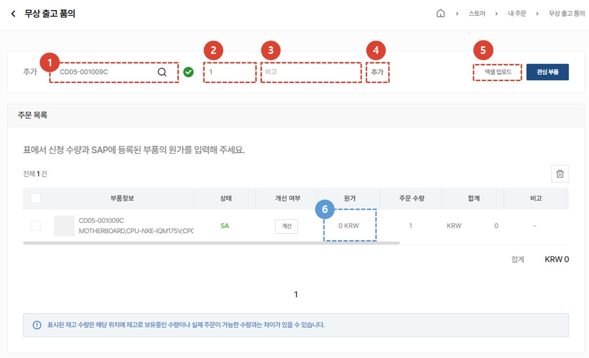
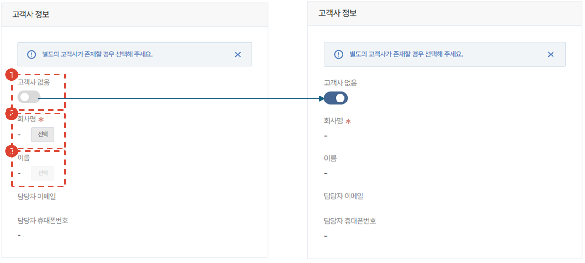
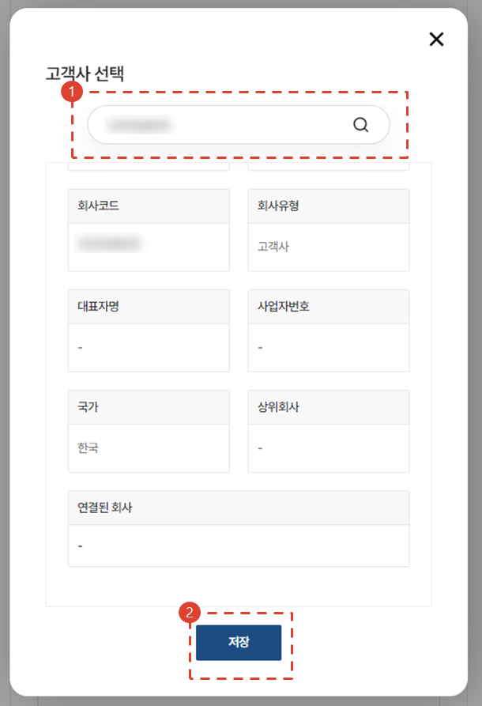
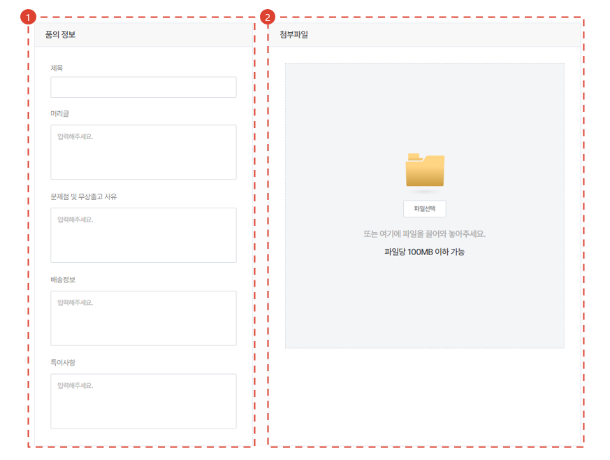
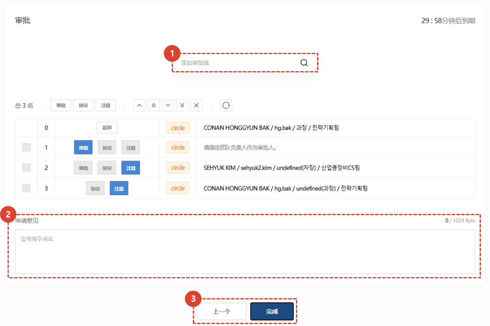

import ValidateTextByToken from "/src/utils/getQueryString.js";
import StrongTextParser from "/src/utils/textParser.js";
import text from "/src/locale/ko/SMT/tutorial-03-store/01-create-order-buyer.json";

# 填写订单 - 无偿出库申请
这不是与服务相关的订单，而是用于必须免费运送材料的特殊情况。

<ValidateTextByToken dispTargetViewer={false} validTokenList={['head', 'branch']}>

1. 选择“禁止退出请求”。
1. 点击“订购”按钮。
 
 

### 添加零件以订购

1. 您可以通过搜索零件代码来添加采购订单应用程序零件。
     → 正常搜索 
     → 没有正确搜索 **(没有进展)**
1. 输入数量
1. 输入与申请零件相关的具体信息。
     示例）相关文件、零件具体信息、送货地址等。
1. 点击**添加**按钮进行添加。
1. 您可以使用 Excel 批量上传。
1. 如果是免运费，请输入**SAP 中注册的成本价**。
 
 

## 检查订单零件清单

1. 双击即可修改成本价。
1. 双击即可修改订单数量和备注。
1. 与内部系统关联，可查看订货方（出单方）**物料审批中心**的库存、MOQ、L/T（Lead Time）。

## 输入基本信息

- 在备注栏中填写备注，并确认订购人（出票人）信息。

## 输入其他信息

1. 如果没有客户信息，请激活切换按钮。
 如果从培训中心订购材料，请选择“无客户”。
1. 点击[选择]按钮加载客户信息。（必填）
1. 点击[选择]按钮加载客户联系信息。（可选）

## 输入附加信息 - 选择客户

1. 输入要搜索的客户名称。
1. 单击“保存”按钮。

## 输入附加信息 - 选择客户代表

1. 如果列表中没有联系信息，请输入客户联系信息并进行注册。
1. 从列表中选择已添加的联系人。

## 撰写提案

1. 输入产品信息。
1. 如有附件，请附加文件。

## 最好的人

1. 搜索付款明细。（Circle user）
1. 输入提案意见。
1. 点击完成按钮，将付款凭证发送至圈子。

</ValidateTextByToken>