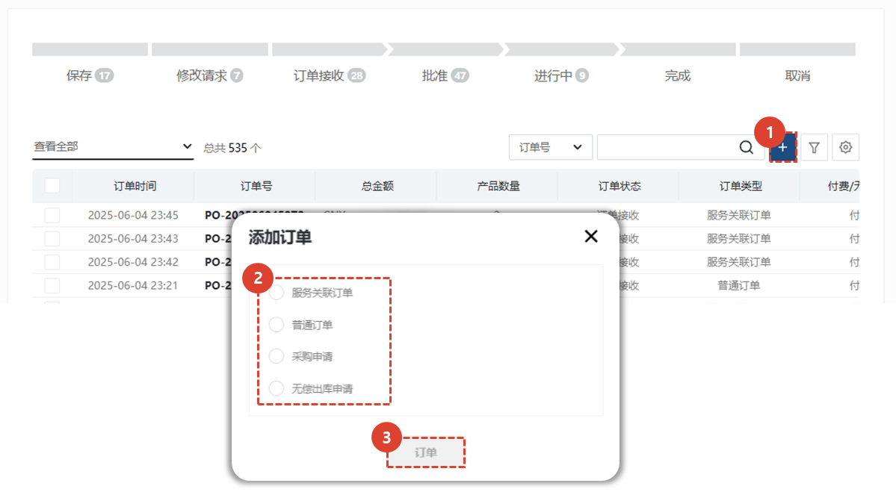

import ValidateTextByToken from "/src/utils/getQueryString.js";
import StrongTextParser from "/src/utils/textParser.js";
import text from "/src/locale/ko/SMT/tutorial-03-store/01-create-order-buyer.json";

# 내 주문

스토어의 내 주문 메뉴를 안내합니다.

<ValidateTextByToken dispTargetViewer={true} dispCaution={false} validTokenList={['head', 'branch', 'agent']} ></ValidateTextByToken>

## 주문서 목록

<ValidateTextByToken dispTargetViewer={false} validTokenList={['head', 'branch', 'agent']}>

1. <StrongTextParser text={text.list01} />
1. <StrongTextParser text={text.list02} />

</ValidateTextByToken>

## 주문서 목록 - 주문서 상태

<ValidateTextByToken dispTargetViewer={false} validTokenList={['head', 'branch', 'agent']}>

- 저장: 주문서가 임시저장된 상태입니다.
- 수정 요청: 판매자가 주문자에게 수정할 것을 요청한 상태의 주문서입니다.
- 주문 접수: 주문자가 주문서를 생성하여 판매자에게 접수된 상태의 주문서입니다.
- 승인: 판매자에 의해 승인된 상태의 주문서입니다.
- 진행중: 승인된 주문서가 주문자에게 납품되는 중에 있는 상태의 주문서입니다.
- 완료: 주문자에게 납품이 완료된 상태의 주문서입니다.
- 취소: 주문자에 의해 취소된 상태의 주문서입니다.

</ValidateTextByToken>

## 주문서 생성

<ValidateTextByToken dispTargetViewer={false} validTokenList={['head', 'branch', 'agent']}>

1. **+** 버튼을 눌러 주문서를 생성합니다.
1. 4가지 유형의 주문서 생성 방식 중에서 1가지를 선택합니다.
    - 서비스 연계주문 : 서비스 주문서에 사용된 부품을 주문시 (특히 무상자재 요청시) 활용합니다.
    - 일반주문: 일반 유상 PO 생성 시 사용합니다.
    - 구매품의: 법인사용자를 위한 메뉴입니다. 법인의 유상 PO 생성시 사용하는 메뉴입니다.
    - 무상출고: (본사전용) 서클에서 작성하는 일반적인 무상출고 품의를 CRM에서 생성하는 것으로 생각해주시면 됩니다.
1. 유형을 선택 후 **주문** 버튼을 클릭합니다.

</ValidateTextByToken>
