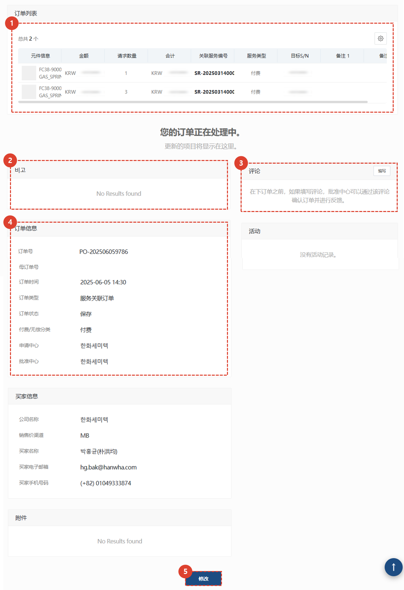
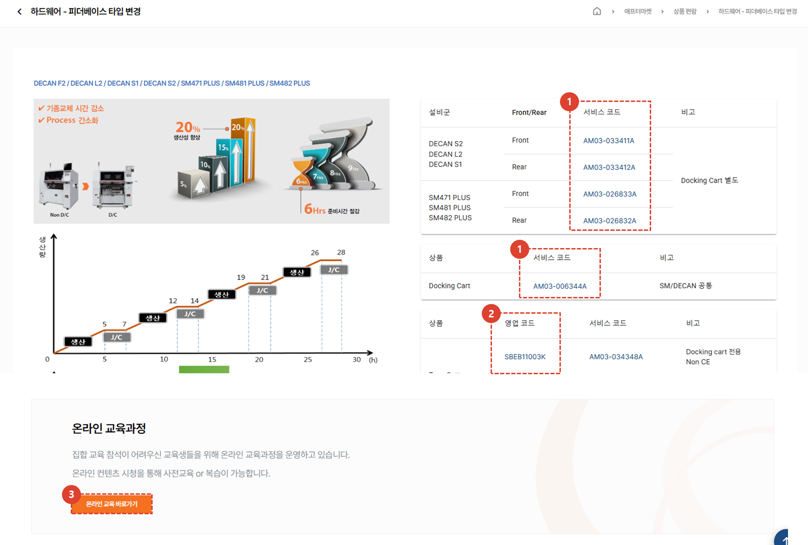

import ValidateTextByToken from "/src/utils/getQueryString.js";

# 产品目录

本页面提供售后产品（包括硬件和软件）的指南。

<ValidateTextByToken dispTargetViewer={true} dispCaution={true} validTokenList={['head', 'branch', 'agent']}>

## 产品目录列表

 
1. 从售后市场列表中选择一个产品目录。
1. 选择您要搜索的产品类别以查看相应的目录。
1. 使用搜索功能查找所需的目录。
 
 

 
1. 您可以查看产品相关信息，以及设备组和产品的服务代码。
    :::tip
    - 点击服务代码即可查看该服务代码的详细信息。
    :::
1. 您可以查看与产品关联的销售代码。
    :::tip
    - 与服务代码类似，您可以查看销售代码的详细信息。
    :::
1. 您可以通过点击在线培训链接访问产品相关的培训。 

</ValidateTextByToken>