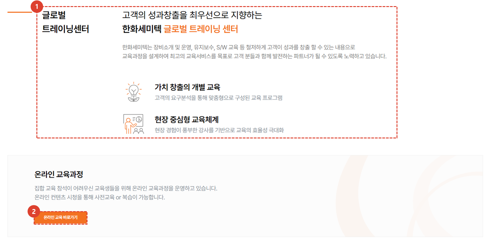
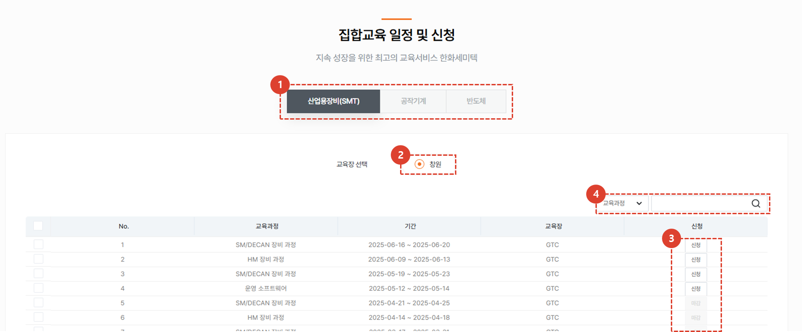
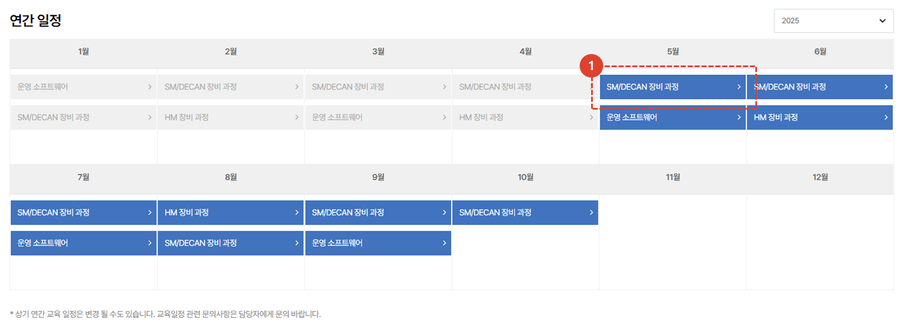

import ValidateTextByToken from "/src/utils/getQueryString.js";

# 집합 교육

<ValidateTextByToken dispTargetViewer={true} dispCaution={false} validTokenList={['head', 'branch', 'seller', 'agent', 'customer']}>

집합 교육(오프라인 교육) 과정의 소개와 수강 절차에 대해 안내합니다.

</ValidateTextByToken>

## 메인 페이지

<ValidateTextByToken dispTargetViewer={false} dispCaution={true} validTokenList={['head', 'branch', 'seller', 'agent', 'customer']}>

1. 집합 교육 페이지 소개입니다. 
1. [온라인교육 바로가기] 버튼을 클릭하여 온라인 교육 페이지로 이동할 수 있습니다. 

1. 사업부를 선택할 수 있습니다.
1. 원하는 교육장을 선택할 수 있습니다.
1. 사업부와 교육장 선택에 따라 운영중인 오프라인교육 목록입니다. 버튼 클릭 시, 상세페이지로 이동합니다. 
1. Selectbox의 유형을 선택 후, 원하는 검색어로 검색할 수 있습니다.

1. 연간 일정을 한 눈에 볼 수 있습니다. 버튼을 클릭하여 상세페이지로 이동이 가능합니다. 
1. 연도별 연간일정을 조회할 수 있습니다. 

</ValidateTextByToken>

## 상세 페이지

<ValidateTextByToken dispTargetViewer={false} dispCaution={true} validTokenList={['head', 'branch', 'seller', 'agent', 'customer']}>

1. [신청] 버튼을 클릭 시, 상세 페이지로 이동됩니다. 
    :::tip
    - 교육 신청기간이 아닐 경우, 신청 버튼을 클릭할 수 없습니다. 
    :::
1. [문의하기] 버튼을 클릭 시 [기술지원 > Q&A] 오프라인교육 문의 페이지가 새 탭으로 열립니다. 해당 페이지에서 문의내용을 작성할 수 있습니다.

### 교육 신청

1. [신청] 버튼을 클릭 시, 신청 페이지로 이동됩니다. 
    :::tip
    - 교육 신청기간이 아닐 경우, 신청 버튼을 클릭할 수 없습니다. 
    :::

1. 오프라인 교육신청을 위한 신청자 정보를 입력해야 합니다.
1. 이메일 인증과 휴대폰번호 인증을 해야 합니다.
1. 필수값을 모두 입력 후, [교육신청] 버튼을 클릭 시, 오프라인교육 신청이 완료됩니다. 신청에 대한 결과는 관리자 심사를 거쳐 신청자 메일로 전송됩니다. 

</ValidateTextByToken>