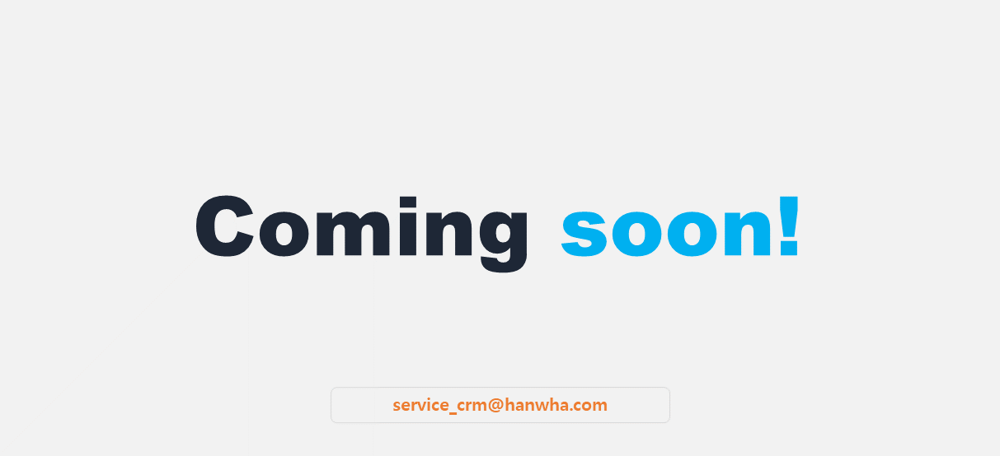

import ValidateTextByToken from "/src/utils/getQueryString.js";

# Special nozzle

<ValidateTextByToken dispTargetViewer={true} dispCaution={true} validTokenList={['head', 'branch', 'seller', 'agent']}>

We provide menus related to special nozzle selection and design request work.

</ValidateTextByToken>
