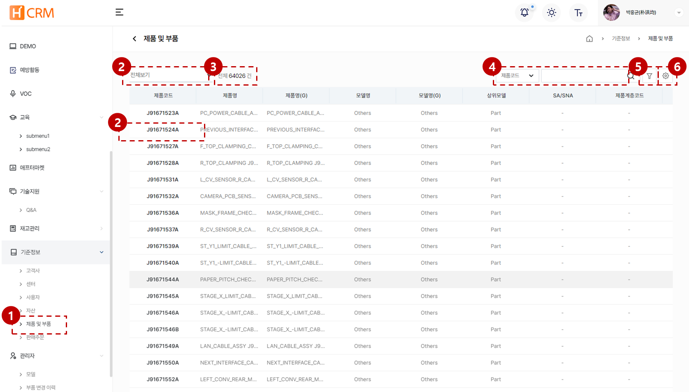

import ValidateTextByToken from "/src/utils/getQueryString.js";

# 고객사 데이터 관리

고객사 데이터 관리에 대한 안내입니다.

<ValidateTextByToken dispTargetViewer={true} dispCaution={true} validTokenList={['head', 'branch', 'seller', 'agent']}></ValidateTextByToken>

## 목록 페이지

<ValidateTextByToken dispTargetViewer={false} dispCaution={true} validTokenList={['head', 'branch', 'seller', 'agent']}>

:::tip 아래의 데이터들이 목록에 표시됩니다.
    - **등록채널** 컬럼에 데이터가 생성된 위치가 표시됩니다.
        - **MDG**: MDG에서 채번된 고객사 정보
        - **4CUST**: 4CUST 시스템에서 마이그레이션된 고객사 정보
        - **CRM**: H-CRM 서비스 모듈에서 생성된 고객사 정보
        - **CRM(HTAA)**: H-CRM 미주법인 영업 모듈에서 생성된 고객사 정보
:::

</ValidateTextByToken>