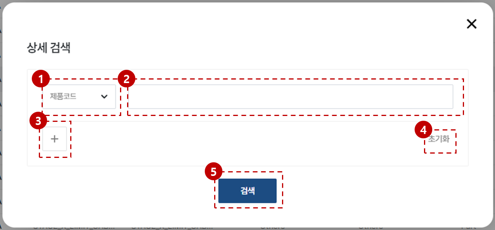
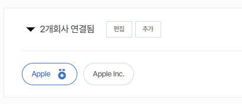
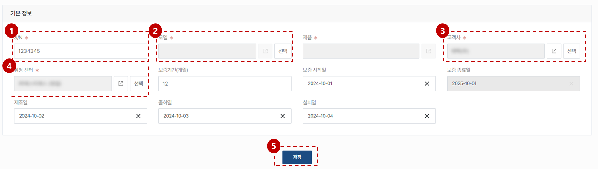

import ValidateTextByToken from "/src/utils/getQueryString.js";
import filterList from "./img/002.png";
import searchList from "./img/017.png";
import tableFilter from "./img/006.png";
import createLabor from "./img/013.png";

# 고객사 데이터 관리

고객사 데이터 관리에 대한 안내입니다.

<ValidateTextByToken dispTargetViewer={true} dispCaution={true} validTokenList={['head', 'branch', 'seller', 'agent']}></ValidateTextByToken>

## 목록 페이지

<ValidateTextByToken dispTargetViewer={false} dispCaution={true} validTokenList={['head', 'branch', 'seller', 'agent']}>

:::tip 아래의 데이터들이 목록에 표시됩니다.
    - **등록채널** 컬럼에 데이터가 생성된 위치가 표시됩니다.
        - **MDG**: MDG에서 채번된 고객사 정보
        - **4CUST**: 4CUST 시스템에서 마이그레이션된 고객사 정보
        - **CRM**: H-CRM 서비스 모듈에서 생성된 고객사 정보
        - **CRM(HTAA)**: H-CRM 미주법인 영업 모듈에서 생성된 고객사 정보
:::

1. [기준정보] - [고객사] 메뉴를 클릭합니다.
    :::info 메뉴 접근을 위해 필요한 권한
        - TBD
    :::
2. 목록 필터링
    - 아래의 항목을 기준으로 데이터를 필터링할 수 있습니다.
        

3. 전체 등록된 **고객사**의 개수를 표시합니다.
4. 같은 고객사인 복수개의 고객코드를 연결할 수 있습니다.
    :::info
        TBD 
    :::
5. 검색어를 입력해서 원하는 데이터를 검색할 수 있습니다.
    - 아래의 항목을 기준으로 데이터를 검색할 수 있습니다.
        

6. 고객사를 생성합니다.
7. 테이블 기능을 수행합니다.
    - 상세 필터링 기능을 수행합니다.
        

        1. 필터링 헤드를 선택합니다.
        1. 검색어를 입력합니다.
        1. 필터 조건을 추가합니다.
        1. 입력된 내용을 초기화합니다.
        1. [검색] 버튼을 눌러 결과를 확인합니다.
    - 미리 설정된 데이터 목록의 커스텀 기능을 수행합니다.
        

        - **엑셀 출력**: 현재 필터링된 결과의 데이터 목록을 엑셀파일로 출력합니다.
        - **테이블 관리**: 테이블 보기 옵션을 설정합니다.
            

            <ol style={{listStyleType:"number"}}>
                <li>테이블의 컬럼 보기를 토글할 수 있습니다.</li>
                <li>테이블의 컬럼의 위치를 드래그앤드롭으로 조절할 수 있습니다.</li>
            </ol>
8. [고객사 상세 페이지](#상세-페이지)로 이동합니다.

</ValidateTextByToken>

### 같은 고객사 그룹화

<ValidateTextByToken dispTargetViewer={false} dispCaution={true} validTokenList={['head', 'branch', 'seller', 'agent']}>

#### 고객사 목록에서 진행

:::tip

    - 비슷한 이름의 다른 코드로 채번된 고객사가 있는 경우, **그룹화** 기능을 통해 그룹을 지정할 수 있습니다. 이 경우 각 코드를 기준으로 생성된 아래의 서비스 데이터들이 통합되어 표시됩니다. 
        - 판매 주문
        - 활동 이력
            - 서비스 이력
            - 부품 주문 이력
            - VOC 등
        - 문의 이력
        - CRM 사용자 및 고객담당자 계정
        - 고객사 주소
        - 자산
:::

1. 동일한 고객사이기 때문에 서비스 데이터를 통합하여 관리 및 조회하고 싶은 경우, 그룹화를 진행할 고객사들을 클릭합니다. 
1. 그룹화 버튼을 클릭합니다.
1. 확인 버튼을 눌러 연결작업을 진행합니다. 

#### 고객사 상세페이지에서 진행

1. 추가 버튼을 누릅니다.
1. 그룹화를 진행할 고객사를 검색합니다.
1. 검색된 고객사를 선택할 수 있습니다.
1. 이미 연결되어 있는 회사가 있는지 여부를 확인합니다.
    :::warning
        - 검색된 회사 이미 연결된 회사가 있을 경우 함께 그룹화가 진행됩니다.
    :::
1. 저장 버튼을 누릅니다.
    

    - 연결된 고객사들의 상태를 확인할 수 있습니다.

</ValidateTextByToken>

### 고객 그룹화 해제하기

<ValidateTextByToken dispTargetViewer={false} dispCaution={true} validTokenList={['head', 'branch', 'seller', 'agent']}>

1. [편집] 버튼을 누릅니다.
1. 그룹을 해제할 고객사의 X 버튼을 클릭합니다.
1. [완료] 버튼을 클릭합니다.

</ValidateTextByToken>

## 상세 페이지

### 기본 정보

<ValidateTextByToken dispTargetViewer={false} dispCaution={true} validTokenList={['head', 'branch', 'seller', 'agent']}>

#### MDG에서 등록된 고객사

:::warning
    - MDG에서 등록된 고객사의 기본정보는 수정할 수 없습니다.
    - 기본정보의 수정 작업은 MDG에서 수행해주세요.
:::

1. 등록채널에 **MDG** 로 구분되어 있습니다.
1. 고객 유형은 수정할 수 있습니다. -> 향후 수정 불가 필드로 변경될 수 있습니다.
1. 서비스를 더이상 수행하지 않는 고객사의 경우, 활성화 버튼을 해제합니다.

</ValidateTextByToken>

### 추가 정보 - 주소 🚧

:::info
    - 중국지역의 도메인으로 접속한 경우, 지도 UI가 표시되지 않습니다.
:::

<ValidateTextByToken dispTargetViewer={false} dispCaution={true} validTokenList={['head', 'branch', 'seller', 'agent']}>

:::danger
    - (코레토 귀하)고칠 부분
        - MDG 기준정보인지의 Flag가 없음
        - MDG에서 넘어온 애들은 위치정보(GPS) 셋팅만 가능하다는 것을 알수 있는 UI 구성이 필요함
        - 상세주소는 필수필드에서 빼주세요
        - 기본주소는 주소목록에서 FLAG 설정으로 보일수 있게 해주세요
        - 연결된 고객사의 경우 연결된 회사의 모든 주소가 여기에 보이나요?
:::

</ValidateTextByToken>

### 추가 정보 - 사용자 🚧

<ValidateTextByToken dispTargetViewer={false} dispCaution={true} validTokenList={['head', 'branch', 'seller', 'agent']}>

:::info
    - 선택된 고객사의 소속으로 등록된 사용자의 CRM 계정정보를 표시합니다.
:::

:::danger
    - (코레토 귀하)고칠 부분
        - 고객사 뷰에선 추가 UI 제거필요
:::

</ValidateTextByToken>

### 추가 정보 - 판매 주문

<ValidateTextByToken dispTargetViewer={false} dispCaution={true} validTokenList={['head', 'branch']}>

:::info
    - 선택된 고객사를 대상으로 발행된 판매주문 목록을 표시합니다.
:::

:::warning 권한 알림
    - **조회**: **판매주문 조회** 권한 필요
:::

1. 판매주문 번호로 검색을 할 수 있습니다.
1. 판매주문 상세페이지로 이동이 가능합니다.
    :::warning
        - 판매주문 상세페이지로의 이동을 위해서는 별도 권한이 필요합니다.
    :::

</ValidateTextByToken>

### 추가 정보 - 자산

<ValidateTextByToken dispTargetViewer={false} dispCaution={true} validTokenList={['head', 'branch', 'seller', 'agent']}>

:::info
    - 선택된 고객사를 대상으로 발행된 판매주문 목록을 표시합니다.
:::

1. 자산의 S/N 으로 검색을 할 수 있습니다.
1. 별도로 고객사가 보유하고 있는 자산을 추가할 수 있습니다.
1. 자산의 상세페이지로 이동이 가능합니다.
    :::warning
        - 자산 상세페이지로의 이동을 위해서는 별도 권한이 필요합니다.
    :::

</ValidateTextByToken>

#### 자산 추가 🚧

<ValidateTextByToken dispTargetViewer={false} dispCaution={true} validTokenList={['head', 'branch', 'seller', 'agent']}>

:::warning 권한 알림
    - **자산 추가 및 편집**: **관리** 권한 필요
    - **자산 삭제**: **관리** 권한 필요 
:::

1. 자산의 S/N를 등록합니다. 
    :::warning
        - 이 필드는 고유값 필드입니다. 중복된 데이터가 있다면 '_@#$' 등의 구분자를 사용해주세요.(구분자의 사용은 최소화해주세요.)
    :::
1. 자산의 정보와 연결할 모델을 선택합니다.
1. 고객사는 이전의 고객사 정보를 자동으로 가져옵니다. 고객사를 변경하고자 하는 경우 [선택] 버튼을 눌러 변경해주세요.
1. 담당 센터는 선택된 고객사의 담당 센터를 자동으로 불러옵니다. 
1. 자산의 상세페이지로 이동이 가능합니다.
    :::warning
        - 자산 상세페이지로의 이동을 위해서는 별도 권한이 필요합니다.
    :::

:::danger
    - (코레토 귀하)고칠 부분
        - 모델은 선택가능
        - 제품은 비필수값
        - 고객사는 기본으로 이전 고객사 정보 불러오기
        - 센터는 고객사의 센터정보 불러오기(자동으로)
:::

</ValidateTextByToken>

### 추가 정보 - 첨부 파일

<ValidateTextByToken dispTargetViewer={false} dispCaution={true} validTokenList={['head', 'branch', 'seller', 'agent']}>

- 관련된 파일을 첨부하고 조회할 수 있습니다.

:::warning 권한 알림
    - **파일 첨부**: **작성**, **관리** 권한 필요
    - **파일 조회/다운로드**: **조회** 권한 필요 
    - **파일 삭제**:
        - **본인 업로드 파일**: **작성** 권한 필요
        - **타인 업로드 파일**: **관리** 권한 필요 
:::

</ValidateTextByToken>

### 추가 정보 - 활동

<ValidateTextByToken dispTargetViewer={false} dispCaution={true} validTokenList={['head', 'branch', 'seller', 'agent']}>

- 선택된 고객사의 서비스 활동 이력을 기록합니다.

:::danger
    - 코레토 귀하
        - 어떤 데이터들이 여기 표시가 되나요?
:::

</ValidateTextByToken>

### 추가 정보 - 변경 이력

<ValidateTextByToken dispTargetViewer={false} dispCaution={true} validTokenList={['head', 'branch', 'seller', 'agent']}>

- 고객사 데이터의 변경 이력을 기록합니다.

:::danger
    - 코레토 귀하
        - 어떤 데이터들이 여기 표시가 되나요?
:::

</ValidateTextByToken>

### 추가 정보 - 담당자

<ValidateTextByToken dispTargetViewer={false} dispCaution={true} validTokenList={['head', 'branch', 'seller', 'agent']}>

1. [추가]버튼을 눌러 고객사 직원(담당자) 정보를 추가할 수 있습니다.
1. 이름을 클릭하면 담당자 상세정보를 조회할 수 있고, 정보를 수정할 수 있습니다.

</ValidateTextByToken>
