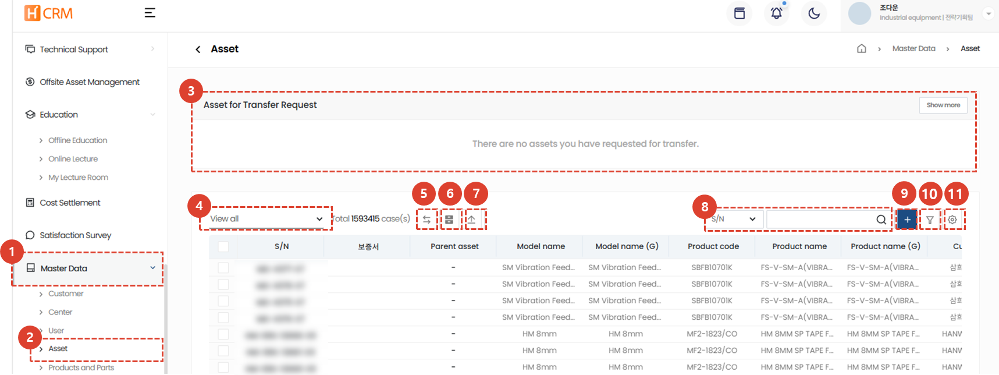
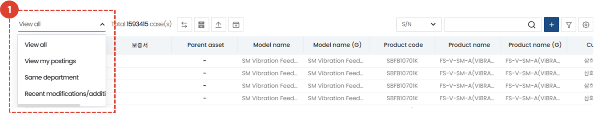
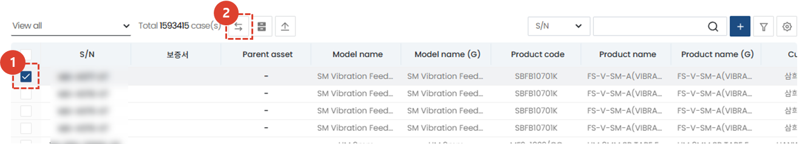
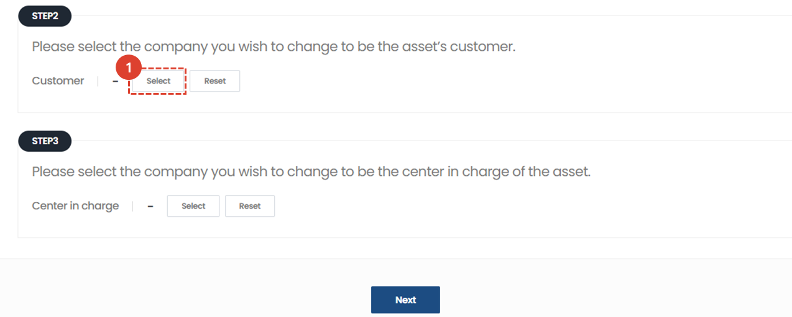
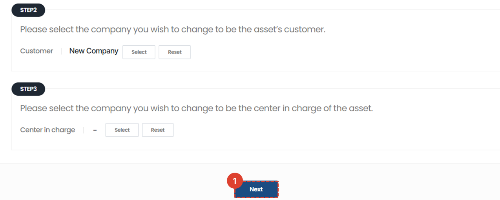
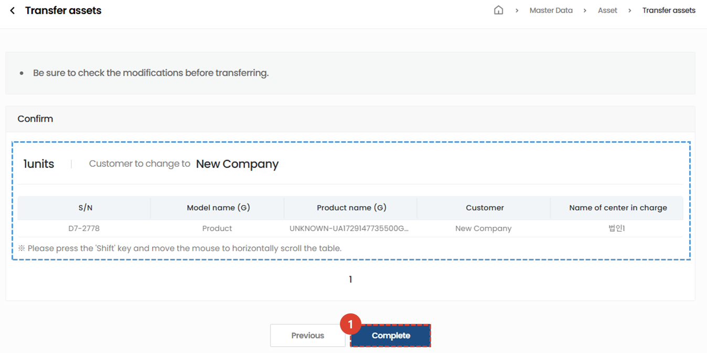
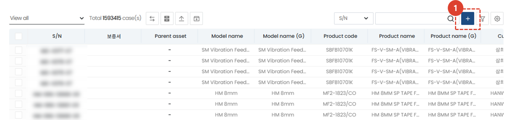
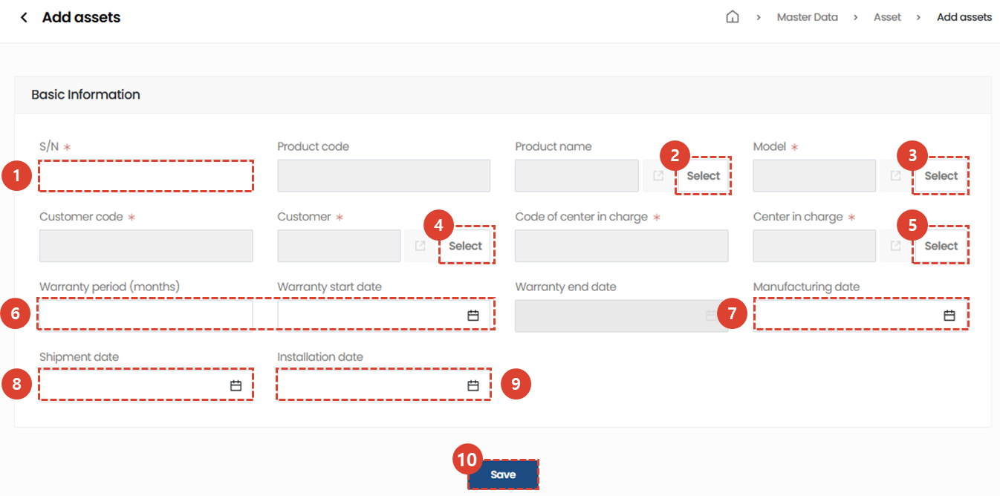
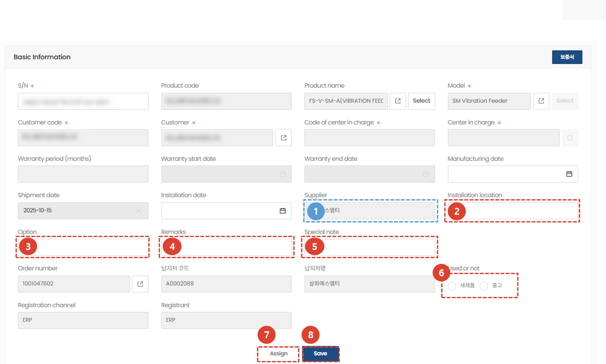
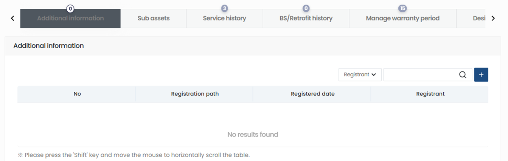

import ValidateTextByToken from "/src/utils/getQueryString.js";
import filterList from "./img/002.png";
import searchList from "./img/053.png";
import tableFilter from "./img/006.png";
import createLabor from "./img/013.png";
import filter1 from "./img/097.png";
import filter2 from "./img/057.png";
import filter3 from "./img/099.png";
import filter4 from "./img/059.png";
import table1 from "./img/101.png";
import table2 from "./img/061.png";
import popup1 from "./img/064.png";

# 资产

资产数据管理指南。
<ValidateTextByToken dispTargetViewer={true} dispCaution={true} validTokenList={['head', 'branch', 'seller', 'agent']}>

## 列表页

1. 点击**标准信息**菜单。
1. 点击**资产**菜单，显示资产数据列表。
    :::tip
    机构用户还可以从列表中**检查其他机构的资产（其中关键信息被屏蔽）**。.
    :::
1. 如果有更改拥有资产的客户或中心的请求，它将出现在[**转移请求的资产**](#资产转移)中并需要管理员批准。
1. 使用**列表过滤**功能，仅显示符合特定条件的客户。
1. 这是**资产转移**按钮，用于需要更改拥有该资产的客户或中心。
1. （仅限代理商）此按钮允许您**显示或隐藏其他代理商屏蔽的资产**。
1. 这是**批量上传资产**按钮。您可以使用 Excel 一次上传多个资产。
1. 输入**搜索词**以搜索所需数据。
1. 您可以**注册新资产**。
1. 您可以**注册多个过滤器**来搜索数据。
1. 您可以**导出到 Excel**、**管理表格**或**删除**资产。
1. 点击序列号查看资产详情。
    :::warning 经销商用户须知
    由于关键信息已被屏蔽，因此无法获得**其他经销商资产**的详细信息。
    :::

### 列表过滤
:::tip
以下是按用户/部门或最近条目进行过滤的方法。
:::

1. 选择您想要的过滤方式。选择后会立即出现相应的列表。
 
 

### 搜索
:::tip
搜索表格的方法如下。
:::

1. 选择搜索过滤器，然后搜索。
 
 

### Advanced Search
:::tip
以下是应用**多个**搜索过滤器的方法。
:::

1. 点击**过滤按钮**。
 
 

1. 选择筛选条件。
1. 输入搜索词。
1. 点击“+”按钮添加搜索词。
1. 点击“搜索”按钮查看结果。
 
 

### Excel 输出
:::tip
以下是将列表导出到 Excel 的方法。
:::

1. 单击“导出到 Excel”按钮。
 
 

1. 选择**输出选项**。
1. 单击**确定**按钮，然后访问[**系统管理 > Excel 下载**](/SMT/tutorial-12-system-management/03-export-data.md)菜单下载 Excel 文件。
 
 
 
### 表管理
:::tip
本指南介绍如何显示列、更改显示的列以及更改其顺序。
:::

1. 点击**表格管理**，可以更改表格中显示的项目和顺序。
 
 

1. 点击您想要在表格中显示的项目对应的切换按钮，使其变为蓝色。
1. 您可以拖动列表图标来更改列的位置。
1. 点击“关闭”以更改表格以反映所选内容。
 
 

### 删除
:::warning
以下是删除客户帐户的说明。
 请谨慎操作，因为删除操作**很难恢复**。
:::

1. 点击**齿轮**按钮。
1. 点击**删除**按钮。
 
 

1. 点击弹出窗口中的**删除**按钮，删除该客户。
 
 

## 资产转移
:::info
如果持有资产的客户或中心需要转移，您可以执行**资产转移**。
当前资产转移将在 30 分钟内反映在系统中。未来的资产转移将在各业务部门批准后完成。
:::
### 资产转移方式

1. **勾选**您想要转移的资产。
1. 点击**转移资产**按钮。
 
 

查看资产转移信息。如果您还有其他资产需要转移，请点击“+”按钮添加更多资产。
 
 

1. 选择您想要转移到的**客户或中心**。
 
 

1. 确认选择后，点击**下一步**按钮。
 
 

1. 确认信息无误后，点击**完成**按钮。 资产转移完成后，资产信息将在30分钟内更新。
 
 

## 资产登记
### 单项登记

1. 点击**+**按钮。
 
 

1. 输入序列号。
1. 点击“选择”选择**产品名称**。
1. 点击“选择”选择**型号**。
1. 选择**客户**。选择后将自动输入客户代码。
1. 选择**负责中心**。选择后将自动输入负责中心代码。
1. 输入**保修期**（例如，12个月、24个月）和**保修开始日期**。保修结束日期将自动输入。
1. 输入资产的**制造日期**。
1. 输入**发货日期**。
1. 输入**安装日期**。
1. 输入资产信息后，点击**保存**按钮。
 
 

### 批量资产登记
:::tip
以下是批量注册大量资产的方法。
:::

1. 单击**上传资产**按钮。
:::info 上传方法
**下载 Excel 模板**，按照格式输入您的资产信息。然后上传包含资产信息的 Excel 文件。
:::
 
 

## 详情页
### 基本信息

:::info
显示注册资产时输入的默认值，并可额外输入第2-6项的信息。
:::
1. 显示在采购订单 (SO) 中输入的**供应商**信息。
1. 您可以输入资产的**安装位置**。
1. 输入资产的详细**选项**。
1. 在**备注**中输入任何其他信息。
1. 输入资产的**特殊说明**。
1. 您可以通过勾选**已使用状态**来管理**已使用状态**，就像资产已转移并成为二手产品一样。
1. 点击**转移**按钮转移资产。
1. 如果有任何更改，请点击**保存**按钮保存更改。
 
 

### 附加信息

此时将显示有关该资产的附加信息。
- 附加信息：您可以手动输入和管理 SW、MMI、RD、Vision、Opti、IT 和 Basic IT 的先前信息。
- 辅助资产：您可以查看相应资产的辅助资产的序列号、型号名称和产品代码等信息。
- 服务历史记录：您可以查看相应资产的服务历史记录并确认详细信息。
- BS/Retrofit 历史记录：您可以查看 BS/Retrofit 活动历史记录并确认详细信息。
- 保修期管理：如果需要修改保修期，请点击“保修期管理”选项卡上的 **+** 按钮进行编辑。修改保修期时，必须提供详细的**保修期变更原因**。
- 设计变更历史记录：您可以查看与该资产相关的设计变更历史记录。
- VOC 历史记录：查看并确认与该资产相关的详细 VOC 历史记录。
- 证书签发历史记录：查看证书的签发历史记录，例如保修单（仅限机床部门）。
- 服务技术数据：查看与资产相关的服务技术数据（如有）。
- 转移历史记录：查看任何资产转移历史记录。
</ValidateTextByToken>