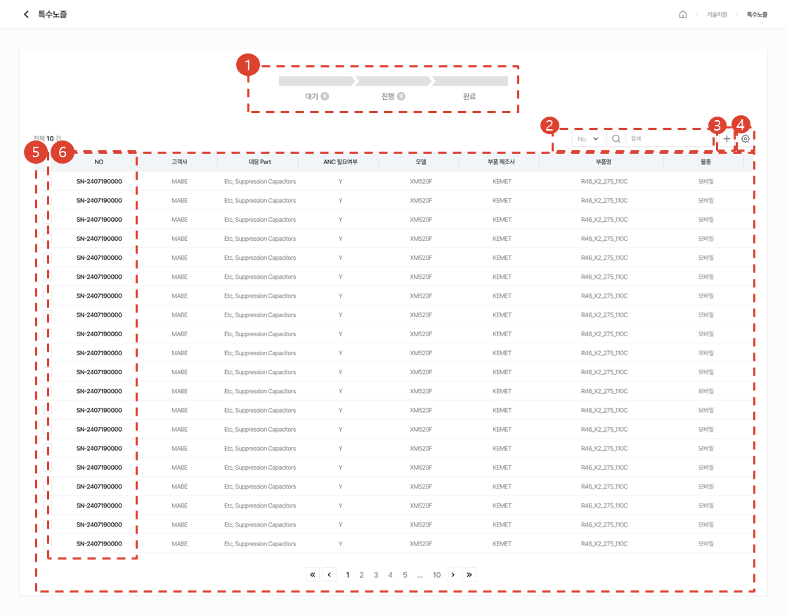
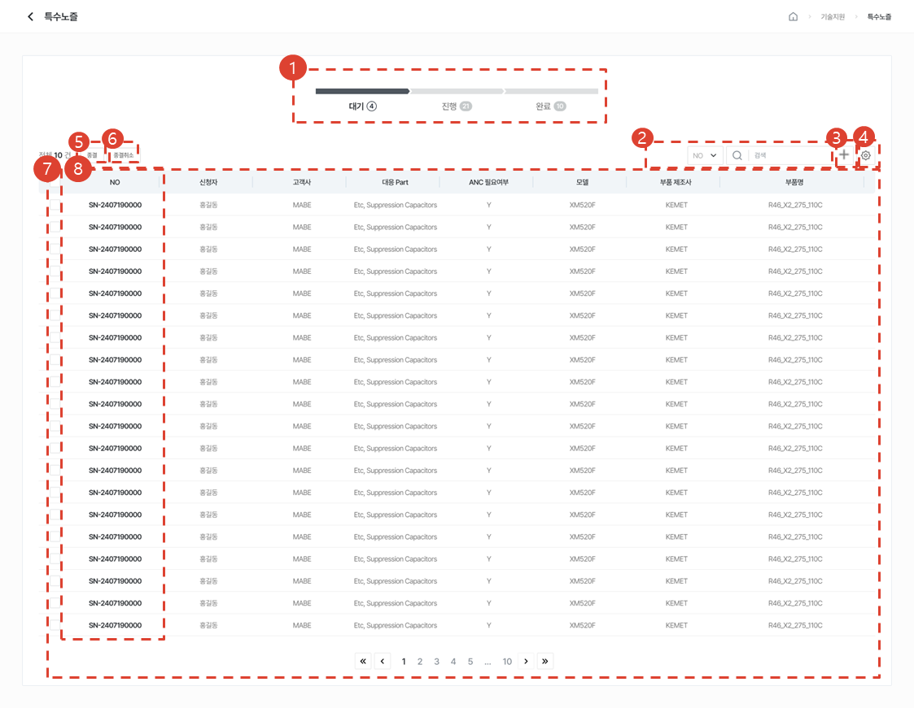
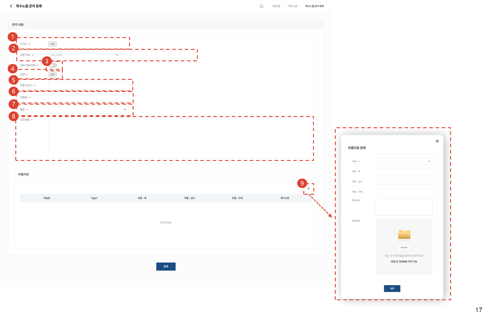
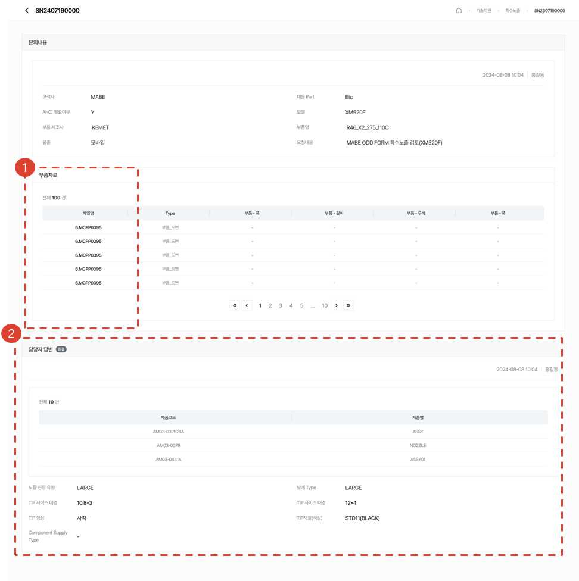
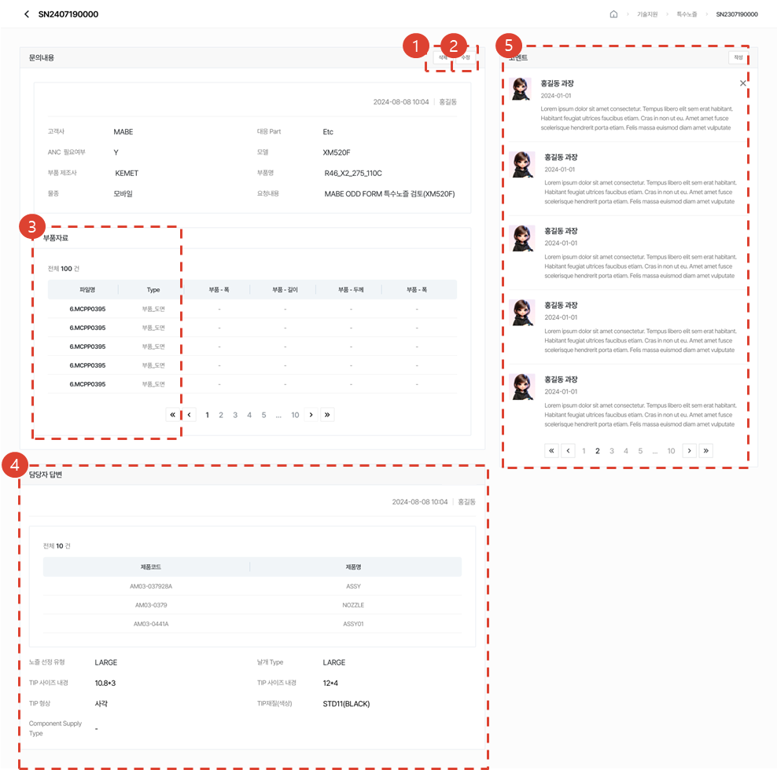
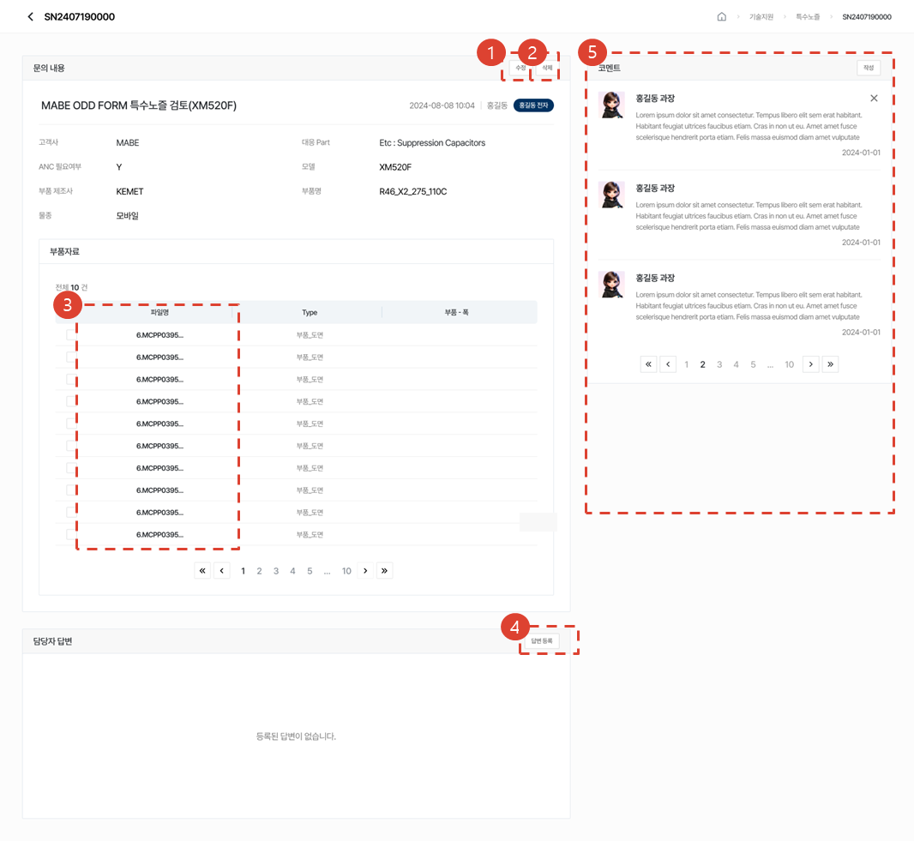
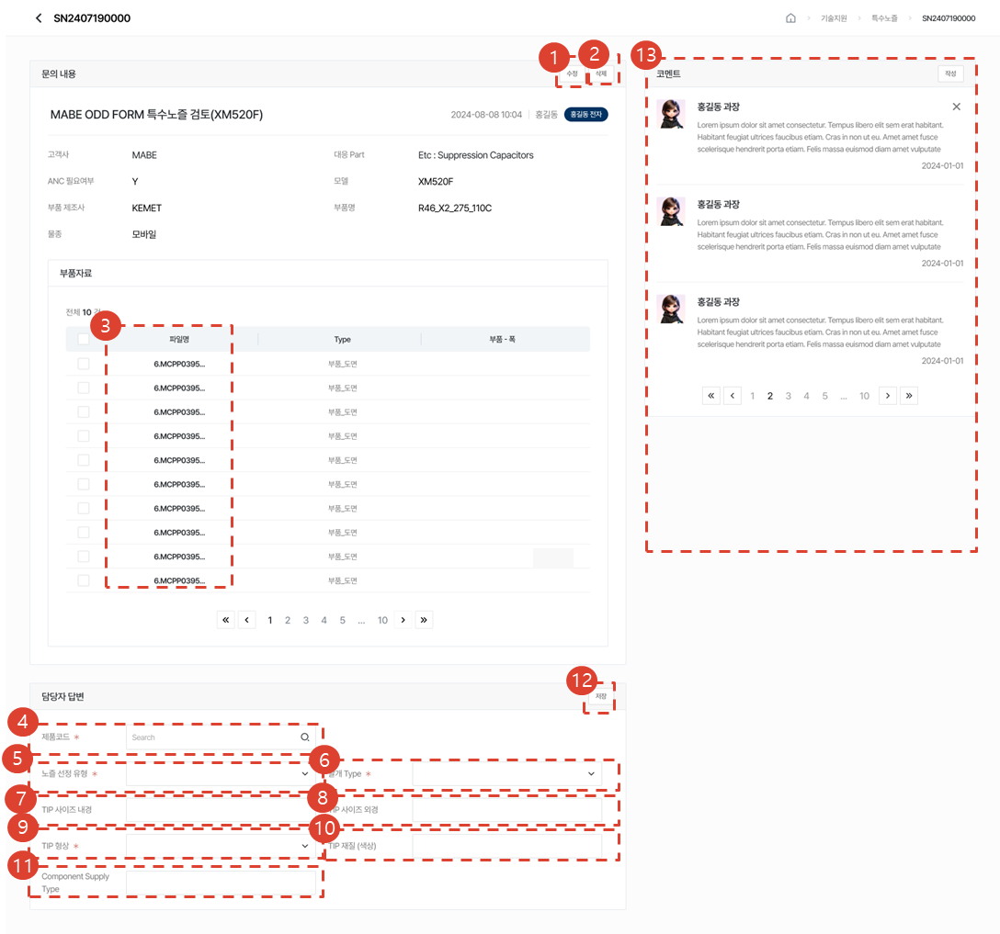
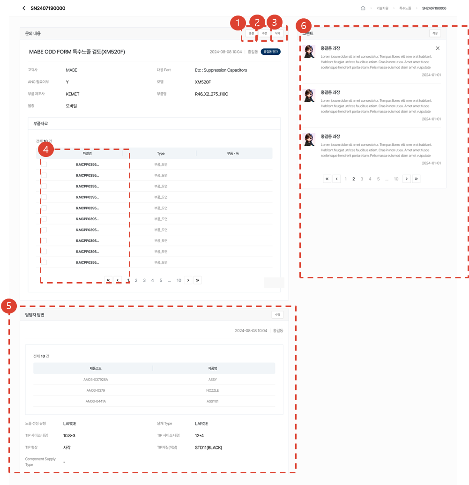

# 특수 노즐

특수 노즐의 선정과 설계 요청 업무와 관련한 메뉴를 안내합니다.

## 목록 페이지

### 조회 / 작성 권한 보유 시

1. 대기/진행/완료 진행률을 선택해 목록을 조회할 수 있습니다.
1. Selectbox의 유형을 선택 후, 원하는 검색어로 검색할 수 있습니다.
1. [추가] 버튼을 클릭하여 Q&A를 작성할 수 있습니다.
1. [톱니바퀴] 버튼을 클릭하여 Q&A 삭제, 테이블 관리를 할 수 있습니다.
1. 등록된 Q&A 목록을 볼 수 있습니다.
1. [제목]를 클릭하여 [Q&A 상세]페이지로 이동합니다.

### 관리 권한 보유 시

1. 대기/진행/완료 진행률을 선택해 목록을 조회할 수 있습니다.
1. Selectbox의 유형을 선택 후, 원하는 검색어로 검색할 수 있습니다.
1. [추가] 버튼을 클릭하여 특수노즐 문의를 작성할 수 있습니다.
1. [톱니바퀴] 버튼을 클릭하여 삭제, 테이블 관리, 엑셀다운로드를 할 수 있습니다.
1. 진행 건을 선택하여 [종결]버튼 클릭 시, 문의를 종결할 수 있습니다. 
1. 완료 건을 선택하여 [종결취소]버튼 클릭 시, 문의를 종결취소 할 수 있습니다. 
1. 등록된 특수노즐 목록을 볼 수 있습니다.
1. [NO]를 클릭하여 [특수노즐 상세]페이지로 이동합니다.

## 등록 페이지

1. 고객사를 선택해주세요. 작성자 본인이 실고객인 경우 자동 선택됩니다. 
1. 대응Part를 선택해주세요.
1. ANC 필요여부를 선택해주세요.
1. 문의를 원하는 모델을 선택해주세요.
1. 부품제조사를 입력해주세요.
1. 부품명을 입력해주세요.
1. 물종을 선택해주세요.
1. 요청내용을 입력해주세요.
1. 부품자료를 여러개 추가할 수 있습니다. 

## 상세 페이지

### 조회 권한 보유 시

1. 부품자료를 다운로드할 수 있습니다. 
1. 특수노즐 문의에 대한 담당자 답변을 확인할 수 있습니다.

### 작성 권한 보유 시

1. [수정] 버튼을 클릭시, 문의를 수정할 수 있습니다. 
1. [삭제] 버튼을 클릭 시, 문의를 삭제할 수 있습니다.
1. 부품자료를 다운로드할 수 있습니다.
1. 특수노즐 문의에 대한 담당자 답변을 확인할 수 있습니다.
1. 코멘트 작성, 삭제가 가능합니다. 담당자와 코멘트를 주고받을 수 있습니다. 

### 관리 권한 보유 시

1. [수정] 버튼을 클릭시, 문의를 수정할 수 있습니다. 
1. [삭제] 버튼을 클릭 시, 문의를 삭제할 수 있습니다.
1. 부품자료를 다운로드할 수 있습니다.
1. [답변등록] 버튼을 클릭시, 문의에 대해 답변을 할 수 있습니다. 
1. 코멘트 작성, 삭제가 가능합니다. 작성자와 코멘트를 주고받을 수 있습니다. 

1. [수정] 버튼을 클릭시, 문의를 수정할 수 있습니다. 
1. [삭제] 버튼을 클릭 시, 문의를 삭제할 수 있습니다.
1. 부품자료를 다운로드할 수 있습니다.
1. 제품코드를 검색해주세요. 제품코드 검색 후 선택시 제품명이 자동 기입됩니다. 
1. 노즐 선정 유형을 선택해주세요.
1. 날개Type을 선택해주세요.
1. TIP 사이즈 내경을 입력할 수 있습니다. 
1. TIP 사이즈 외경을 입력할 수 있습니다. 
1. TIP형상을 선택해주세요.
1. TIP 재질(색상)을 입력할 수 있습니다. 
1. Component Supply Type을 입력할 수 있습니다. 
1. [저장] 버튼을 클릭시, 답변을 등록할 수 있습니다.
1. 코멘트 작성, 삭제가 가능합니다. 작성자와 코멘트를 주고받을 수 있습니다. 

1. 담당자 답변이 완료된 문의건은 [종결] 버튼을 클릭하여 문의를 종결시킬 수 있습니다. 
1. [수정] 버튼을 클릭시, 문의를 수정할 수 있습니다. 종결된 문의는 수정할 수 없습니다. 
1. [삭제] 버튼을 클릭 시, 문의를 삭제할 수 있습니다. 종결된 문의도 삭제할 수 있습니다. 
1. 부품자료를 다운로드할 수 있습니다.
1. [수정] 버튼을 클릭시, 답변을 수정할 수 있습니다. 종결된 문의는 수정할 수 없습니다. 
1. 코멘트 작성, 삭제가 가능합니다. 작성자와 코멘트를 주고받을 수 있습니다. 

