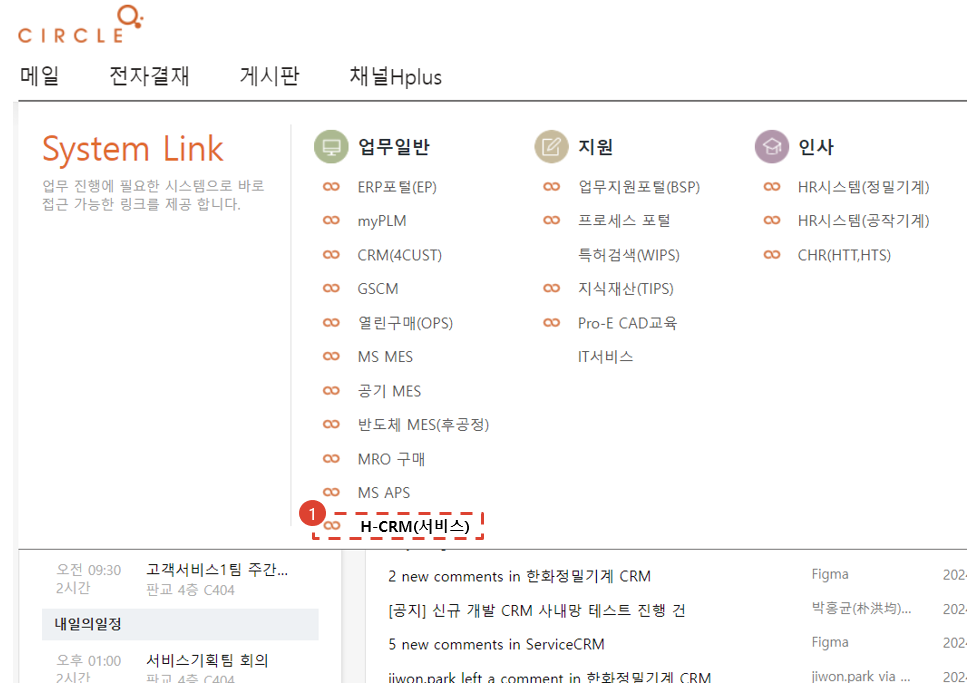
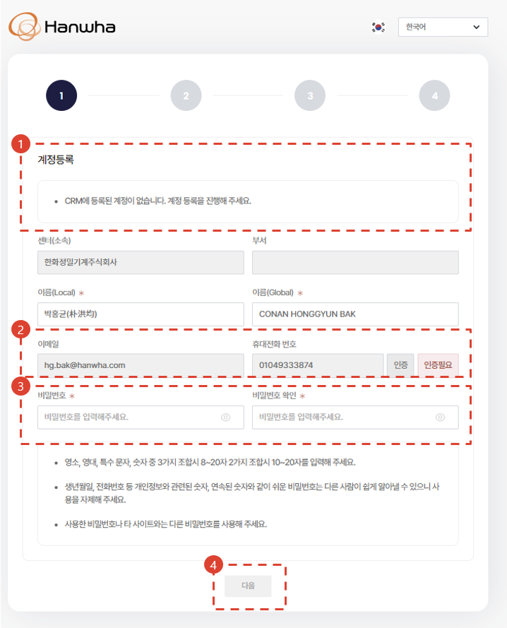
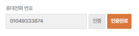
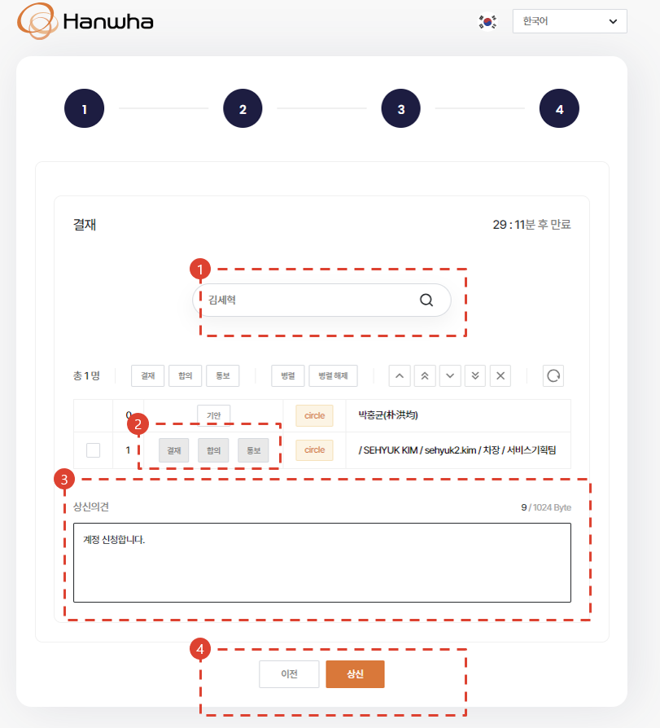
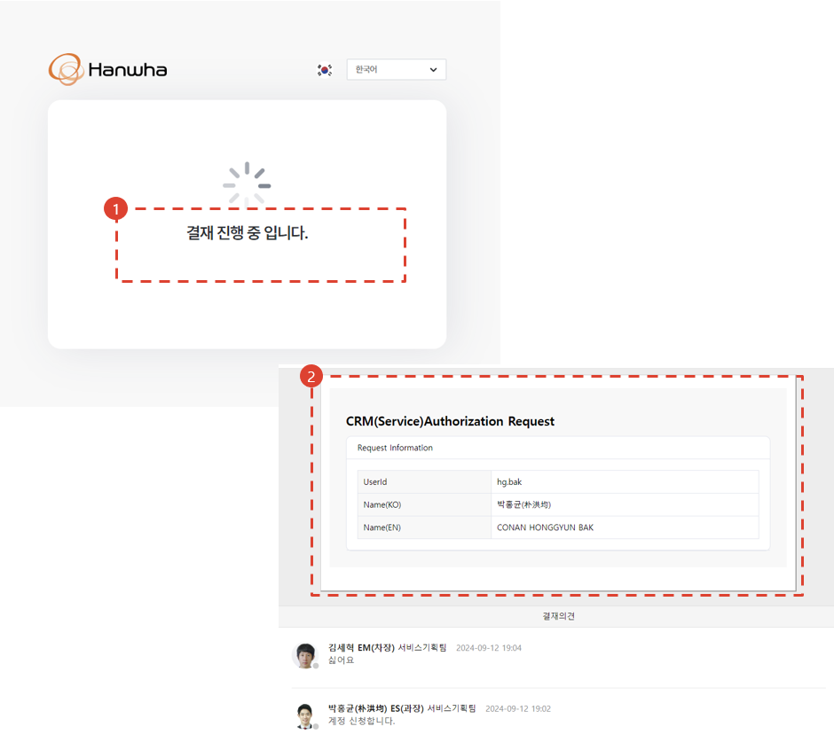

import qrImage from "./img/009.png";

# CRM 계정 생성 (서클사용자)

사내망에서 CRM 사용 계정을 생성하기 위한 절차를 안내합니다.

## 시스템 접속 경로

1. 서클 메인 화면의 업무 메뉴에 **H-CRM** 링크가 추가될 예정입니다. **(`24년 하반기 예정)**
- **사내**에서 접속하는 경우
  - **[접속링크](http://ep.circle.hanwha.com/neo/branch/common/slo/goSloTarget.mvc?authType=1&destination=http://service-qas.hanwha-crm.com:8888/auth/slo)** 를 클릭하세요.
- **사외**에서 접속하는 경우
  - **[접속링크](http://ep.circle.hanwha.com/neo/branch/common/slo/goSloTarget.mvc?authType=1&destination=https://service-qas.hanwha-crm.com/auth/slo)** 를 클릭하거나 아래의 QR코드를 스캔하세요.  

## 계정생성 1단계

1. 서클 유저의 계정등록 화면에 진입합니다. 서클 사용자 정보가 기본적으로 로드가 되며 입력된 정보를 확인해주세요.
1. 이메일은 수정을 할 수 없습니다. 휴대폰 번호를 확인하시고 **인증** 버튼을 눌러 인증절차를 진행해주세요. 인증이 된 이후에는 **인증필요** 상태가 **인증완료** 상태로 변경됩니다.    
    1. 휴대폰 번호를 확인하시고 **발송** 버튼을 눌러주세요. 인증번호 문자가 입력된 휴대폰 번호로 발송됩니다.
    2. 문자로 발송된 인증번호를 입력하시고 **확인** 버튼을 눌러주세요.
1. 아래 기재된 규칙에 맞게 사용하실 비밀번호를 입력해주세요. 이곳에 입력하신 비밀번호는 사외에서 CRM에 접속하실 때 사용됩니다.
    :::note
    - 영소, 영대, 특수문자, 숫자 중 3가지 조합 시 8 ~ 20자, 2가지 조합 시 10 ~ 20자를 입력해주세요.
    - 생년월일, 전화번호 등 개인정보와 관련된 숫자, 연속된 숫자와 같이 쉬운 비밀번호는 다른사람이 쉽게 알아낼 수 있으니 사용은 자제해 주세요.
    - 사용했던 비밀번호나 타 사이트에 사용중인 비밀번호와는 다른 비밀번호를 사용해주세요.
    :::
4. **다음** 버튼을 눌러주세요.

## 계정생성 2단계

시스템 사용 권한을 신청합니다. 업무에 맞는 권한을 선택해주세요. **(현재는 더미 권한만 표시됨 - `24년 10월 중 개발완료)**

1. 사업부를 선택합니다.
1. 권한 목록에 권한이 많은 경우 검색을 통해서 필요 권한만 검색할 수 있습니다.
1. 검색된 결과를 초기화 할 수 있습니다.
1. 전체 화면에서 볼 수 있습니다.
1. 신청할 권한이 많은 경우, 다른 사람의 권한을 복사해 올 수 있습니다.
1. 선택된 권한들을 초기화합니다.
1. 선택한 권한에 대한 설명이 표시됩니다.
1. 다음단계로 진행합니다.

## 계정생성 3단계

시스템 사용 권한을 신청합니다. 업무에 맞는 권한을 선택해주세요. **(현재는 더미 권한만 표시됨 - `24년 10월 중 개발완료)**

1. 앞 단계에서 신청한 권한을 재확인합니다.
    1. 권한을 수정하려면 **이전** 버튼을 눌러주세요.
    2. 이상이 없으면 **다음** 버튼을 눌러주세요.

## 계정생성 4단계

H-CRM 계정 생성을 위한 서클 결재문서를 생성합니다.

1. 결재자를 검색합니다. (김세혁차장)
1. 결재구분을 **결재**로 선택합니다. **('결재'로 기본세팅이 되어 있지 않음 - 개선예정)**
1. 상신 의견을 입력합니다.
1. **상신** 버튼을 클릭합니다.

## 계정생성 완료

1. 결재가 완료되기 전까지 **결재진행중** 메시지가 표시됩니다.
1. 결재 문서가 서클로 전송됩니다.
1. **반려** 시 다시 계정신청 화면으로 이동하게 됩니다.

