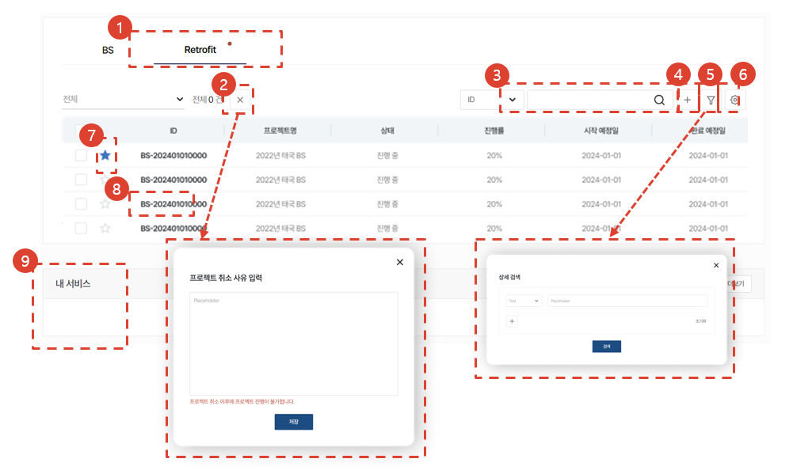
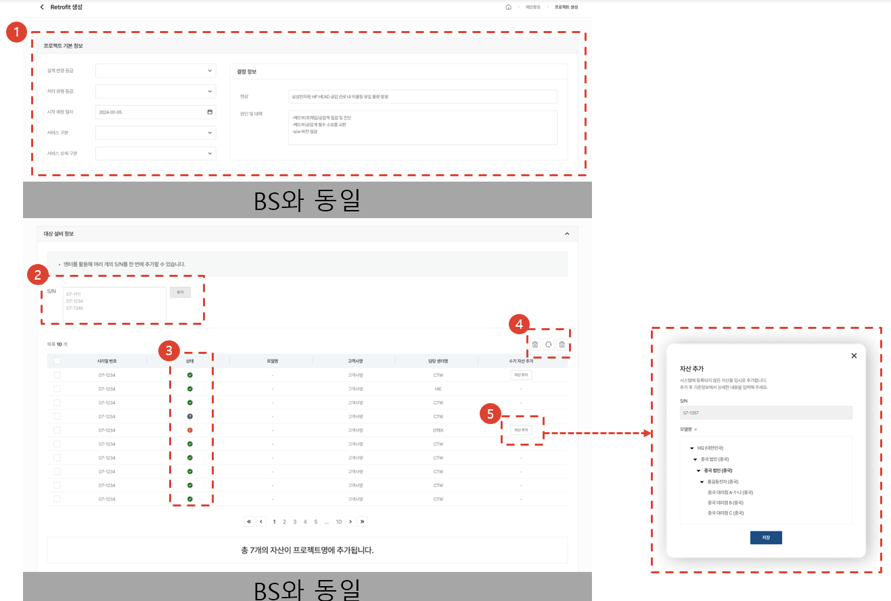
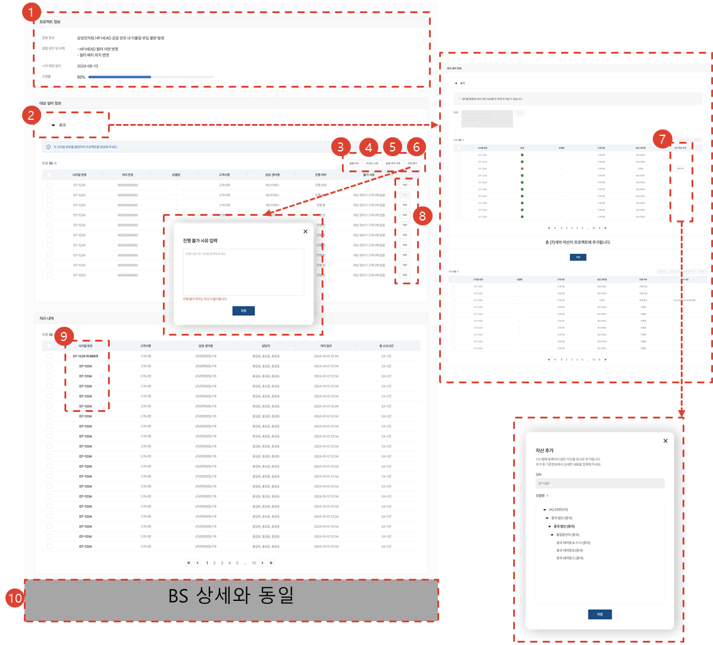
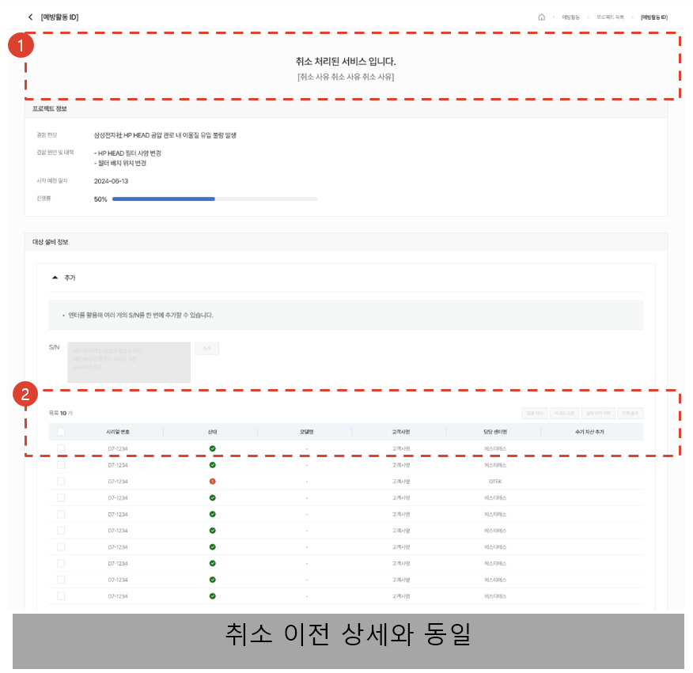

# 리트로핏 활동

리트로핏 대상 자산을 등록하고 등록된 자산의 리트로핏 작업 수행 여부를 관리합니다.

## 프로젝트 목록

1. 탭을 클릭하여 해당 유형의 예방활동 목록을 하단에서 조회할 수 있습니다.
1. 프로젝트를 선택 후 [X]버튼을 클릭하여 프로젝트를 취소할 수 있습니다. 최종 확인 이후의 프로젝트는 취소가 불가합니다. 프로젝트 취소 시에는 프로젝트 취소 사유를 입력해야 합니다.
1. 원하는 검색어로 검색할 수 있습니다.
1. [+]버튼을 클릭하여 프로젝트를 생성할 수 있습니다.
1. 버튼을 클릭하여 목록 내에서 원하는 검색어에 따라 상세 검색 할 수 있습니다. 
1. 버튼을 클릭하여 엑셀 출력, 실적 삭제, 테이블 관리를 할 수 있습니다.
1. [☆]를 클릭 하여 즐겨찾기 설정/해제할 수 있습니다.
1. [ID]를 클릭하여 [프로젝트 상세]페이지로 이동합니다.
1. 프로젝트 관리자, 프로젝트 생성자는 본인이 할당된 프로젝트를 조회할 수 있습니다. 각 영역을 클릭하여 [프로젝트 상세]페이지로 이동할 수 있습니다.

## 프로젝트 생성

1. 프로젝트 기본정보를 입력할 수 있습니다.
1. 시리얼 번호를 입력 후 엔터로 구분하여 [추가]버튼 클릭 시 여러 개의 설비를 한번에 등록할 수 있습니다.
1. 추가한 설비의 상태를 통해 추가 가능 여부를 알 수 있습니다. (확인 진행 중, 등록 가능, 해당하는 자산 없음)
1. [첫 번째 아이콘]을 클릭하여 추가에 실패한 설비만 삭제할 수 있습니다. [두 번째 아이콘]을 클릭하여 목록을 초기화할 수 있습니다. [세 번째 아이콘]을 클릭하여 선택한 설비만 삭제할 수 있습니다.
1. [자산 추가]버튼을 클릭하여 직접 설비를 입력하여 추가할 수 있습니다.

## 프로젝트 상세

1. 프로젝트 정보와 전체 진행률을 확인할 수 있습니다. 진행률은 각 대상설비 진행률의 평균입니다.
1. [▼추가]를 클릭하여 대상 설비를 추가합니다. 
1. 복수 개 선택 후 [일괄 처리]버튼을 클릭하여 [리트로핏 처리(일괄)]페이지로 이동합니다.
1. [바코드 스캔]버튼을 클릭하여 [바코드 스캔]페이지로 이동합니다.
1. [실패 내역 삭제]버튼을 클릭하여 검색 되지 않는 설비를 삭제할 수 있습니다.
1. [진행 불가]버튼을 클릭하여 진행 불가 사유를 입력 후 불가 처리 할 수 있습니다.
1. [자산 추가]버튼을 클릭하여 검색되지 않는 자산은 직접 입력 후 대상 설비로 추가할 수 있습니다.
1. 처리가 끝난 대상 설비를 확인할 수 있고, [처리]버튼을 클릭하여 리트로핏을 단건 처리 할 수 있습니다.
1. [시리얼 번호]를 클릭하여 [리트로핏 처리 (단건 또는 일괄)]페이지로 이동합니다.
1. BS 상세와 동일 : 첨부파일, 프로젝트 삭제, 즐겨찾기 기능

## 프로젝트 상세 - 취소된 프로젝트

1. 취소 여부와 사유를 확인할 수 있습니다.
1. 모든 기능이 불가합니다.
