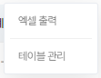
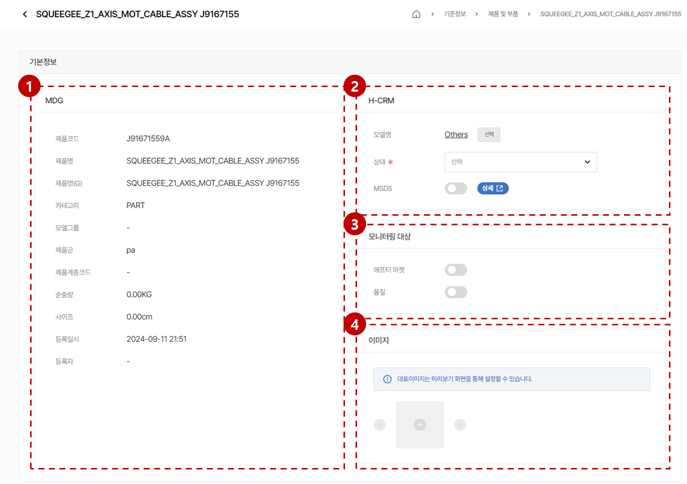

import ValidateTextByToken from "/src/utils/getQueryString.js";
import filterList from "./img/002.png";
import searchList from "./img/003.png";
import tableFilter from "./img/006.png";

# 제품 및 부품 데이터 관리

제품 및 부품 데이터 관리에 대한 안내입니다.

<ValidateTextByToken dispTargetViewer={true} dispCaution={true} validTokenList={['head', 'branch', 'seller', 'agent']}></ValidateTextByToken>

## 목록 페이지

<ValidateTextByToken dispTargetViewer={false} dispCaution={true} validTokenList={['head', 'branch', 'seller', 'agent']}>

:::tip 아래의 데이터들이 목록에 표시됩니다.
    - MDG에서 채번된 제품 및 부품코드 데이터
    - CRM에서 시스템 매핑을 위해 자동으로 생성된 데이터
:::

1. [기준정보] - [제품 및 부품] 메뉴를 클릭합니다.
    :::info 메뉴 접근을 위해 필요한 권한
        - TBD
    :::
1. 목록 필터링
    - 아래의 항목을 기준으로 데이터를 필터링할 수 있습니다.
        

1. 전체 **제품 및 부품 데이터**의 개수를 표시합니다.
1. 검색어를 입력해서 원하는 데이터를 검색할 수 있습니다.
    - 아래의 항목을 기준으로 데이터를 검색할 수 있습니다.
        

1. 상세 필터링 기능을 수행합니다.
        

        1. 필터링 헤드를 선택합니다.
        1. 검색어를 입력합니다.
        1. 필터 조건을 추가합니다.
        1. 입력된 내용을 초기화합니다.
        1. [검색] 버튼을 눌러 결과를 확인합니다.
1. 미리 설정된 데이터 목록의 커스텀 기능을 수행합니다.
    

    - **엑셀 출력**: 현재 필터링된 결과의 데이터 목록을 엑셀파일로 출력합니다.
    - **테이블 관리**: 테이블 보기 옵션을 설정합니다.
        

        <ol style={{listStyleType:"number"}}>
            <li>테이블의 컬럼 보기를 토글할 수 있습니다.</li>
            <li>테이블의 컬럼의 위치를 드래그앤드롭으로 조절할 수 있습니다.</li>
        </ol>
1. [제품 상세 페이지](#상세-페이지)로 이동합니다.

</ValidateTextByToken>

## 상세 페이지

<ValidateTextByToken dispTargetViewer={false} dispCaution={true} validTokenList={['head', 'branch', 'seller', 'agent']}>

### 기본 정보

1. MDG에서 인터페이스된 정보를 표시합니다. 이곳의 정보는 수정할 수 없습니다.
1. H-CRM에서 활용하기 위해 가공할 수 있는 추가정보를 표시합니다.
    - **모델명**: [선택] 버튼을 눌러 모델을 선택합니다.

</ValidateTextByToken>