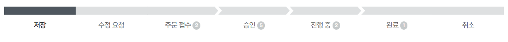

import ValidateTextByToken from "/src/utils/getQueryString.js";

# 주문서 수정

<ValidateTextByToken dispTargetViewer={true} dispCaution={false} validTokenList={['head', 'branch', 'agent']}>

구매하고자 하는 서비스 부품의 주문서 수정 절차에 대해 안내합니다.

</ValidateTextByToken>

## 주문서 목록

<ValidateTextByToken dispTargetViewer={false} dispCaution={true} validTokenList={['head', 'branch', 'agent']}>

1. **스토어** - **내 주문** 메뉴를 선택합니다.
1. 주문 목록을 조회합니다.

</ValidateTextByToken>

## 주문서 목록 - 주문서 상태

<ValidateTextByToken dispTargetViewer={false} dispCaution={true} validTokenList={['head', 'branch', 'agent']}>

- 저장: 주문서가 임시저장된 상태입니다.
- 수정 요청: 판매자가 주문자에게 수정할 것을 요청한 상태의 주문서입니다.
- 주문 접수: 주문자가 주문서를 생성하여 판매자에게 접수된 상태의 주문서입니다.
- 승인: 판매자에 의해 승인된 상태의 주문서입니다.
- 진행중: 승인된 주문서가 주문자에게 납품되는 중에 있는 상태의 주문서입니다.
- 완료: 주문자에게 납품이 완료된 상태의 주문서입니다.
- 취소: 주문자에 의해 취소된 상태의 주문서입니다.

</ValidateTextByToken>

## 주문서 유형 확인

### 서비스연계 주문(유무상 PO) 🚧

<ValidateTextByToken dispTargetViewer={false} dispCaution={true} validTokenList={['head', 'branch', 'agent']}>

</ValidateTextByToken>

### 일반주문(유상 PO) 🚧

<ValidateTextByToken dispTargetViewer={false} dispCaution={true} validTokenList={['head', 'branch', 'agent']}>

</ValidateTextByToken>

### 일반주문(유상 PO, 법인용) 🚧

<ValidateTextByToken dispTargetViewer={false} dispCaution={true} validTokenList={['head', 'branch']}>

</ValidateTextByToken>

### 무상출고 품의(본사용) 🚧

<ValidateTextByToken dispTargetViewer={false} dispCaution={true} validTokenList={['head', 'branch']}>

</ValidateTextByToken>
