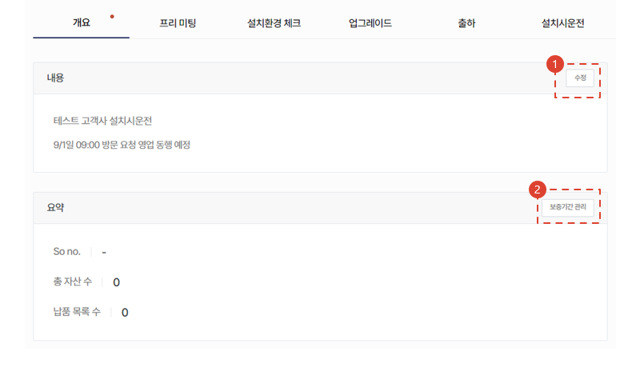
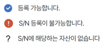
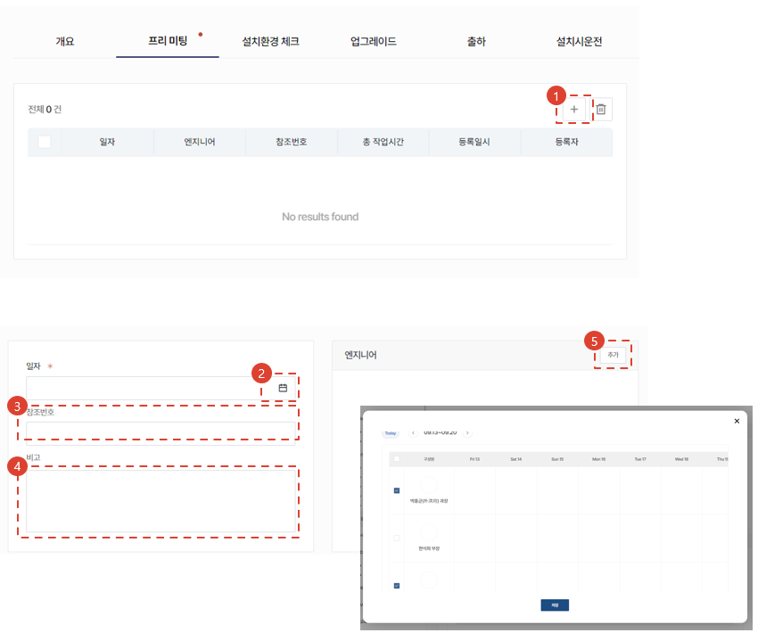
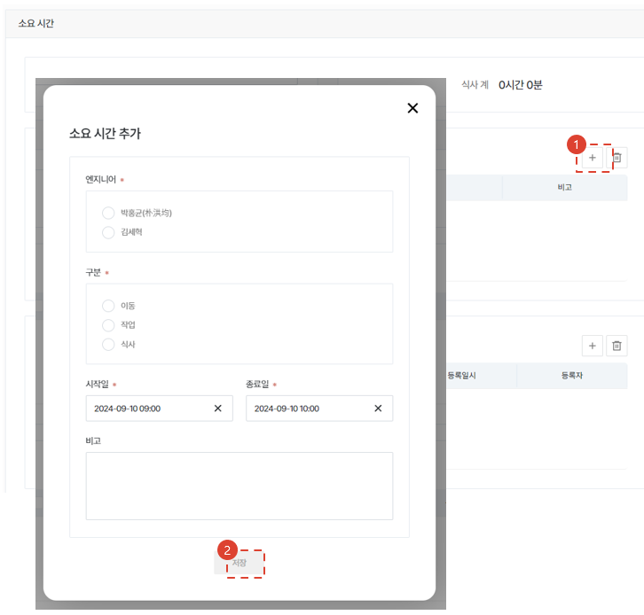
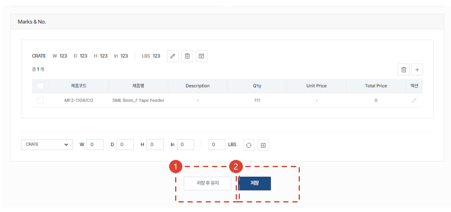
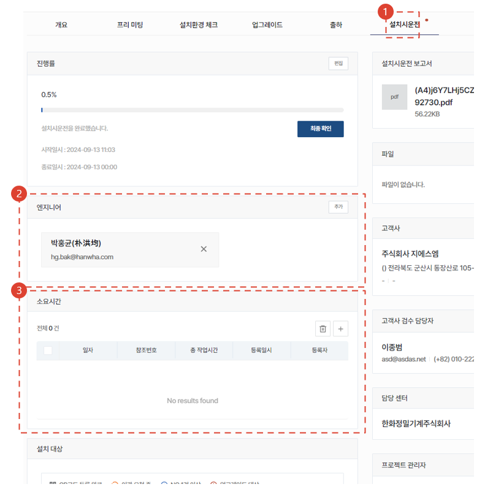
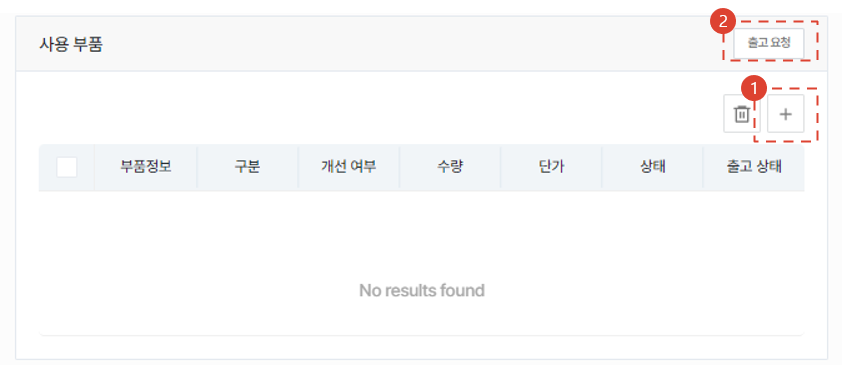
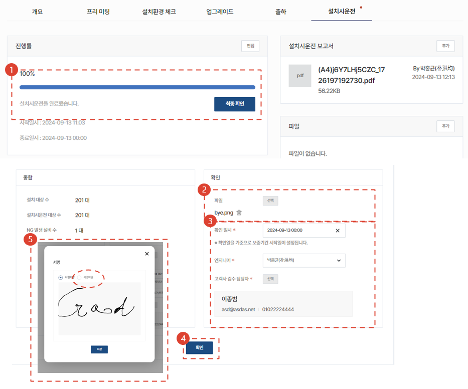
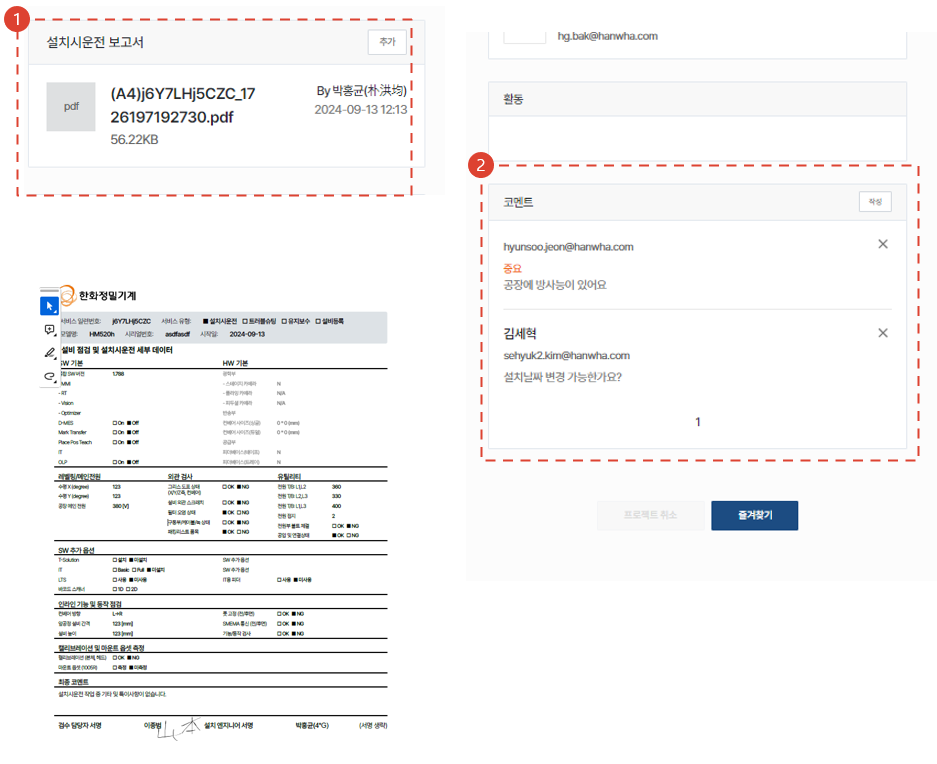

import ValidateTextByToken from "/src/utils/getQueryString.js";
import StrongTextParser from "/src/utils/textParser.js";
import text from "/src/locale/zh/SMT/tutorial-02-installation/02-details-project.json";

# 项目详情

我们将为客户公司已交付资产的安装调试工作提供操作指南。

<ValidateTextByToken dispTargetViewer={true} dispCaution={false} validTokenList={['head', 'branch', 'agent']}></ValidateTextByToken>

## 项目列表

<ValidateTextByToken dispTargetViewer={false} dispCaution={true} validTokenList={['head', 'branch', 'agent']}>

1. <StrongTextParser text={text.list01} />
1. <StrongTextParser text={text.list02} />

</ValidateTextByToken>

## 进入项目详细

<ValidateTextByToken dispTargetViewer={false} dispCaution={true} validTokenList={['head', 'branch', 'agent']}>

1. <StrongTextParser text={text.details01} />

</ValidateTextByToken>

## 项目详情 - 概要

<ValidateTextByToken dispTargetViewer={false} dispCaution={true} validTokenList={['head', 'branch', 'agent']}>

1. <StrongTextParser text={text.overview01} />
1. <StrongTextParser text={text.overview02} />
    :::warning 
    ※ <StrongTextParser text={text.overview03} link="添加资产" />
    :::
- <StrongTextParser text={text.overview04} link="项目详情 - 共通事项" />

</ValidateTextByToken>

### 添加资产

<ValidateTextByToken dispTargetViewer={false} dispCaution={true} validTokenList={['head', 'branch', 'agent']}>

1. <StrongTextParser text={text.overviewAddAsset01} />
    :::warning
    ※ <StrongTextParser text={text.overviewAddAsset02} />
    :::

</ValidateTextByToken>

#### 通过销售订单添加

<ValidateTextByToken dispTargetViewer={false} dispCaution={true} validTokenList={['head', 'branch']}>

1. <StrongTextParser text={text.overviewAddAssetBySalesOrder01} />
1. <StrongTextParser text={text.overviewAddAssetBySalesOrder02} />
1. <StrongTextParser text={text.overviewAddAssetBySalesOrder03} />
1. <StrongTextParser text={text.overviewAddAssetBySalesOrder04} />
    - <StrongTextParser text={text.overviewAddAssetBySalesOrder05} link="通过销售订单添加资产时" />

</ValidateTextByToken>

#### 从资产列表中添加

<ValidateTextByToken dispTargetViewer={false} dispCaution={true} validTokenList={['head', 'branch', 'agent']}>

1.  <StrongTextParser text={text.overviewAddAssetByAssetList01} />
    :::note
    <StrongTextParser text={text.overviewAddAssetByAssetList02} />
    :::
1. <StrongTextParser text={text.overviewAddAssetByAssetList03} />
1. <StrongTextParser text={text.overviewAddAssetByAssetList04} /> 
    
1. <StrongTextParser text={text.overviewAddAssetByAssetList05} />
1. <StrongTextParser text={text.overviewAddAssetByAssetList06} />

</ValidateTextByToken>

#### 直接注册

<ValidateTextByToken dispTargetViewer={false} dispCaution={true} validTokenList={['head', 'branch', 'agent']}>

1. <StrongTextParser text={text.overviewAddAssetByDirect01} />
    :::danger
    <StrongTextParser text={text.overviewAddAssetByDirect02} />
    :::
1. <StrongTextParser text={text.overviewAddAssetByDirect03} />
1. <StrongTextParser text={text.overviewAddAssetByDirect04} /> 
    
1. <StrongTextParser text={text.overviewAddAssetByDirect05} />
1. <StrongTextParser text={text.overviewAddAssetByDirect06} />

</ValidateTextByToken>

### 交付列表

<ValidateTextByToken dispTargetViewer={false} dispCaution={true} validTokenList={['head', 'branch', 'agent']}>

<StrongTextParser text={text.serveList01} />

</ValidateTextByToken>

#### 通过销售订单添加资产时

<ValidateTextByToken dispTargetViewer={false} dispCaution={true} validTokenList={['head', 'branch']}>

※ <StrongTextParser text={text.serveListBySalesOrder01} />

1. <StrongTextParser text={text.serveListBySalesOrder02} />
    :::note
    <StrongTextParser text={text.serveListBySalesOrder03} />
    :::
1. <StrongTextParser text={text.serveListBySalesOrder04} />
    :::note
    <StrongTextParser text={text.serveListBySalesOrder05} />
    :::
1. <StrongTextParser text={text.serveListBySalesOrder06} />
1. <StrongTextParser text={text.serveListBySalesOrder07} />

</ValidateTextByToken>

#### 从现有资产列表中添加或直接注册资产时

<ValidateTextByToken dispTargetViewer={false} dispCaution={true} validTokenList={['head', 'branch', 'agent']}>

1. <StrongTextParser text={text.serveListByOtherWay01} link="通过销售订单添加资产时" />

</ValidateTextByToken>

## 项目详情 - 会前会

<ValidateTextByToken dispTargetViewer={false} dispCaution={true} validTokenList={['head', 'branch', 'agent']}>

<StrongTextParser text={text.premeeting01} />

### 添加

1. <StrongTextParser text={text.premeetingAdd01} />
1. <StrongTextParser text={text.premeetingAdd02} />
1. <StrongTextParser text={text.premeetingAdd03} />
1. <StrongTextParser text={text.premeetingAdd04} />
1. <StrongTextParser text={text.premeetingAdd05} />

### 注册所需时间

1. <StrongTextParser text={text.premeetingWorktime01} />
1. <StrongTextParser text={text.premeetingWorktime02} />

### 保存

1. <StrongTextParser text={text.premeetingSave01} />
1. <StrongTextParser text={text.premeetingSave02} />
1. <StrongTextParser text={text.premeetingSave03} />

</ValidateTextByToken>

## 项目详情 - 安装环境检查（for HTAA）

<ValidateTextByToken dispTargetViewer={false} dispCaution={true} validTokenList={['branch']}>

1. <StrongTextParser text={text.facility01} />
1. <StrongTextParser text={text.facility02} />
1. <StrongTextParser text={text.facility03} />

</ValidateTextByToken>

## 项目详情 - 升级（for HTAA）

<ValidateTextByToken dispTargetViewer={false} dispCaution={true} validTokenList={['branch']}>

1. <StrongTextParser text={text.upgrade01} />
1. <StrongTextParser text={text.upgrade02} />
    - <StrongTextParser text={text.upgrade03} />
    - <StrongTextParser text={text.upgrade04} />
1. <StrongTextParser text={text.upgrade05} />
1. <StrongTextParser text={text.upgrade06} />

</ValidateTextByToken>

## 项目详情 - 出货 (for HTAA)

<ValidateTextByToken dispTargetViewer={false} dispCaution={true} validTokenList={['branch']}>

1. <StrongTextParser text={text.packing01} />
1. <StrongTextParser text={text.packing02} />

### 生成装箱单和发票 (1/3) (for HTAA)

1. <StrongTextParser text={text.step1Packing01} />

### 生成装箱单和发票 (2/3) (for HTAA)

1. <StrongTextParser text={text.step2Packing01} />
1. <StrongTextParser text={text.step2Packing02} />
1. <StrongTextParser text={text.step2Packing03} />
1. <StrongTextParser text={text.step2Packing04} />
1. <StrongTextParser text={text.step2Packing05} />

### 生成装箱单和发票 (3/3) (for HTAA)

1. <StrongTextParser text={text.step3Packing01} />
1. <StrongTextParser text={text.step3Packing02} />

</ValidateTextByToken>

## 项目详情 - 安装调试

<ValidateTextByToken dispTargetViewer={false} dispCaution={true} validTokenList={['head', 'branch', 'agent']}>

1. <StrongTextParser text={text.installation01} />
1. <StrongTextParser text={text.installation02} />
1. <StrongTextParser text={text.installation03} />
    - <StrongTextParser text={text.installation04} link="注册所需时间" />

### 选择安装目标

1. <StrongTextParser text={text.installation05} />
1. <StrongTextParser text={text.installation06} />
- <StrongTextParser text={text.installation07} link="填写检查清单" />

### 添加使用元件(@HTAA)

1. <StrongTextParser text={text.installationAddParts01} />
1. <StrongTextParser text={text.installationAddParts02} />

### 填写检查清单

1. <StrongTextParser text={text.installationChecklist01} />

### 客户验收 (@HTS)

1. <StrongTextParser text={text.installationInspection01} />
1. <StrongTextParser text={text.installationInspection02} />
1. <StrongTextParser text={text.installationInspection03} />
1. <StrongTextParser text={text.installationInspection04} />
1. <StrongTextParser text={text.installationInspection05} />
    :::note
    <StrongTextParser text={text.installationInspection06} />
    :::

</ValidateTextByToken>

## 项目详情 - 共通事项

<ValidateTextByToken dispTargetViewer={false} dispCaution={true} validTokenList={['head', 'branch', 'agent']}>

1. <StrongTextParser text={text.common01} />
1. <StrongTextParser text={text.common02} />

</ValidateTextByToken>
