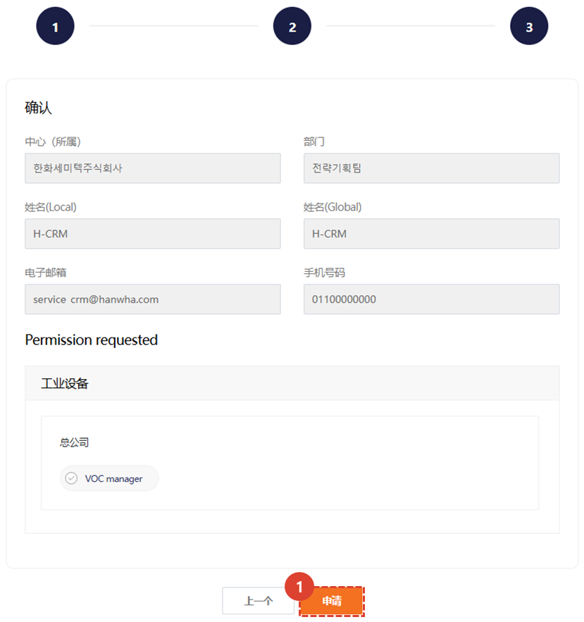

import ValidateTextByToken from "/src/utils/getQueryString.js";
import StrongTextParser from "/src/utils/textParser.js";
import text from "/src/locale/ko/SMT/tutorial-01-auth/create-a-acount-circle-user.json";
import Phon from "./img/004.png";

# 创建 CRM 帐户（员工）

<!-- 메뉴단에서 번역이 안되므로 여기 하드코딩해야 함 #가 달린 헤더와 함께 -->
我们将引导您完成在公司网络上创建 CRM 用户帐户的步骤。

<ValidateTextByToken dispTargetViewer={true} validTokenList={['head', 'branch']}>

## 系统访问路径

1. 在 Circle 主屏幕上的工作菜单中，选择 H-CRM 链接。
  - 如果您从公司网络访问
    - 点击[**连接链接**](http://ep.circle.hanwha.com/api/branch/common/slo/goSloTarget.mvc?authType=1&destination=https://service.hanwha-crm.com/auth/slo )。通过与 Circle 连接，您将自动登录。
  - 如果您从公司外部访问
    - 点击[**连接链接**](https://service.hanwha-crm.com)或扫描下方二维码。
    
 
 

## 创建账户-注册基本信息

1. 进入 Circle 用户账户注册界面。Circle 用户信息默认加载，请检查输入的信息。
1. 邮箱地址无法修改。请检查您的手机号码，然后点击“身份验证”按钮进行身份验证。身份验证完成后，待验证状态将变为已验证状态。
    :::note
    

    (1) 请检查您的手机号码，然后点击“发送”按钮。验证码将通过短信发送到您输入的手机号码。
     (2) 请输入短信发送的验证码，然后点击“确认”按钮。
    :::
1. 请输入符合以下规则的密码。您在此处输入的密码将在公司外部访问 CRM 时使用。
    :::info
    - 如果密码由以下三种字符组合而成：英文小写字母、英文大写字母、特殊字符和数字，请输入8至20个字符。如果密码由两种字符组合而成，请输入10至20个字符。
    - 请勿使用与生日、电话号码等个人信息相关的密码或连续数字等简单易记的密码。
    - 请勿使用您曾经使用过的密码或在其他网站上正在使用的密码。
    :::
4. 请单击“下一步”按钮。
 
 

## 账户创建-授权注册

请求系统使用权限。请选择最适合您任务的权限。

1. 选择相关业务部门。
1. 选择所需权限。
1. 您可以初始化所选权限。
1. 继续下一步。
 
 

## 账户创建 - 验证和注册

请求系统使用权限。请选择最适合您任务的权限。

1. 重新确认上一步申请的权限，点击注册。
 
 

## 帐户创建完成

将出现管理员的待批准屏幕，当批准完成后，您将收到电子邮件通知并能够登录。

</ValidateTextByToken>