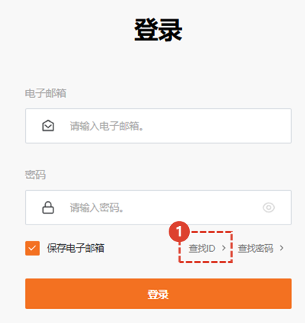
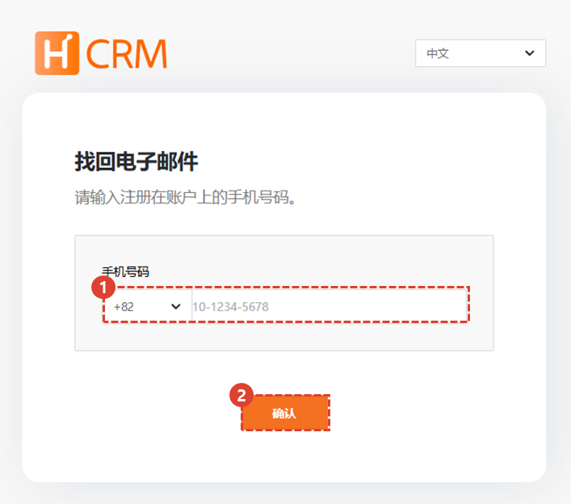
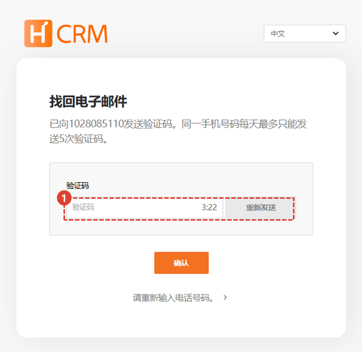
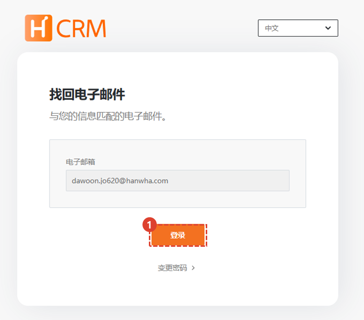

import ValidateTextByToken from "/src/utils/getQueryString.js";

# 查找电子邮件

如果您丢失了帐户电子邮件，这是使用菜单的指南。

<ValidateTextByToken dispTargetViewer={true} validTokenList={['head', 'branch', 'agent', 'customer']}>

## 移动页面

1. 在登录屏幕上，点击[查找ID]按钮。

## 通过电话号码查找您的 ID（电子邮件）

1. 输入您账户中注册的手机号码。
1. 输入号码并按[确认]按钮。

1. 输入您手机上收到的验证码。

## 验证身份（电子邮件）

1. 点击确认按钮登录或重置密码。

</ValidateTextByToken>