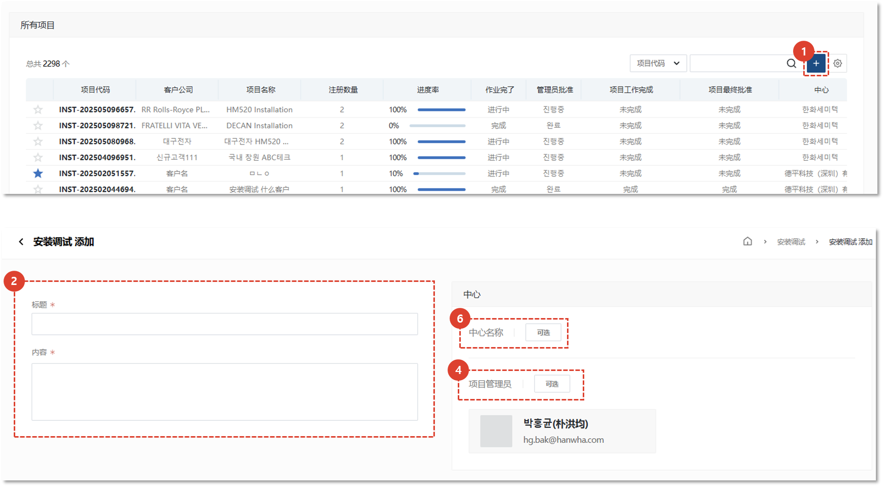
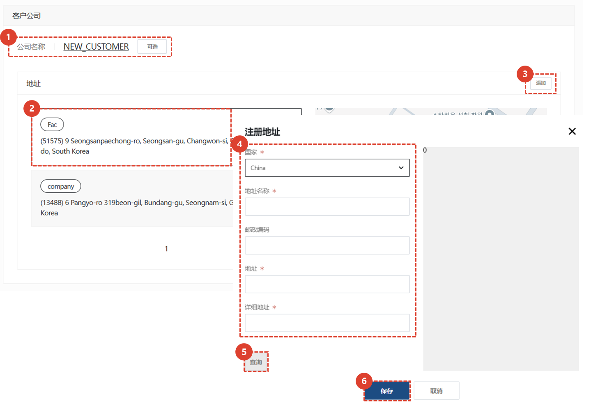
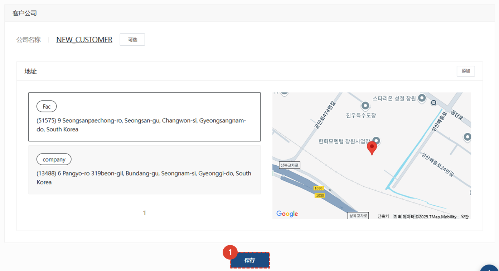

import ValidateTextByToken from "/src/utils/getQueryString.js";
import StrongTextParser from "/src/utils/textParser.js";
import text from "/src/locale/ko/SMT/tutorial-02-installation/01-create-project.json";

# 创建项目

我们将指导您完成向客户交付资产的安装和调试工作。

<ValidateTextByToken dispTargetViewer={true} validTokenList={['head', 'branch', 'agent']}>

## 创建项目 - 1/3

1. 点击列表中的“+”按钮。
1. 输入内容
1. 选择负责管理和执行安装及调试的中心。
1. 选择所选中心的项目经理。

## 创建项目 - 2/3

1. 选择作为试驾目标的客户公司。
1. 选择安装工作的地点。
1. 如果没有安装地址，请点击**添加**按钮注册地址。
1. 输入地址信息。
1. 完成输入后，请点击**搜索**按钮，在地图上显示该地址。
1. 点击**保存**按钮。

## 创建项目 - 3/3

1. 点击安装试驾项目的**保存**按钮。

</ValidateTextByToken>
